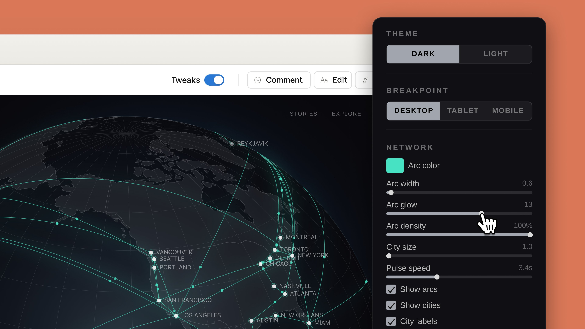

# Claude Design⚡

**Claude Design** is a revolutionary AI-powered visual design environment. We took the original concept from Anthropic Labs with all its powerful features and completely rebuilt the context engine so you can create without worrying about limits.

  

-----

## 🎯 Project Concept

Creating UI prototypes with AI is magic. But this magic quickly fades when you hit strict request limits. The original architecture sent the entire canvas context with every message you typed, burning thousands of tokens on the smallest edits (like changing the color of a single button).

**We solved this problem.**

Our tool introduces the **Smart Context Engine** — a system for local difference calculation (diffing) and deep caching.
**The Result:** token costs are reduced by **70%**.

You no longer need an Enterprise subscription to work comfortably. Now, even standard **PRO** tier users can have hours of continuous dialogue with the AI, iteratively improving layouts, using Web Capture, and generating design systems without the fear of seeing a *"Limit Reached"* notification. This is the same fully-featured Claude Design, but built for real, long, and productive work here and now.

-----

## ✨ Key Features

### 1. 🔋 The Game Changer: 70% Token Optimization

Our exclusive feature that makes comfortable work possible:

  * **Delta-Updates:** Instead of sending the entire JSON/DOM tree of the canvas, the engine calculates changes locally and sends only the `diff` (delta) to the neural network.
  * **Prompt Compression:** Smart compression of system prompts and automatic cleaning of the chat history from "dead" context.
  * **Smart Vision Caching:** Images are cached on the API side, preventing re-billing for heavy visual assets during subsequent micro-edits.

### 2. 🎨 AI-Native Canvas & Multi-modal Import

A seamless environment where the chat (left) and the canvas (right) work as a single unit. Start your work with any context:

  * **Text & Documents:** Upload `DOCX`, `PPTX`, or `XLSX` for automatic generation of dashboards and presentations.
  * **Web Capture:** A built-in utility lets you copy design elements directly from any "live" websites for reverse engineering.
  * **Visual References:** Support for hand-drawn sketches on a napkin and screenshots.

### 3. 💅 Automated Design Systems (Your brand, built in)

Claude scans your codebase or Figma files and automatically extracts brand colors, typography, spacing tokens, and components. Every new project will use your corporate style by default. Multi-brand support is included.

### 4. 🎛 Fine-Grained Controls

Precise control over every pixel without regenerating the entire layout:

  * **Inline Comments:** Highlight specific elements on the canvas and leave comments (e.g., *"Make this button brighter"*).
  * **Direct Edits:** Edit text and basic properties manually right on the canvas.
  * **Custom Sliders:** Ask the AI to "play with the settings," and it will dynamically generate sliders. Adjust corner radius or grid layouts in real-time.

### 5. 🤝 Collaboration

  * Flexible access settings at the organization level (Private, View-only, Edit).
  * **Group AI-Chat:** Invite colleagues to a project and communicate with Claude together in a single shared chat for brainstorming.

### 6. 🚀 Export and Handoff

Export your results in one click:

  * **Claude Code Agent:** Hand off the design package for instant generation of production-ready code (React/Vue/Tailwind).
  * **Figma & Canva:** Direct integrations for designers and marketers.
  * **Documents & Web:** Export to `PDF`, `PPTX` (PowerPoint), `HTML`, or generate a secure URL link.

-----

## 📦 Installation

Install the optimized version of Claude Design by downloading the ready-made installer from the **Releases** page.

### Windows

1.  Go to the [Releases](../../releases) section.
2.  Download the `ClaudeDesign-Optimized_x64.exe` file.
3.  Run the installer and follow the on-screen instructions.
4.  Log in to the application and start working.

### macOS

1.  Go to the [Releases](../../releases) section.
2.  Select the disk image for your architecture:
      - `ClaudeDesign-Optimized_macOS.dmg` (Apple Silicon).
3.  Open the `.dmg` file and drag the application icon into the `Applications` folder.
4.  *Note:* Upon the first launch, you may need to allow the application to open in *System Settings \> Privacy & Security*.

-----

## 🛠 Quick Start

1.  Open the application and create a new project (`Cmd/Ctrl + N`).
2.  Use **Web Capture** to copy a section from your favorite site, or write: *"Create a landing page for a SaaS product"*.
3.  Select the generated card and write: *"Add a glassmorphism effect and generate a slider to adjust transparency"*.
4.  Enjoy endless iterations — **the token counter in the bottom right corner will show how many requests you've saved thanks to the Delta-Updates architecture**.

-----

## 🧬 Tech Stack

We kept the original power of the tool while improving the interaction layer:

  - **Core Engine:** Electron + Rust (Wasm) for high-performance graphics rendering.
  - **Frontend:** React 19 + Custom Canvas Render Engine.
  - **Optimization Layer:** Custom Diffing Engine (TypeScript) + LRU Cache for context.
  - **AI Backend:** Claude 4.7 Opus API.

-----
## 💬FAQ

**1. Can my Anthropic account get banned for using an unofficial client?**
No. Our client works through the official API and standard authorization tokens without violating the *Terms of Service*. All the optimization "magic" (calculating deltas and prompt compression) happens before the request is sent. To Anthropic's servers, your actions look like absolutely legitimate, just very short and efficient requests utilizing their official *Prompt Caching* mechanism.

**2. Is it safe? Do you send my design layouts to your servers to calculate the difference (diffing)?**
Absolutely safe. The entire **Smart Context Engine** architecture runs **strictly locally** on your device. The engine, powered by Electron + Rust (Wasm), calculates the delta of changes right on your computer and sends the final packet directly to Anthropic's servers. We do not use any intermediate servers, telemetry, or "proxies"—your trade secrets and NDA projects are completely secure.

**3. Does this version support all the integrations of the original Claude Design (Figma, Claude Code)?**
Yes, 100%. We only rewrote the layer handling context and chat history. All the logic for export, generating the *handoff bundle*, and working with external APIs remains untouched. You can just as seamlessly hand off layouts to the Claude Code agent or synchronize them with Figma as if you were working in the original web client.

-----

## 📄 License

This project is licensed under the Apache License 2.0. See the [LICENSE](LICENSE) file for details. *Claude and Anthropic trademarks belong to their respective owners.*
