# Head Editor

**id**: chaodays
**title**: 朝朝學美
**description**: 朝朝學美是一個結合營養科學與習慣養成的健康管理數位平台。我們協助建立會員專屬系統，整合飲食紀錄、份量查詢、生理期追蹤與體重體脂圖表分析，打破數據孤島，提供具備心理支持的健康減重旅程。
**keywords**: 健康管理平台, 飲食紀錄, 生理期追蹤, 女性減重, 營養科學, 習慣養成, 會員制 Web App, 數位健康, Vue3
**subtitle**: 結合營養科學與習慣養成的女性健康管理平台 SAAS
**list-summary**: 結合營養科學與習慣養成的數位平台，透過數據化的生理追蹤提供女性專屬減重旅程。
**foreword**: 朝朝學美是一個結合「營養科學」與「習慣養成」的健康管理數位平台。其核心價值在於透過日復一日的小改變，協助使用者建立正確的飲食習慣。我們協助打造這個會員制 Web App，透過數據化的生理追蹤（體重、體脂、生理期），提供尋求健康體態管理的女性族群一個具備心理支持的減重旅程。
**tags**: SAAS, 科技與服務, 大型專案
**urlwebsite**: https://chaodays.app/
**confidential**: No

---

# Content Editor

	

		<h2 class="inside">背景與挑戰</h2>
		
現代女性在追求健康體態的過程中，經常面臨資訊碎片化與心理壓力的雙重考驗。許多人依賴傳統的熱量計算，卻因此陷入對每一口食物的熱量焦慮。同時，市面上的健康管理工具大多功能單一，無法將女性特有的生理週期與體重變化進行有效連動。這使得減重過程宛如孤軍奮戰，缺乏一個能提供全方位指引與心理陪伴的數位工具。

		

			

				
			

			

				<h3 class="inside">關鍵痛點</h3>
				
最大的問題在於「數據孤島」。女性在減重時，體重紀錄與生理期追蹤往往散落在不同的應用程式中。這種斷層導致使用者難以察覺「生理性水腫期」與「黃金瘦身期」的關聯，容易因為荷爾蒙帶來的短期體重波動而感到挫折，進而放棄減重計畫。此外，繁瑣的熱量計算也讓日常飲食紀錄成為一種負擔。

			

		

		

			

				
			

			

				<h3 class="inside">專案目標</h3>
				
為朝朝學美建置一個專屬女性的數位健康管理平台。系統需要整合飲食紀錄、份量查詢、生理期追蹤與體重體脂圖表分析。透過智慧化的數據驅動，將複雜的營養攝取轉化為直觀的份量管理，並結合生理週期提供動態的健康指引，讓平台成為使用者減重旅程中溫暖的陪伴者。

			

		

	

	

		<h2 class="inside">解決問題的過程</h2>
		
要打造一個具備「陪伴感」的健康管理平台，我們必須跳脫傳統冷硬的醫療數據呈現方式。我們深入分析女性在減重過程中的心理變化，認為系統不該只是冰冷的紀錄工具，而是一套「抗焦慮」的解決方案。因此，我們在架構設計與前端技術上，皆以提供流暢、安心的使用者體驗為核心。

		

			<h3 class="inside">智慧份量轉換，化解熱量計算焦慮</h3>
			
為了降低飲食紀錄的門檻與壓力，我們打破傳統依賴熱量計算的作法。我們內建由專業團隊開發的查詢資料庫，將使用者的食物輸入自動轉化為「六大類份量」管理。系統會同步顯示「當日營養配比」進度條，並在紀錄完成後給予視覺化的達標回饋，讓飲食管理變得直觀且充滿成就感。

		

		

			<h3 class="inside">生理週期體態整合，提供高維度健康洞察</h3>
			
我們將使用者的生理期與體重、體脂波動圖表進行深度結合。當使用者在日曆上標註經期，系統會自動在趨勢圖中標示生理期區間，並在圖表下方提供衛教說明。這樣的設計能有效緩解使用者對體重短暫回升的焦慮，幫助她們掌握個人專屬的黃金瘦身期。

		

		

			<h3 class="inside">梳理複雜邏輯與優化前端效能，確保體驗流暢</h3>
			
健康管理平台涉及大量的數據交換與狀態同步。在開發過程中，我們面臨了儀表板載入時間過久以及巢狀頁面參數難以管理的挑戰。我們將共用變數往上提取到容器元件，統整過去、當月、未來的不同情境，並完善非同步操作，避免多餘的 API 請求。同時，我們針對跨元件的通訊（如聊天室狀態）進行了物件包裝與監聽設計，確保複雜的互動功能在前端依然能流暢運行。

		

	

	

		<h2 class="inside">看看作品成果</h2>
		
朝朝學美成功地將專業的營養科學與貼心的使用者體驗結合，為女性提供了一個無壓力的健康管理環境。在視覺風格上，我們採用溫潤的黃色與深綠色調，搭配充滿手繪感與溫馨氛圍的插畫設計，徹底消弭了傳統健康工具的冰冷感，營造出如同陪伴者般的產品性格。平台整合了品牌傳遞與數位工具雙重價值，使用者不僅能透過社群聊天室獲得同儕的支持，更能透過首創的數據整合機制，找回對身體的掌控權。

		<ul>
			<li><b>智慧飲食監測系統</b>：提供份量查詢與自動換算，將複雜的營養攝取轉化為直觀的進度條，降低記錄焦慮。</li>
			<li><b>生理與體態重疊圖表</b>：將生理期與體重波動連動顯示，提供精準的衛教指引，消弭數據孤島。</li>
			<li><b>動態減重計畫</b>：依據會員初始數據與每日記錄，動態生成個性化的營養攝取配比推薦。</li>
			<li><b>溫暖的情感化設計</b>：跳脫醫療冷硬感，運用溫暖色調與插畫引導，建立信賴與陪伴感。</li>
			<li><b>流暢的單頁式體驗</b>：優化前端效能與複雜組件狀態管理，確保即時通訊與數據同步的穩定性。</li>
		</ul>
		

			

				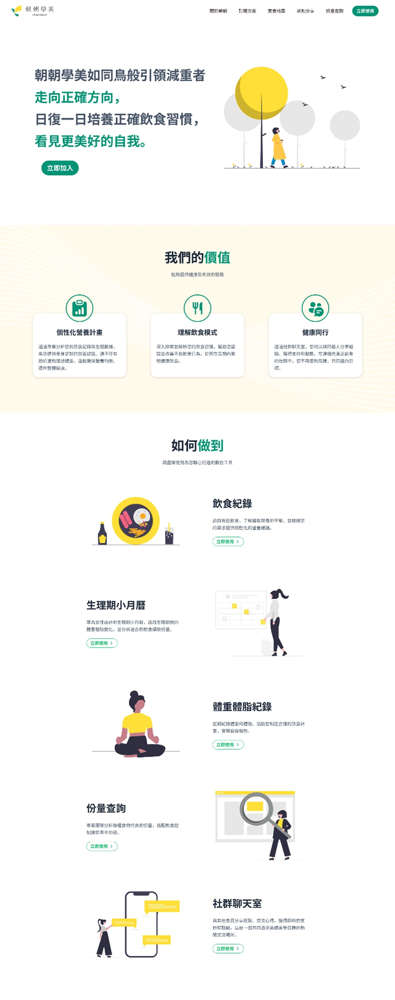
			

			

				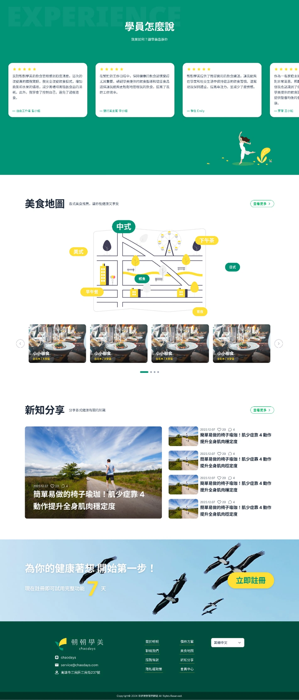
			

			

				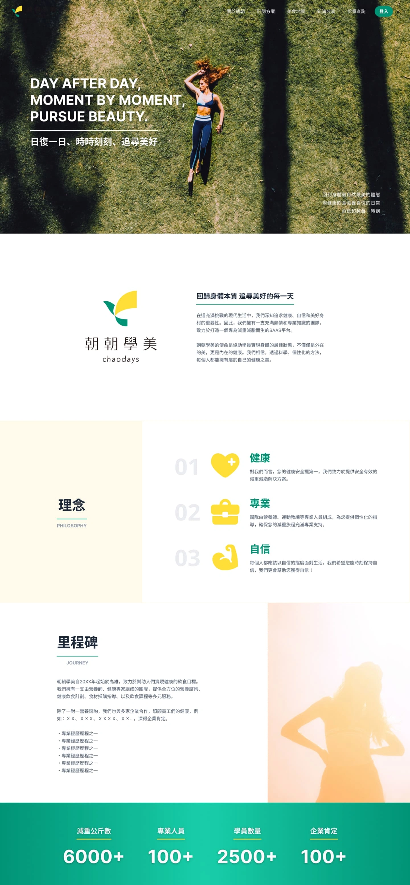
			

			

				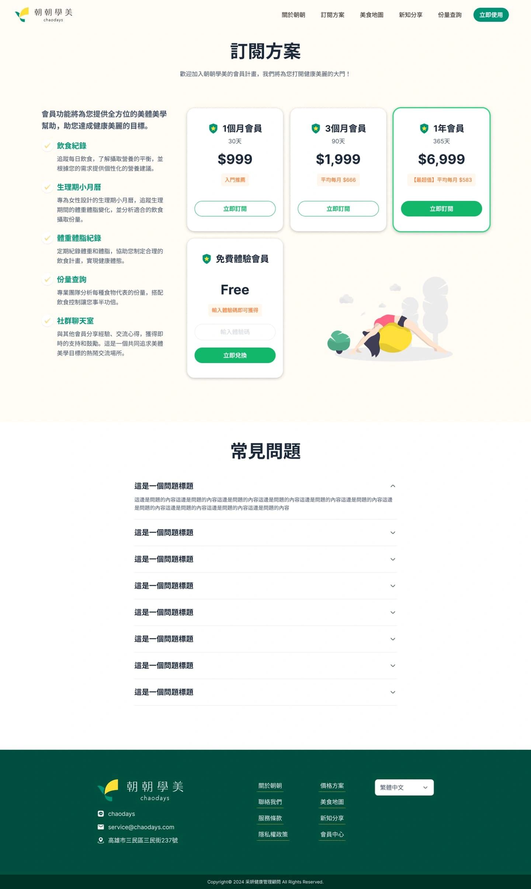
			

			

				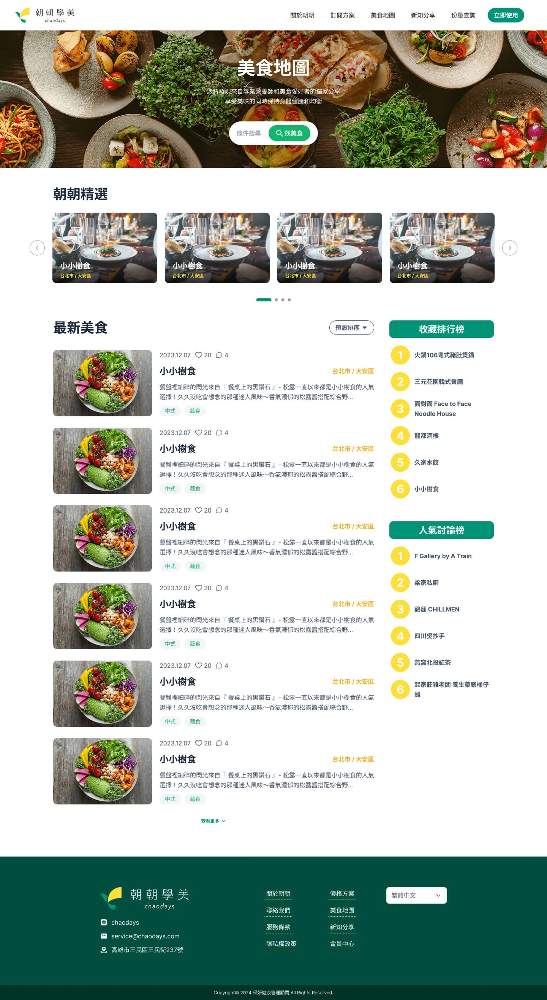
			

			

				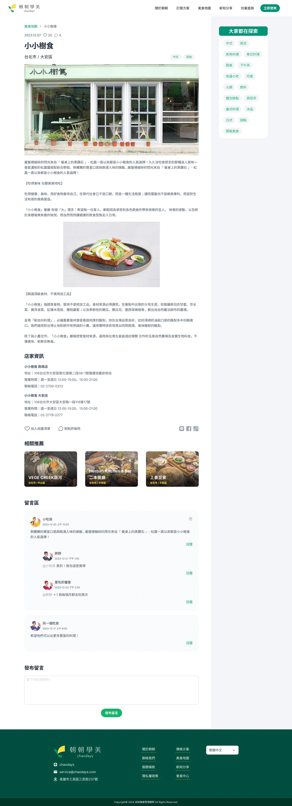
			

			

				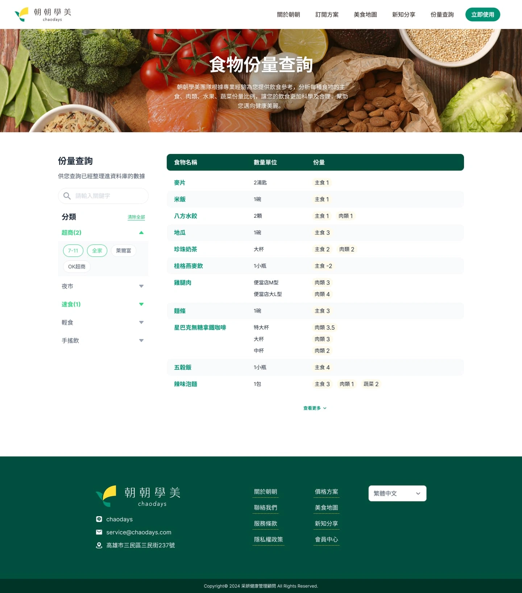
			

			

				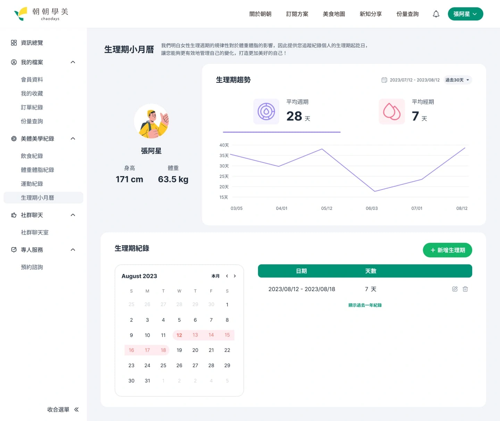
			

			

				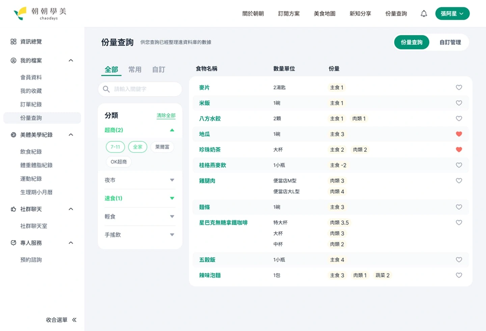
			

			

				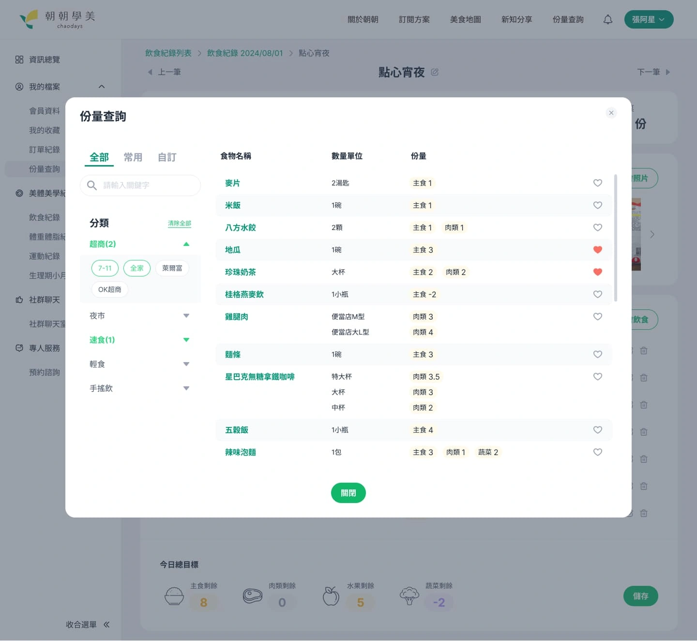
			

			

				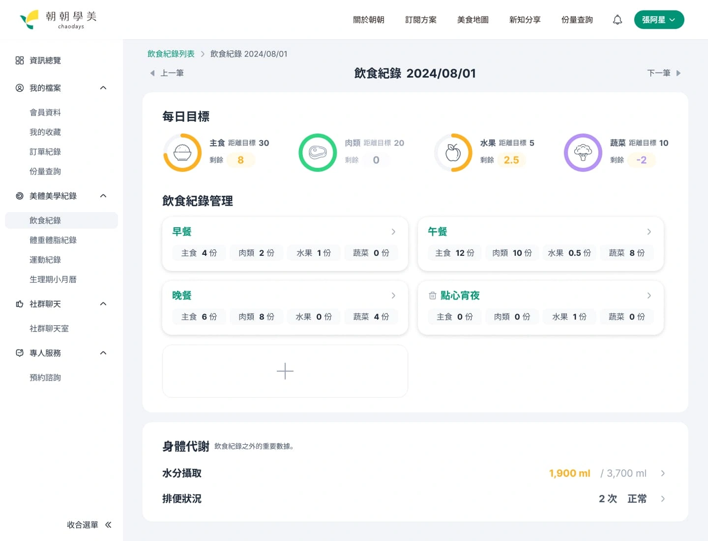
			

			

				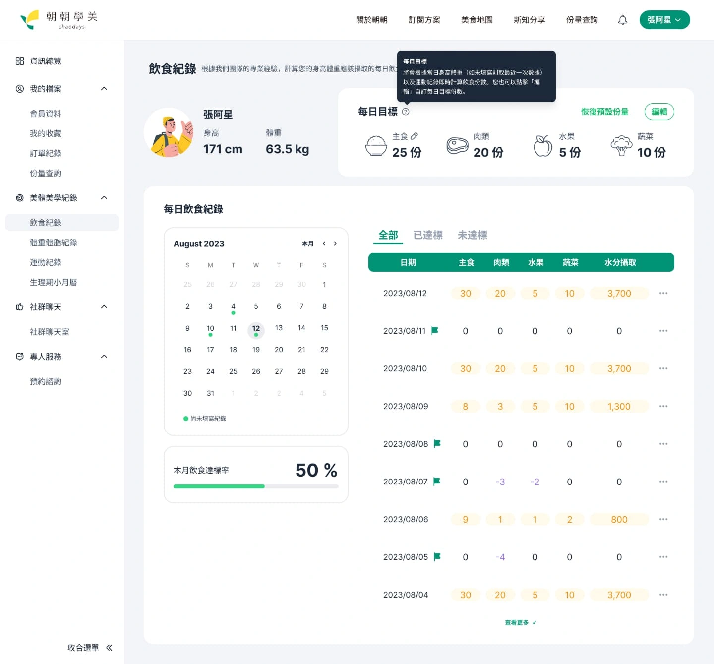
			

			

				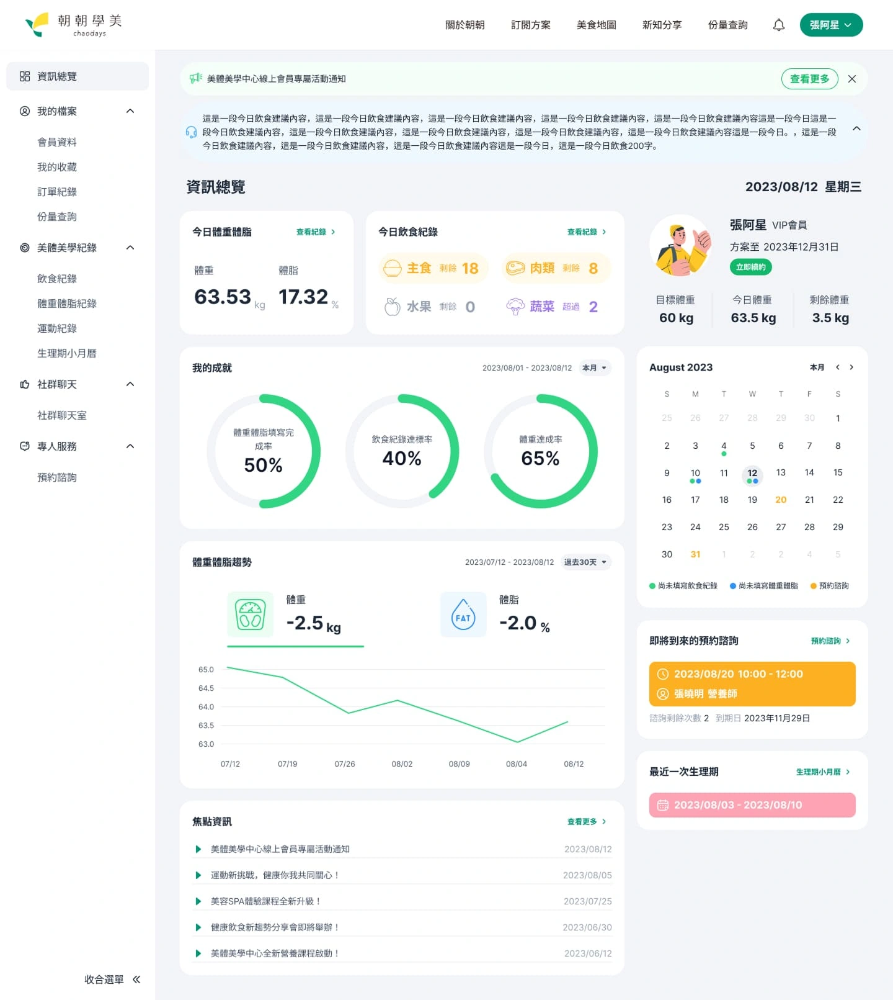
			

			

				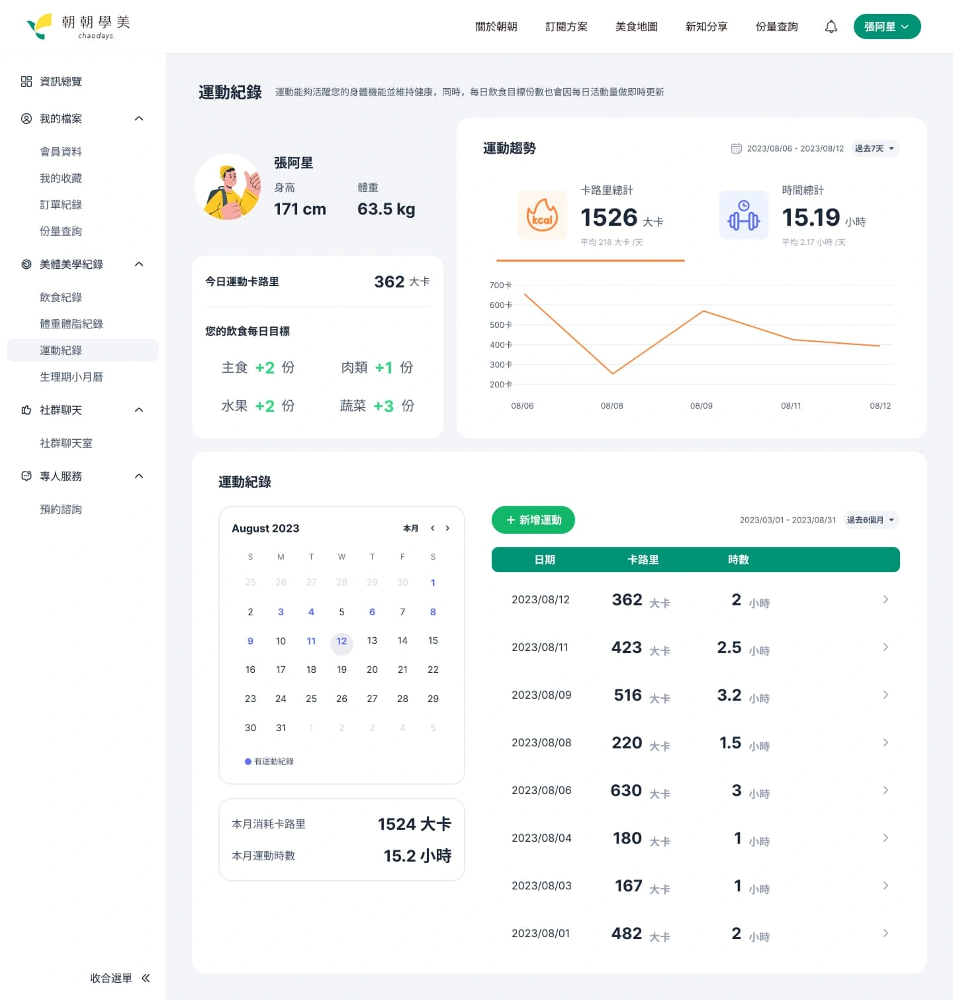
			

			

				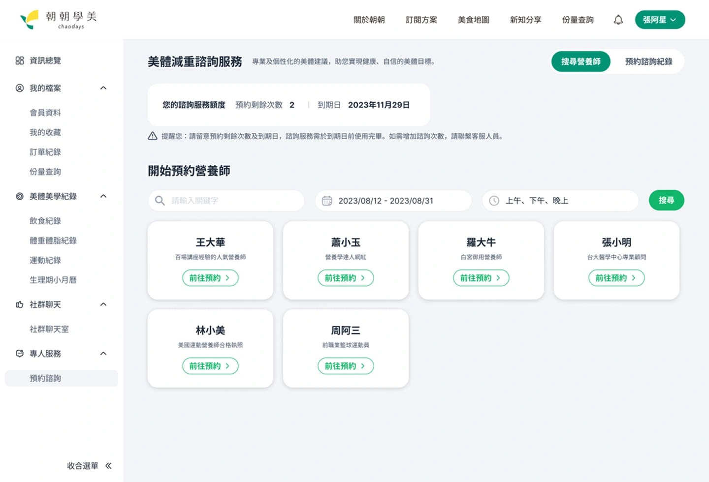
			

		

		

			<a href="https://chaodays.app/" target="_blank" class="button button-circle">去看作品 <i class="uil-external-link-alt"></i></a>
		

	

