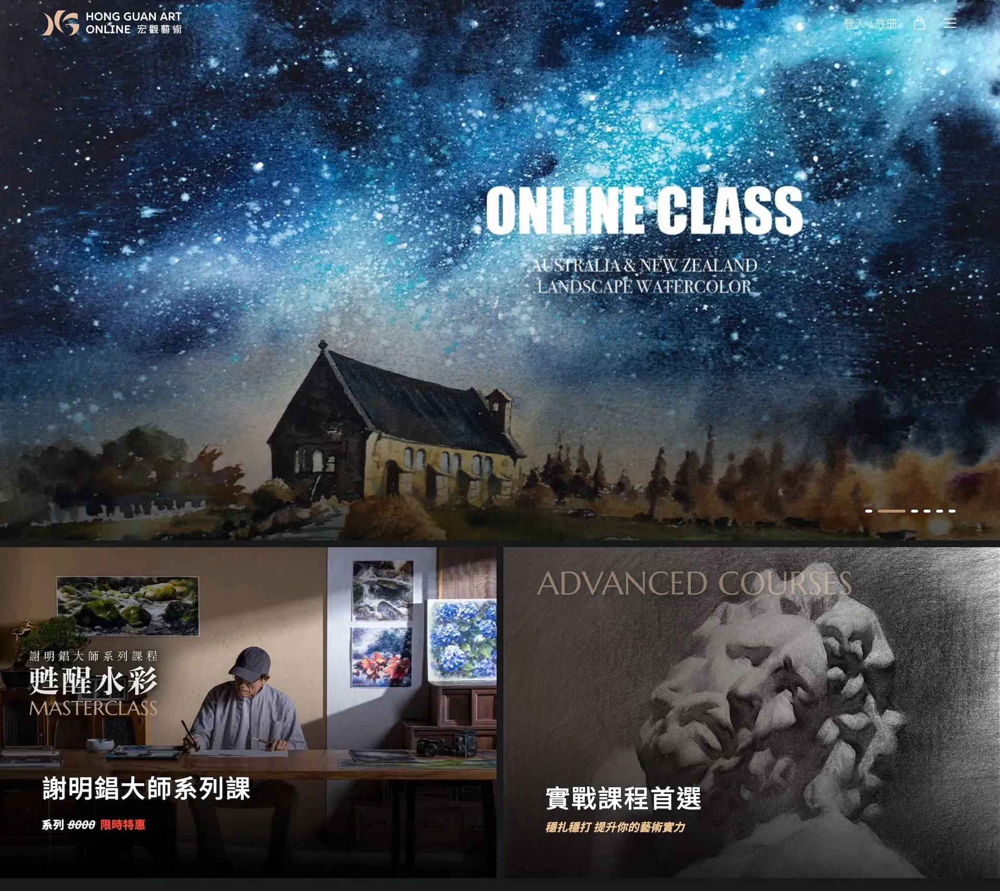
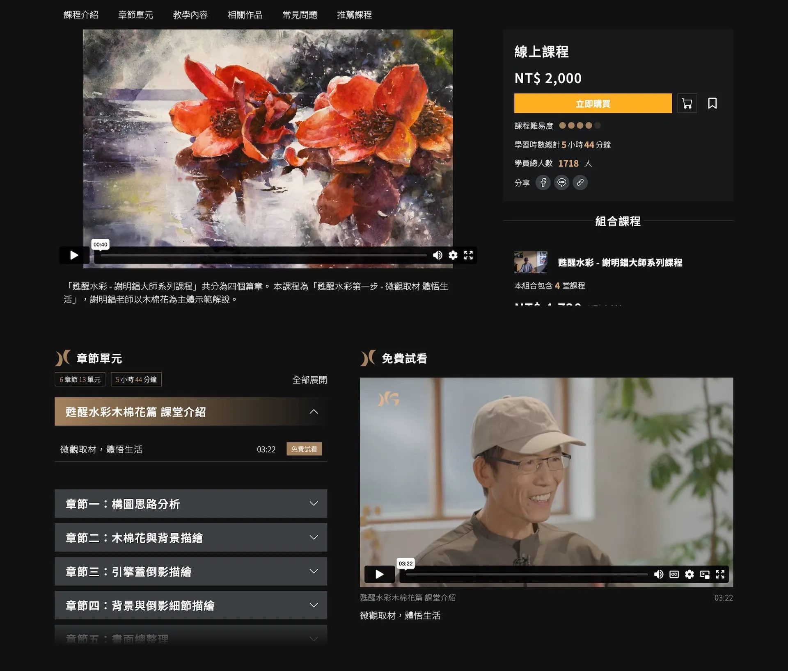
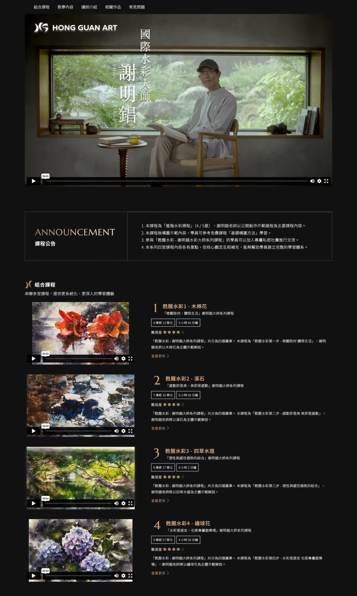

# Head Editor

**id**: hongguanartonline
**title**: 宏觀美術線上課程平台建置
**description**: 為宏觀美術打造線上課程平台 HONG GUAN ART ONLINE，從課程架構、影音串流、分類策略到 SEO 建置，全方位協助品牌跨入數位教育市場，提升教學影響力與轉換率。
**keywords**: 宏觀美術, 線上課程平台, 藝術教育, 教育平台開發, UX設計, SEO策略, 課程分類架構, 串流整合, 數位轉型, 教育網站製作
**subtitle**: 藝術教育數位轉型的成功案例
**list-summary**: 藝術課程教學的數位轉型。
**foreword**: 宏觀美術致力於藝術升學與創作教育，為擴大教學觸及與課程價值延伸，打造「HONG GUAN ART ONLINE」線上學習平台。我們協助團隊從教學架構出發，重構課程分類邏輯、整合影音串流、建立可擴充的行銷模組，並協助建立 SEO 基礎架構，協助宏觀順利跨入數位教育市場，讓教學內容能被更多學生「同時看見、有效吸收」。
**tags**: SAAS, 藝術產業, 中型專案
**urlwebsite**: https://hongguanartonline.com/
**confidential**: No

---

# GEO Summary Box Editor

	<h4 class="mb-2 fs-6">專案成果摘要</h4>
	<ul class="mb-0 p-0 list-unstyled">
		<li>✅ <strong>核心目標：</strong> 突破實體場域限制，實現高品質藝術教學的規模化傳播。</li>
		<li>✅ <strong>關鍵優化：</strong> 雙維度課程分類架構、穩定影音串流整合、主機成本與 SEO 策略規劃。</li>
		<li>✅ <strong>轉型效益：</strong> 成功建置專業教育平台，觸及跨地域學生，建立品牌數位聲譽。</li>
	</ul>

---

# Content Editor

	

		<h2 class="inside">背景與挑戰</h2>
		
宏觀美術是知名的藝術教育品牌，創立於 2012 年，是一家專注於藝術教育與升學輔導的高端畫室，長年投入素描、水彩、書法、立體模型等課程的師資養成與青少年藝術培育。總部位於台北市大安區忠孝 SOGO 商圈，服務對象涵蓋國小至研究所學生，尤其在海外藝術設計院校申請輔導上具有高度市場區隔。

		
其品牌以「高度專業、長期陪伴」為核心定位，擁有完整的實體教學空間、專業器材與材料庫，並強調升學成果導向與作品集品質。

		
為因應業務擴展與教學規模化的需求，宏觀美術近年推動數位轉型，建置線上平台「HONG GUAN ART ONLINE」（就是我們的作品），並採取「線上搭配線下」的混合經營策略，期望透過數位內容最大化教學影響力，觸及更多跨地域學生，強化品牌聲譽與教育規模效益。

		

			

				
			

			

				<h3 class="inside">關鍵痛點</h3>
				
藝術圈知名的宏觀美術，長年深耕藝術教育，雖然強大的品牌聲譽在學員之間保持著高人氣，但終究受限於地點與實體場域的容量限制。為了打破空間限制，讓高品質課程同時觸及更多學生，宏觀選擇啟動數位轉型計畫，建立線上平台實現內容的規模化與遠距傳播，將原本只能現場參與的專業教學，擴展至全台與海外市場。

			

		

		

			

				
			

			

				<h3 class="inside">專案目標</h3>
				
協助「宏觀美術」建置具備專業形象與穩定串流能力的線上課程平台，將品牌多年累積的教學資源數位化，打造兼具學習體驗與內容安全的數位教學環境。

				
透過穩定的影音串流、分層授權管理與跨裝置介面設計，讓學員能在任何地點順暢學習，同時維持宏觀美術「高品質、專業導向」的品牌精神。

			

		

	

	

		<h2 class="inside">解決問題的過程</h2>
		
我們多次訪談宏觀團隊，盡可能深入理解宏觀的課程及營運邏輯，並在設計階段及開發階段同步釐清他們對線上平台的實際疑慮。

		
前半段「理解需求、討論策略、降低不確定性」的 UX 過程，我們投入較多心力，幫助雙方能夠在進入開發階段前，達到最大共識。

		

			<h3 class="inside">雙維度分類架構，幫助學員探索課程</h3>
			
定義課程分類不容易，多年累積的課程涵蓋水彩、素描、書法、模型、兒童創意等，要重新規劃為適用於線上課程平台的分類，若分類不清，會直接影響購買體驗與轉換率。

			
UX 策略階段，我們從「使用者的選課思維」與「教學邏輯」來思考分類，重新建立為「課程形式」和「主題分類」這樣的雙維度架構。

			
課程形式以使用情境為導向，分為線上單堂課程、線上組合課程、直播課程與實體課程；而如水彩、素描、書法、模型等媒材，則改以標籤（TAGs）形式呈現，讓課程能被靈活歸類於多種學習主題。這樣的設計提升平台的分類彈性，同時更貼近使用者的決策流程。

		

		

			<h3 class="inside">挑選影片串流服務</h3>
			
宏觀希望盡可能多的呈現自己最好的知識，影片會需要比較長的時間長度，串流的穩定度及成本就會是大考驗。

			
考量線上課程平台對串流穩定度及預算的需求，我們協助宏觀進行主流串流平台的技術與費用評估，包括影片解析度、載入速度、穩定性、流量計價模式等指標。篩選出幾個合適的方案，加上優缺點建議，供客戶評估決策。

			
串接第三方串流，就不需要自行承擔串流基礎建設的技術與維運，同時大幅降低初期成本與不確定風險。

		

		

			<h3 class="inside">主機成本的明確試算，化解對支出的不安</h3>
			
有聽說過同行支付大額的主機成本，擔心實際營運後會超出自己預期。

			
宏觀有聽說其他品牌在主機成本上花費大額支出，這造成宏觀對於主機成本支出的不安。我們先提供雲端主機的收費規則，再加上本身其他專案的經驗，推算出不會發生同樣狀況，雖然沒辦法計算精確數字，但是確定成本會遠低於想像中的大額支出。

		

		

			<h3 class="inside">SEO 基礎策略建立，從內容主題探索開始</h3>
			
SEO 沒有策略。知道有 SEO 這件事，但不知道實際該怎麼執行，擔心之後需要新增很多額外花費。

			
專案開始前，說明我們的網頁會配置基本的 H1、H2、H3 層級的標題，以及具備 Title 和 Description，網址會命名有實際意義的名稱，幫助搜尋引擎的爬蟲更好搜尋。

			
我們也在專案過程持續說明，初期 SEO 不需要立即投入高預算，可以從自己的專業中找出市場感興趣的關鍵字，融入頁面內容。並且利用 AI 工具擬定 SEO 策略，先為自己定調主軸，大幅降低初期成本。

		

	

	

		<h2 class="inside">看看作品成果</h2>
		
本案為宏觀美術打造專屬的線上課程平台，系統支援單堂課程、組合課程、免費課程與實體活動等多種課程型態，搭配「教學類型」和「課程主題」雙維度課程分類，提升課程探索效率。

		
課程頁具備課綱展示、前導影片預覽、優惠倒數、學員人數與難度標示等模組，協助用戶快速判斷課程價值。

		
管理後台支援彈性折扣設定、課程內容設定與影片串流整合，搭配 SEO 架構與關鍵字欄位，為未來內容經營預留彈性空間。整體設計延續宏觀品牌官網的風格，品牌簡潔、高質感調性，搭配大量視覺區塊與明確行動引導，優化使用者體驗與購買轉換。

		<ul>
			<li>系列型「大師課程」與實戰短課的雙軸課程設計。</li>
			<li>限時折扣與免費入門資源。</li>
			<li>明確標示課程時數、難易度與學習人次，幫助學員提供決策依據。</li>
			<li>多位具代表性的藝術講師陣容，建立專業信任感。</li>
			<li>完整購物與會員機制，支援訂單查詢、學習紀錄、問與答功能。</li>
		</ul>
		

			

				
			

			

				
			

			

				
			

		

		

			<a href="https://hongguanartonline.com/" target="_blank" class="button button-circle">去看作品 <i class="uil-external-link-alt"></i></a>
		

	

