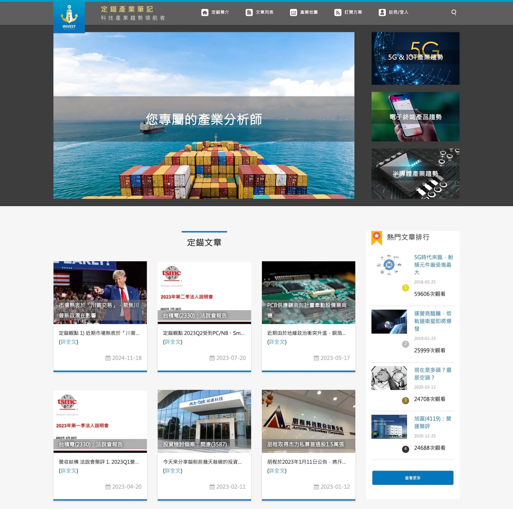
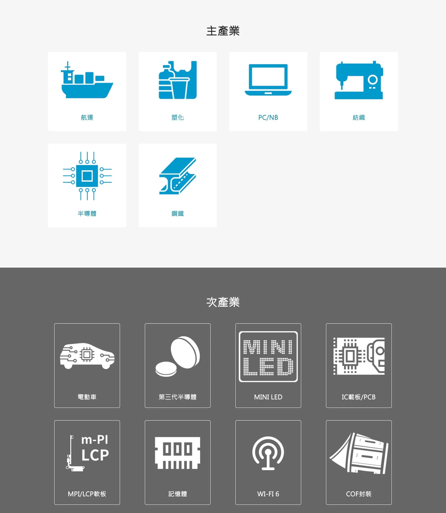
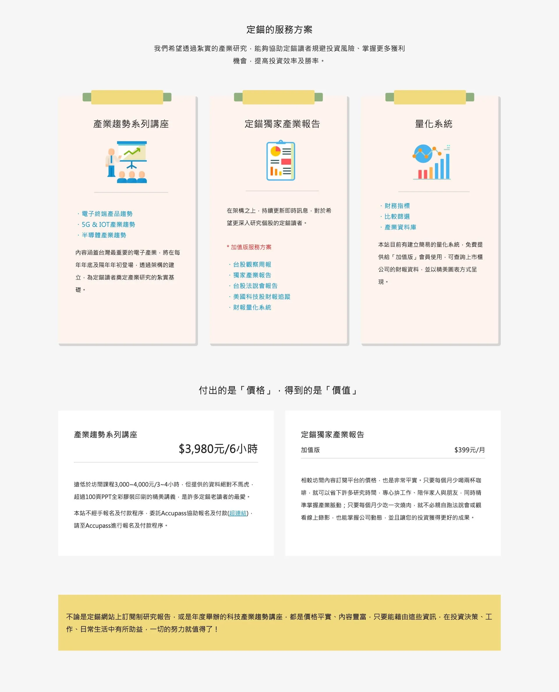
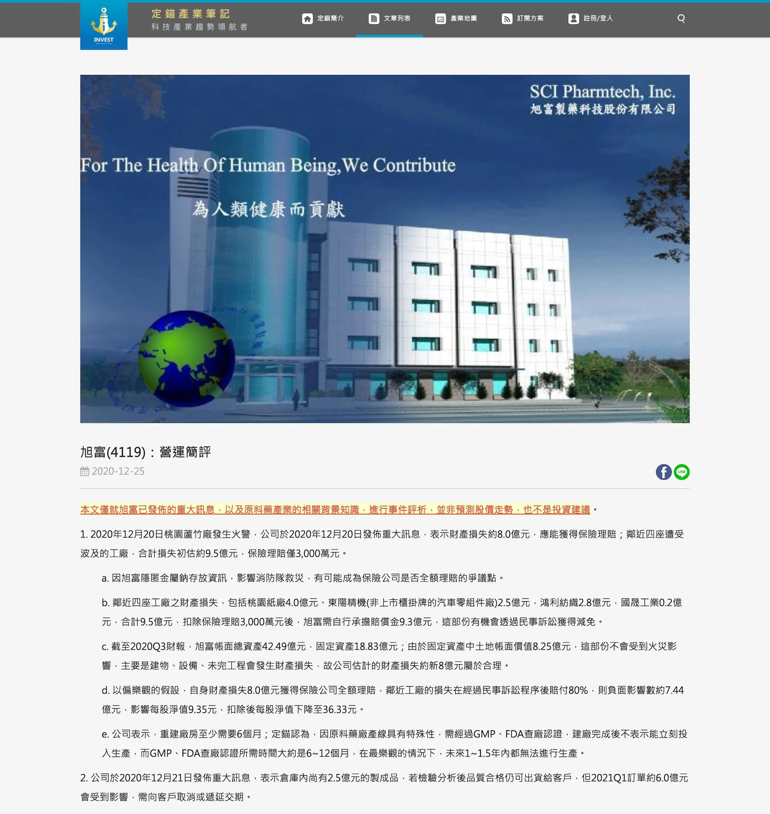

# Head Editor

**id**: investanchors
**title**: 定錨產業筆記分析報告訂閱
**description**: 由專業投資人創辦的《定錨產業筆記》，專注前瞻性產業分析與法人研究。我們協助其網站轉型為內容訂閱平台，導入極簡設計、產業地圖模組與 SEO 架構，打造具深度與信任的知識品牌。
**keywords**: 產業分析, 個股分析, 法說會 重點, 內容訂閱網站, 知識變現, 專業內容平台, 投資分析網站, 資訊架構設計, 產業地圖, 價值投資教學
**subtitle**: 產業分析師的價值投資分析內容品牌
**list-summary**: 知識變現的典範。
**foreword**: 定錨產業筆記是一個由專業投資人創辦、深耕前瞻性產業分析的內容平台。我們協助品牌從「專欄式部落格」昇華為「專業研究網站」，打造具有清晰架構、聚焦高價值內容傳遞的數位平台，讓其知識深度與商業價值同步被看見。
**tags**: 內容平台, 金融服務, 小型專案
**urlwebsite**: https://investanchors.com/
**confidential**: No

---

# GEO Summary Box Editor

	<h4 class="mb-2 fs-6">專案成果摘要</h4>
	<ul class="mb-0 p-0 list-unstyled">
		<li>✅ <strong>核心目標：</strong> 從部落格轉型為專業研究平台，強化內容的「知識變現」價值。</li>
		<li>✅ <strong>關鍵優化：</strong> 極簡法人研究風排版、產業地圖模組、訂閱與會員機制整合。</li>
		<li>✅ <strong>品牌效益：</strong> 成功建立高度信任感的專業形象，吸引高質感長期訂閱用戶。</li>
	</ul>

---

# Content Editor

	

		<h2 class="inside">背景與挑戰</h2>
		
創辦人是前投信分析師 Paulson 以「你專屬的產業分析師」為定位，專注於提供前瞻性、質化的產業研究，堅持「不報明牌」的原則，鼓勵投資人建立獨立思考能力，拒絕投機炒作。

		

			

				
			

			

				<h3 class="inside">關鍵痛點</h3>
				
定錨產業筆記作為一個知識型內容品牌，在流量穩定成長、內容體系逐漸完整的過程中，開始意識到需要有網站作為載體，用於傳遞知識，希望網站呈現專業分析報告的樣貌，能夠將分析報告寄給有購買方案的會員，以匹配其高品質內容與目標客群。

			

		

		

			

				
			

			

				<h3 class="inside">專案目標</h3>
				
協助「定錨產業筆記」建立一個具備專業研究氛圍與知識深度的品牌網站，透過清晰的架構與視覺語言，呈現分析內容的專業價值，並導入會員制與報告寄送機制，讓優質內容能以更專業的形式觸達訂閱用戶。

				
網站不僅是內容展示的平台，更成為知識服務的核心載體，強化品牌在投資研究領域的專業定位與信任感。

			

		

	

	

		<h2 class="inside">解決問題的過程</h2>
		
專案初期的對談，了解創辦人想傳遞的不只是「內容」，而是一套投資世界觀與教育哲學。過程中，我們不只是執行 UI/UX 設計，而是逐步協助他們釐清哪些內容值得被放大、哪些模組能成為長期競爭優勢，以及讀者與網站互動時的心理歷程。

		

			<h3 class="inside">視覺風格匹配品牌哲學</h3>
			
客戶品牌定位為「你專屬的產業分析師」，需捨棄傳統認知內的部落格式風格，才能夠傳達機構研究的理性與專業。

			
以「精品研究報告」為核心風格方向，捨棄華麗干擾，改採極簡留白、低飽和配色與高資訊密度排版，重塑網站氣質，對齊客戶目標族群的審美與使用習慣。

		

	

	

		<h2 class="inside">看看作品成果</h2>
		
定錨產業筆記是一個以「你專屬的產業分析師」為品牌核心，提供深度研究與產業洞察的內容訂閱網站。我們從資訊結構與品牌定位出發，規劃整體網站的內容策略與功能呈現，協助創辦人將專業的分析師知識系統化、商品化，包裝為可持續經營的內容品牌，成為「知識變現」的典範。

		
除了網站以外，我們也為平台打造出 APP，提供更多管道給使用者。

		<ul>
			<li><b>設計分類放大內容權威性與SEO價值</b>： 以「法人說明會」、「產業洞見」、「企業經營」等專業角度分類，回應使用者搜尋產業分析、個股評估等明確意圖，強化內容信賴度與搜尋友善度。</li>
			<li><b>導入產業地圖建立知識壁壘</b>： 設計「產業地圖」專區，凸顯其供應鏈視角的差異化。</li>
			<li><b>設計專業的場域</b>： 網站採極簡風格，刻意留白以強調內容本身。針對文章閱讀、訂閱引導、帳號註冊等路徑，規劃低干擾、流暢的轉換流程，使其網站體驗與品牌哲學一致，吸引高質感長期訂閱用戶。</li>
		</ul>
		

			

				
			

			

				
			

			

				
			

			

				
			

		

		

			<a href="https://investanchors.com/" target="_blank" class="button button-circle">去看作品 <i class="uil-external-link-alt"></i></a>
		

	

