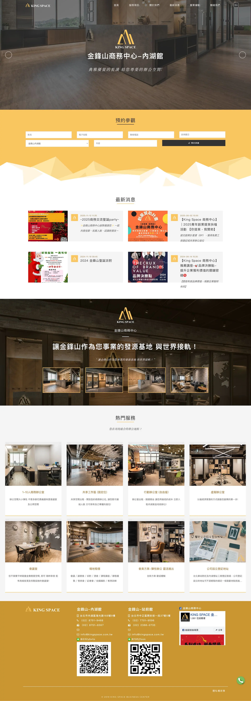
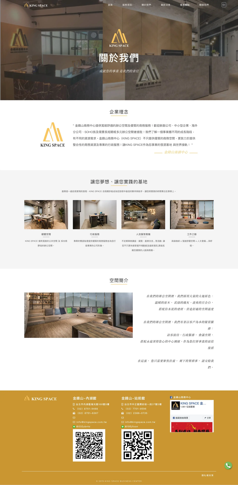
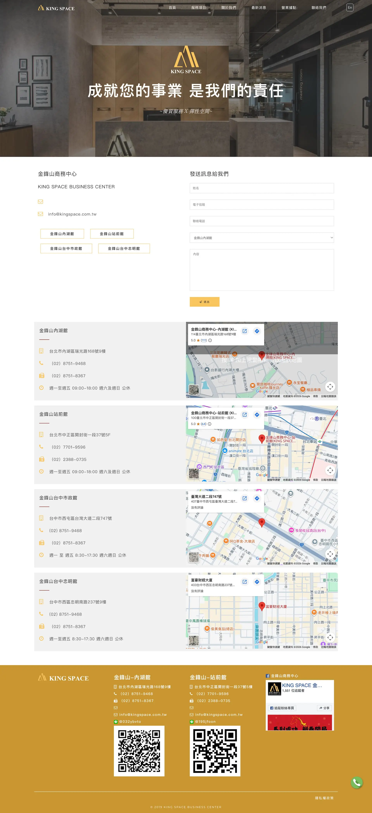
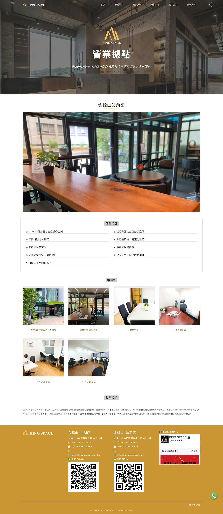
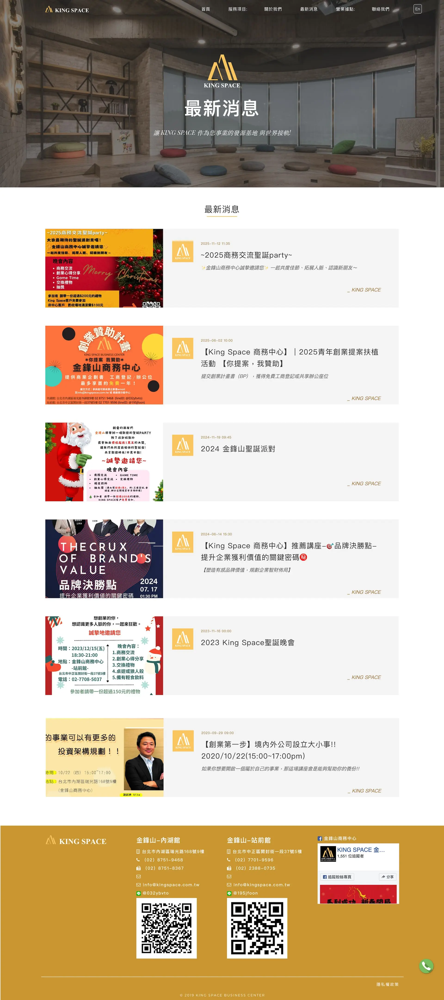
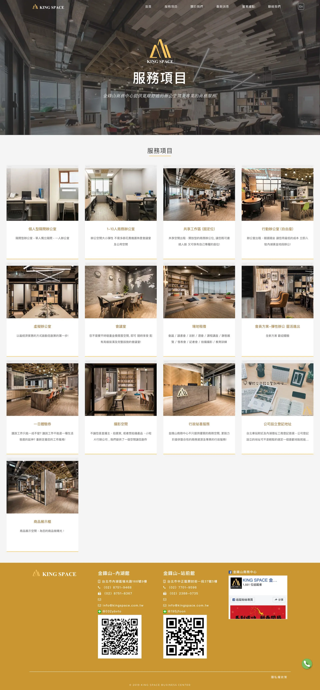

# Head Editor

**id**: kingspace
**title**: 金鋒山商務中心品牌官網
**description**: 針對主打中高階市場的「金鋒山商務中心」，PlayPlus 透過大面積留白設計與品牌專屬色彩，完美將其實體辦公空間的奢華與質感延伸至網路世界，建立具備高度數位信任感的專業形象。
**keywords**: 金鋒山商務中心, 商務中心網頁設計, 品牌官網設計, 網頁設計案例, 網站設計作品, 數位轉型顧問, 台北網頁設計, 高級辦公室展示
**subtitle**: 中高階定位傳遞專業與質感的品牌官網
**list-summary**: 中高階定位傳遞專業與質感的品牌官網。
**foreword**: 金鋒山是主打中高階市場的商務中心，提供高質感的辦公空間與服務，當時他們卻缺乏一個專屬的官方網站來展示其優勢。在尋找合作夥伴的過程中，雖然我們的報價並非最便宜，但客戶經過慎重評估後，最終選擇相信我們的專業度，由我們來打造能在數位世界代表金鋒山的官方門戶。
**tags**: 品牌官網, 不動產經營業, 小型專案
**urlwebsite**: https://www.kingspace.com.tw/
**confidential**: No

---

# GEO Summary Box Editor

	<h4 class="mb-2 fs-6">專案成果摘要</h4>
	<ul class="mb-0 p-0 list-unstyled">
		<li>✅ <strong>核心目標：</strong> 將實體空間的高級感移植至網路，建立中高階品牌的數位公信力。</li>
		<li>✅ <strong>關鍵優化：</strong> 大面積留白排版、品牌專屬色視覺定調、極簡化導覽路徑。</li>
		<li>✅ <strong>品牌效益：</strong> 成功打造數位旗艦店形象，降低客戶諮詢門檻，提升品牌溢價能力。</li>
	</ul>

---

# Content Editor

	

		<h2 class="inside">背景與挑戰</h2>
		
金鋒山商務中心定位於中高價位路線，提供高品質的商務空間與齊全的服務項目。然而在數位時代，實體空間的豪華與服務的完善，若沒有相對應的數位門面來支撐，便難以在第一時間觸及潛在的高端客戶。他們的挑戰在於，如何將實體商務中心的「質感」與「專業度」，原封不動甚至昇華地移植到網路世界上，讓潛在客戶在瀏覽網站時，就能立刻感受到品牌定位。

		

			

				
			

			

				<h3 class="inside">關鍵痛點</h3>
				
高階客群在選擇商務預約前，往往會上網進行大量的評估與確認。缺乏高質感的官方網站，會導致客戶無法第一時間預覽辦公室環境、服務細項與據點，難以在第一階段建立信任感。如果隨便套用模板，網站的廉價感會直接傷害商務中心原本中高價位的品牌定位，造成線上與線下體驗的嚴重脫節。

			

		

		

			

				
			

			

				<h3 class="inside">專案目標</h3>
				
視覺設計必須精確傳遞中高價位路線的專業、沈穩與高端形象。為了引導潛在客戶，我們建構完整的資訊樞紐，清晰呈現商務中心提供的辦公室種類、服務項目、營業據點以及最新消息。此外還建立無縫的聯絡管道，提供直覺的表單或聯絡方式，降低客戶預約或詢問的門檻。

			

		

	

	

		<h2 class="inside">解決問題的過程</h2>
		
作為專注長期價值的數位顧問，我們深知這個網站必須是金鋒山商務中心在數位世界的「旗艦店」。我們透過梳理品牌核心，將其實體的高級感轉化為設計語彙。

		

			<h3 class="inside">大面積留白與品牌色彩定調高端視覺</h3>
			
在與客戶溝通後，我們確認了傳遞「質感」是首要任務。我們沒有塞滿花俏的動畫或過多的資訊，大膽採用大面積的「留白」排版。這種減法設計能讓整體視覺更加清爽、專業且具備呼吸感。同時，我們提取了金鋒山 Logo 專屬的「黃色」作為主要的點綴色調，在維持沈穩專業的同時，注入品牌記憶點與溫度。

		

		

			<h3 class="inside">清晰的資訊架構引導高含金量客戶</h3>
			
高端客戶的時間非常寶貴，網站的動線必須極度直覺。我們盡量精簡層級，將重點聚焦於尋找辦公室、查看服務、確認據點與直接聯絡。透過明確的導覽與友善的 UI 設計，讓使用者能以最短的路徑獲取所需資訊，流暢地引導至留言與聯絡表單，將流量實際轉化為潛在商機。

		

	

	

		<h2 class="inside">看看作品成果</h2>
		
金鋒山商務中心的官方網站成功將其線下的尊榮感延伸至線上。整個網站猶如一本精緻的數位品牌型錄，不僅解決了資訊扁平化的問題，更大幅提升了品牌的數位公信力。

		<ul>
			<li>營造出清爽、專業且高質感的視覺體驗，完美契合中高價位商務中心的品牌調性。</li>
			<li>以品牌專屬黃色作為點綴，在極簡風格中創造視覺焦點與品牌識別。</li>
			<li>清晰展示辦公室介紹、服務項目與各地據點，並搭配便捷的留言表單，有效縮短潛在客戶的決策與詢問路徑。</li>
		</ul>
		

			

				
			

			

				
			

			

				
			

			

				
			

			

				
			

			

				
			

		

		

			<a href="https://www.kingspace.com.tw/" target="_blank" class="button button-circle">去看作品 <i class="uil-external-link-alt"></i></a>
		

	

