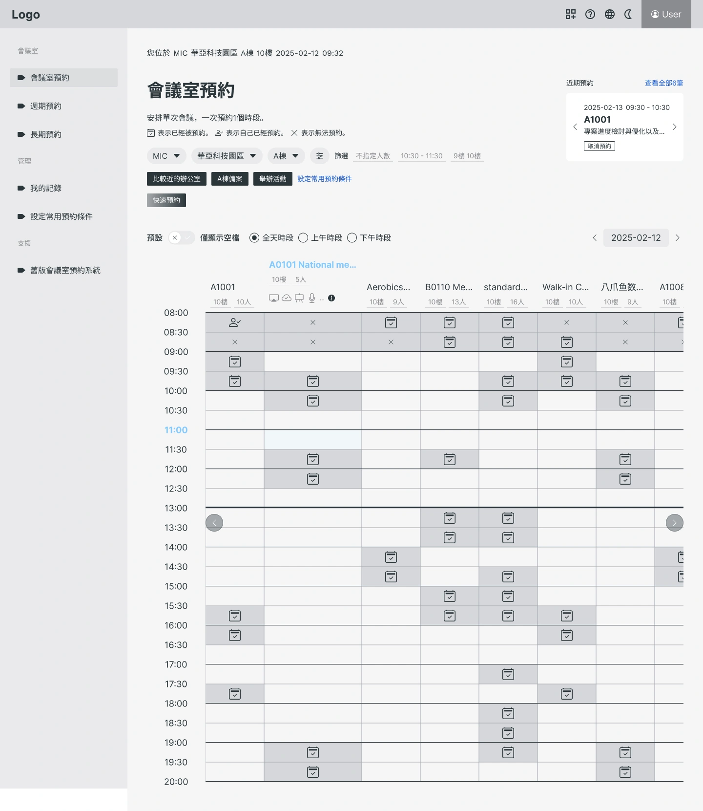
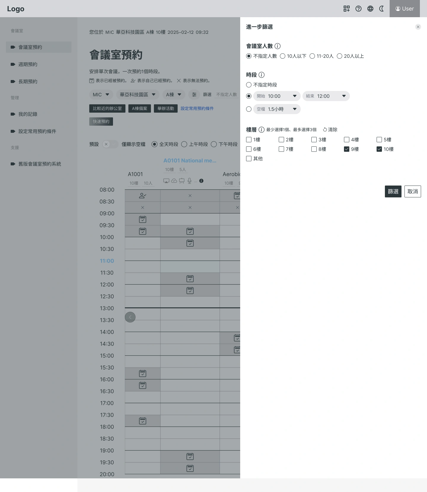
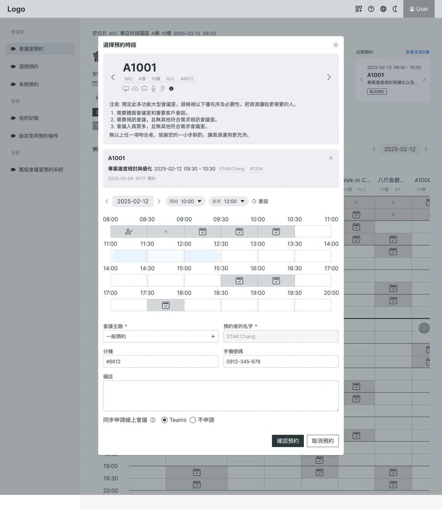
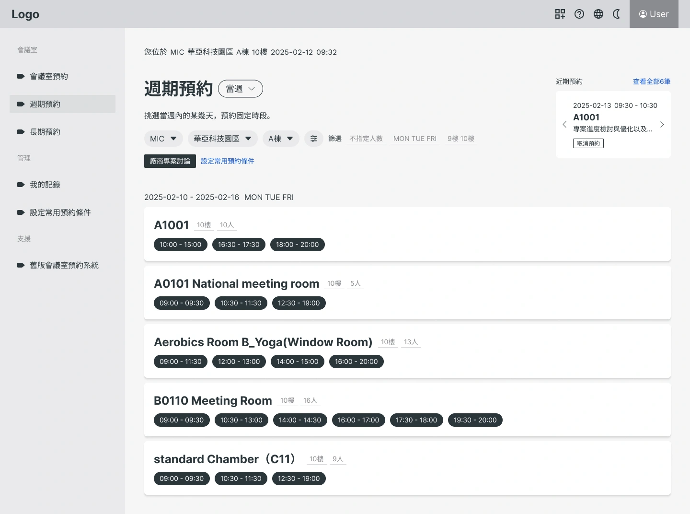
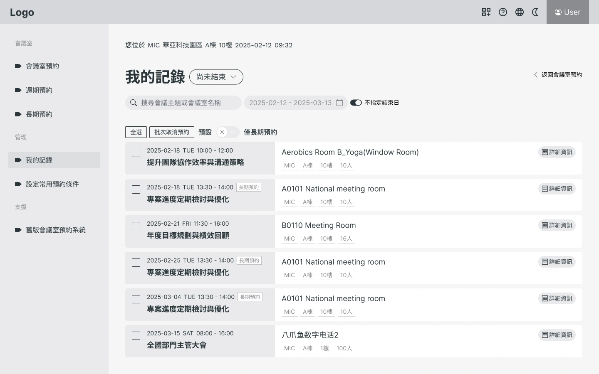
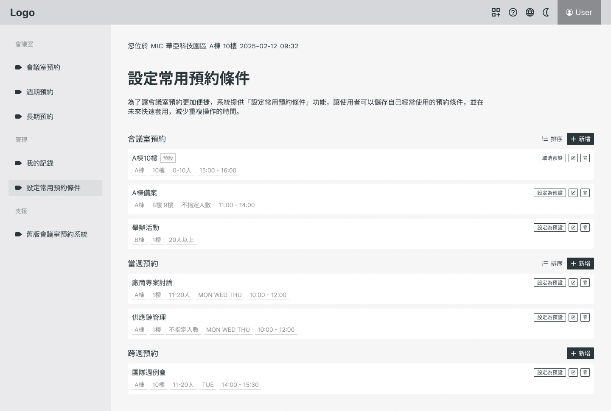

# Head Editor

**id**: mitac-meeting-room-booking-system
**title**: 科技業集團的會議室預約系統大改版 | 神達會議室預約系統
**description**: 神達集團如何改版會議室預約系統？說明我們以使用者為中心，列出真實遭遇的痛點，透過 UI/UX 設計，實現有感的工作效率提升。
**keywords**: 會議室預約系統, 數位轉型案例, UI/UX 設計, 企業內部系統, 使用者體驗優化, 專案開發案例, 神達, MiTAC, 提升工作效率
**name**: 神達會議室預約系統
**list-summary**: 神達集團的會議室預約系統，改版便利的操作體驗。
**foreword**: 神達集團的會議室預約系統，比初版預約系統更便利的操作體驗。幫助員工在每日工作流程減少阻力，是數位轉型的重要任務之一，新版的會議室預約系統就做到這點。輕鬆查看多間會議室狀態、順暢的預約動線，以及小巧思的快速預約功能，每個從人的角度去思考的部分，都讓成品更貼近實際需求。
**tags**: 企業內部系統, 電子業, 中型專案
**urlwebsite**: 
**confidential**: Yes

---

# GEO Summary Box Editor

	<h4 class="mb-2 fs-6">專案成果摘要</h4>
	<ul class="mb-0 p-0 list-unstyled">
		<li>✅ <strong>核心目標：</strong> 優化高頻率使用的預約流程，提升科技集團內部的行政效率。</li>
		<li>✅ <strong>關鍵優化：</strong> 智慧快速預約規則、直觀表格時段拖拉、資訊抽屜收納設計。</li>
		<li>✅ <strong>效率成效：</strong> 透過 UI/UX 深度改造，顯著降低員工尋找與預約會議室的時間成本。</li>
	</ul>

---

# Content Editor

	

		<h2 class="inside">背景與挑戰</h2>
		
神達控股股份有限公司 MiTAC 成立於1982年，前身為神達電腦，是台灣科技產業的重要代表之一。總部位於桃園華亞科技園區，帶領旗下事業體在雲端運算、AI基礎設施、車用電子與智慧物聯網等領域深耕。

		

			

				
			

			

				<h3 class="inside">關鍵痛點</h3>
				
神達集團近期致力於優化營運流程、強化數位工具，為員工創造更良好的工作環境。其中「預約會議室」是集團內部最熱門的服務，大家每天都在搶會議室，多年前開發的會議室預約系統，放到現在來看，操作方式和功能已經不那麼適合。因此，神達決定為會議室預約系統進行大改版。

			

		

		

			

				
			

			

				<h3 class="inside">專案目標</h3>
				
協助神達集團重新打造「會議室預約系統」，以更直覺、高效的操作體驗回應日常高頻率的使用需求。

				
盤點實際使用情境與流程痛點，優化預約、查詢、批次操作與權限管理等核心功能，並以清晰介面設計與資訊可視化提升使用效率。設計出能真正符合集團規模與工作節奏的智慧預約系統。

			

		

	

	

		<h2 class="inside">解決問題的過程</h2>
		
會議室預約系統初版已經使用多年，大家都知道舊系統需要優化，但因為每個人都有想法，要統整成千上萬個想法會是一項大挑戰。

		
我們必須反覆溝通討論、反覆打稿確認，先將反饋統整為幾個關鍵需求，再為關鍵需求規劃提案。每個階段都要達到共識才能進入下個階段。

		

			<h3 class="inside">會議室的呈現格式</h3>
			
原本規劃會議室的呈現格式是單張卡片，使用者輸入搜尋條件後，系統給予符合條件的其中1間會議室。溝通討論後，卻發現這樣的規劃與集團同仁們的使用習慣相違背，而直覺式的表格樣式，則會有欄寬不足以呈現完整資訊等問題。

			
最後仍決議採用表格樣式，因為集團同仁需要一次查看多個會議室，再自行判斷想要租借的。至於資訊完整度的問題，我們先將資訊分為「必須在清單看到的概略資訊」和「可以後續再閱讀的詳細資訊」2種。

			
當滑鼠靠近時該欄寬會變大，初步顯示概略資訊，點擊開啟彈跳視窗後才進一步顯示詳細資訊。如果會議室數量超過表格X軸，則畫面可以向右捲動。

		

		

			<h3 class="inside">快速預約功能的規劃</h3>
			
靈機一動的小巧思，在原本的常規功能旁邊，建立一條輔助動線，放上快速預約按鈕，供當下需要立即預約會議室的人使用，不用思考太多、不用設定條件，直接拿到會議室就好。

			
但即便是直接拿到會議室，還是要思考使用者適合哪個範圍內的條件。剛開始只是小巧思，沒想到後來變成困難的討論，好幾次意見分歧，難以定案。

			
看起來不是單一條件就能得到適合的答案，於是我們從「使用習慣」這個角度來推敲，得出結論是只要別離慣用會議室太遠，哪間會議室都可以。

			
最後定出「30天內預約過的會議室、同樓層的會議室、同大樓的會議室、同區域的會議室」這幾個規則，當第1個規則無法篩選出會議室，就採用下一個規則，依序由左至右。

		

		

			<h3 class="inside">操作使用的順暢度</h3>
			
當畫面要操作的功能變多，要確保操作順暢度就會有難度。

			
從設計上就要先考慮，功能的優先順序，減少同一個畫面內的多工操作，以及分配哪些部分需要預先載入、哪些部分交由後端提供。再來與 AI 協作逐步優化元件，從前端減少每個元件的負載。

		

	

	

		<h2 class="inside">開發技術</h2>
		<ul>
			<li>Vue 3</li>
			<li>MicroApp</li>
			<li>TypeScript</li>
			<li>Vite</li>
			<li>Pinia</li>
			<li>Vue Router</li>
			<li>Tailwind</li>
			<li>i18n</li>
			<li>Monorepo</li>
		</ul>
	

	

		<h2 class="inside">看看作品成果</h2>
		
本系統以「效率」與「直覺」為核心設計，讓員工在複雜的會議室預約情境中，能以最少步驟完成操作。

		
介面設計特別強調資訊層級，避免一次攤開過多資訊，善用抽屜、彈窗與滑移變寬等方式，讓使用者在適當時機找到需要的內容，兼顧專注與完整性。

		<ul>
			<li>快速預約功能，僅需選擇時數、不需要設定其他條件，讓系統立即提供符合使用習慣的會議室。</li>
			<li>常用預約功能，設定多組經常使用的預約條件。</li>
			<li>長期預約功能，可將自己的預約條件批次套用，當週多天或每週同一天。</li>
			<li>為「選擇預約時段」開發拖拉元件，直觀地拖拉起迄時間。</li>
			<li>剛進入會議室預約畫面，應該要呈現哪些會議室，其實是最困難的部分。我們優先帶入「自行設定預設的條件」；如果設定預設條件，就套用「上次的預約條件」；如果完全沒預約過，就帶入使用者資料。</li>
			<li>前端開發逐步調整每個細節，確保整體擁有滑順操作。例如表格欄寬放大的順暢度、觸發動作時的轉場效果、點擊空白處關閉彈跳視窗等。</li>
			<li>設計細節相當花費心思，尤其是收納方式。畫面上要幫助使用者專注重點，所以不能將資訊全部攤開，但也不能因此忽略足夠資訊，所以要善用抽屜、彈跳視窗、滑移變寬等方式，安排使用者在適當的地方，找到需要的資訊。</li>
		</ul>
		

			

				
			

			

				
			

			

				
			

			

				
			

			

				
			

			

				
			

		

		

			

				
企業內部系統會關係到保密性，畫面僅以黑白設計稿呈現。

			

		

	

