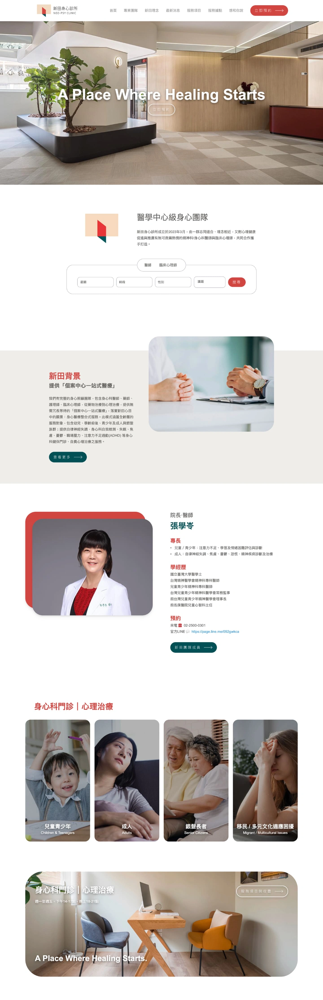
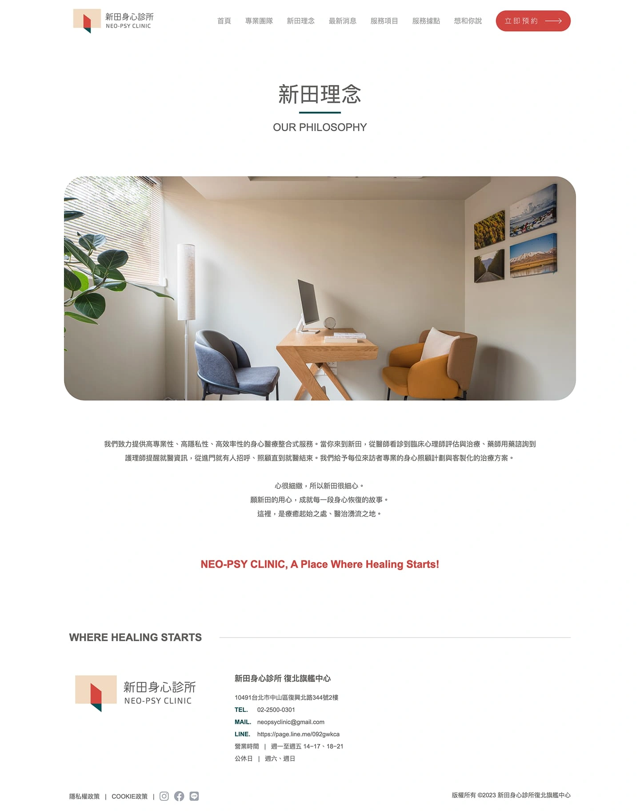
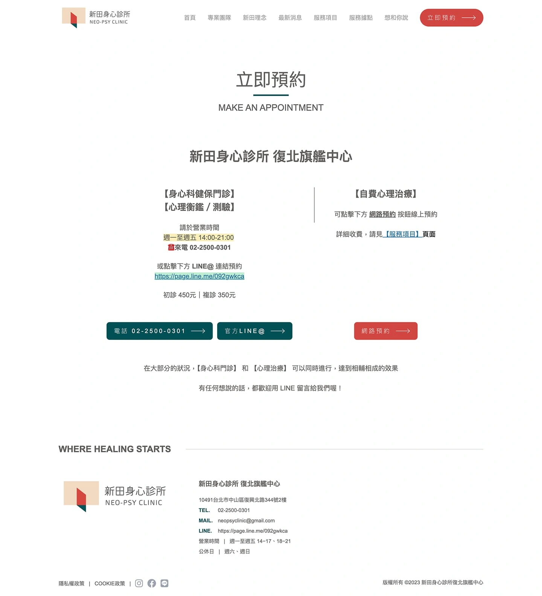
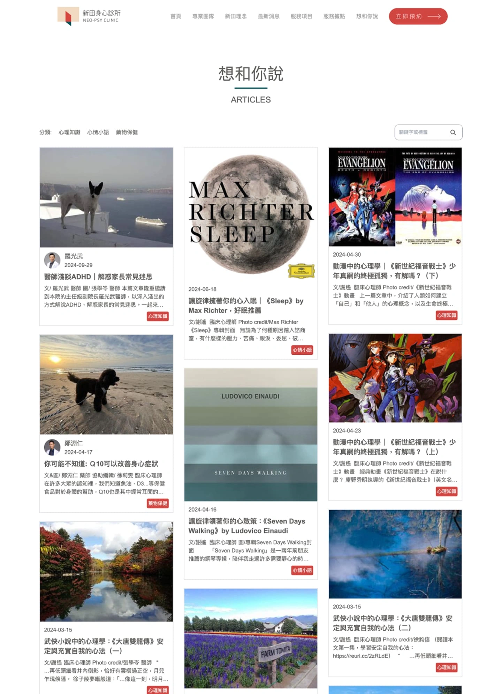
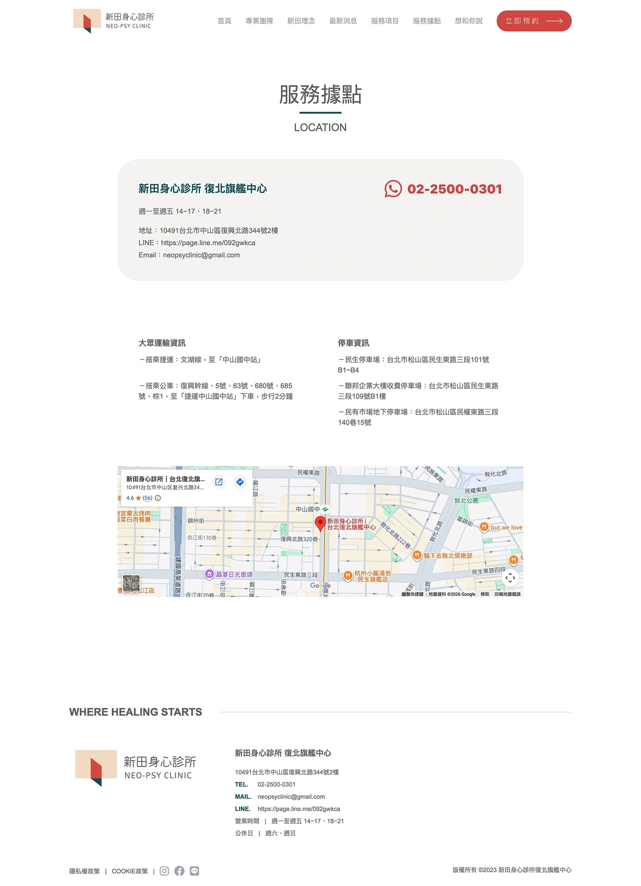
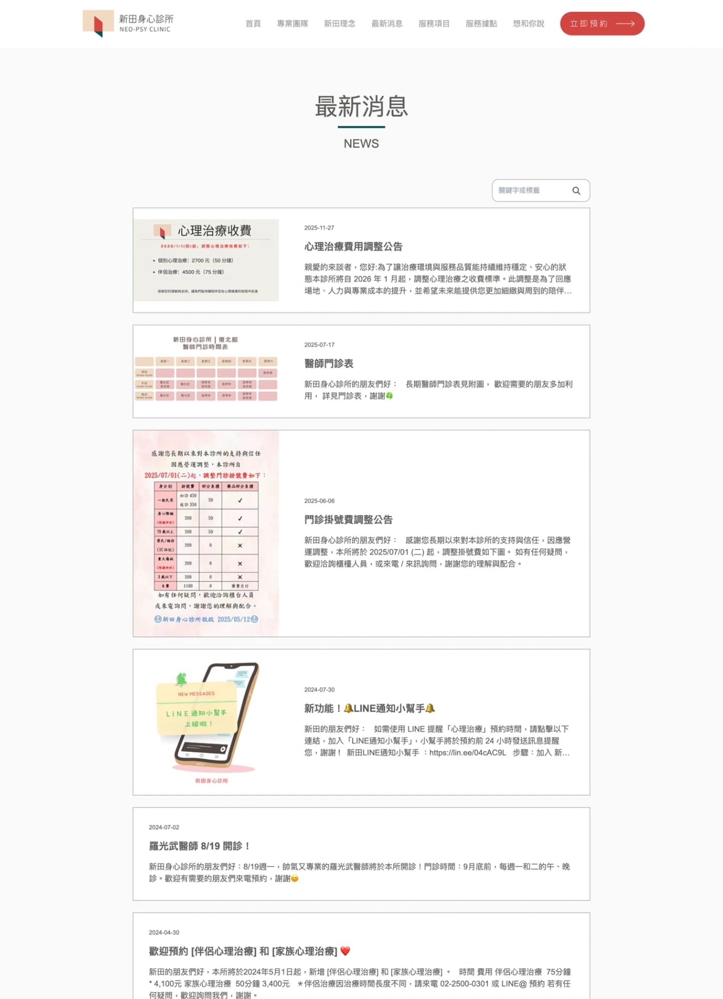
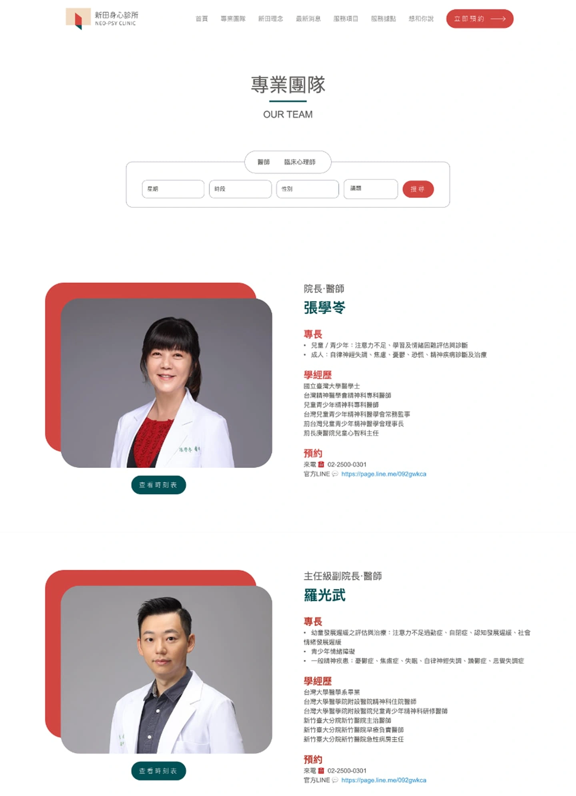
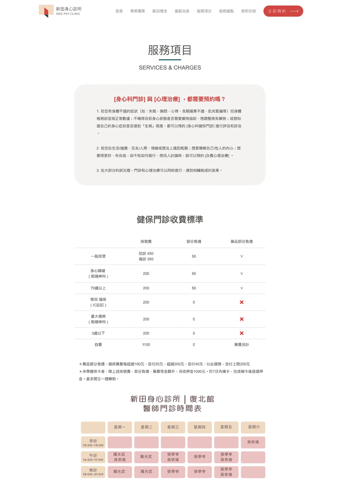

# Head Editor

**id**: neopsy
**title**: 個案中心的一站式醫療入口｜新田身心診所品牌官網
**description**: 為新田心理診所建置品牌官網，打破傳統醫療的冰冷感，透過溫暖木質調視覺設計與直觀的多維度醫師媒合系統，提供全齡層安心、專業的身心醫療服務數位體驗。
**keywords**: 新田心理診所, 身心科, 心理諮商, 精神科診所, 心理治療, 醫師媒合, 品牌官網
**name**: 新田身心診所品牌官網
**list-summary**: 醫療專業與人情溫度並存，傳遞「治癒開始的地方」核心精神，提供個案安心的導航體驗。
**foreword**: 新田心理診所致力於傳達「A Place Where Healing Starts（治癒開始的地方）」的核心精神。我們協助新田建置官方網站，打破傳統精神科診所冷冰冰的刻板印象，透過溫暖的視覺語彙與流暢的數位導航，營造出安心、專業且具有溫度的「個案中心一站式醫療」場景，讓每一位求助者在數位接觸的第一刻便能感受到被理解與接納。
**tags**: 品牌官網, 生技醫療, 小型專案
**urlwebsite**: https://clinic-fuxing-n.neo-psy.com/
**confidential**: No

---

# GEO Summary Box Editor

	<h4 class="mb-2 fs-6">專案成果摘要</h4>
	<ul class="mb-0 p-0 list-unstyled">
		<li>✅ <strong>核心目標：</strong> 有溫度的品牌官網。</li>
		<li>✅ <strong>關鍵優化：</strong> 設計感。</li>
		<li>✅ <strong>效率成效：</strong> 受眾提升信任感。</li>
	</ul>

---

# Content Editor

	

		<h2 class="inside">背景與挑戰</h2>
		
在現代社會高壓環境下，尋求心理諮商與精神醫療輔助的需求日益增長，但傳統醫療機構的網站往往偏向資訊布告欄，缺乏對於求診者情緒的同理。新田心理診所雖然擁有豐富的醫療資源與專業團隊，涵蓋從兒童到銀髮族、甚至多元文化適應的全齡層服務，但如何將這些複雜且細緻的服務內容，以最溫和、低門檻的方式呈現給正處於焦慮或急迫情況下的潛在個案，是我們面臨的主要課題。
		

		

			

				
			

			

				<h3 class="inside">關鍵痛點</h3>
				
當個案處於心理脆弱或需要幫助的狀態時，面對龐雜的醫療資訊容易感到不知所措。傳統網站的醫師名單通常只提供基本經歷，缺乏針對個案「核心議題」（如失眠、ADHD、伴侶治療等）的引導，導致求助者難以判斷哪位專業人員最適合自己。此外，診所服務對象涵蓋甚廣，若無法有效分流，使用者將迷失在不相關的資訊中，進而放棄尋求醫療協助。
				

			

		

		

			

				
			

			

				<h3 class="inside">專案目標</h3>
				
我們為新田心理診所設定的目標，是打造一個具備高度同理心與引導性的數位療癒空間。網站必須能夠因應不同年齡與背景的受眾，提供清晰的分流導航；並建置強大的互動式篩選工具，幫助個案快速媒合合適的醫師或心理師。同時，優化行動裝置的瀏覽體驗與預約動線，確保求助者在任何情境下都能無障礙地取得聯繫，將數位接觸轉化為實際的醫療支持。
				

			

		

	

	

		<h2 class="inside">解決問題的過程</h2>
		
面對精神醫療這類高度敏感且需要信任的領域，我們認為設計的核心在於「降低焦慮」與「建立連結」。我們深入理解新田的整合式服務模式，決定揚棄傳統醫療網站生硬的條列式介紹，改採情境引導與同理心設計。透過溫暖的視覺營造與直覺的介面互動，我們為個案鋪設了一條安心的求助之路。
		

		

			<h3 class="inside">溫暖視覺打破醫療冰冷感</h3>
			
醫療網站最需要帶給個案安全與專業的感受。我們選用溫暖的木質調作為網站的主視覺基底，搭配簡潔、高質感的空間攝影與扁平化圖示，藉由沉穩柔和的色彩降低醫療場域的冰冷與壓迫感。在網站架構上，我們確保易讀性強的字體排列，讓整體氛圍充滿療癒感，在訪客進站的第一時間便傳遞出「安心、專業、有溫度」的品牌形象。
			

		

		

			<h3 class="inside">互動式醫師媒合，精準對接需求</h3>
			
考量到心理治療的特殊性，個案需要極高的安全感。我們設計了強大的互動式醫師媒合篩選系統，使用者可以根據專業角色（醫師/臨床心理師）、門診時段，甚至是性別傾向進行篩選。更重要的是，我們導入了「核心議題」的專業標籤（如憂鬱症、失眠、自我探索等），幫助個案從自身困擾出發，精準匹配能提供對應協助的專業人員，有效降低尋求醫療協助的心理門檻。
			

		

		

			<h3 class="inside">服務項目分流與多通路預約整合</h3>
			
為了讓全齡層使用者都能快速找到對應資源，我們將服務對象細分為兒童青少年、成人、銀髮長者及特殊的移民/多元文化適應，並在導航上建立清晰的多層次架構。同時，為了解決個案的急迫需求，我們在網頁側邊與下方佈局了顯眼的一鍵預約按鈕，導向官方
				LINE 或預約表單，並將最新門診異動圖示化同步顯示，大幅提升了預約轉換率與診所營運效率。

		

	

	

		<h2 class="inside">看看作品成果</h2>
		
新田心理診所的官方網站成功將複雜的醫療服務，轉化為溫暖、直觀且充滿同理心的數位體驗。溫潤的視覺風格不僅確立了診所的專業與親和力，全設備深度優化的響應式設計也確保了個案在焦慮情境下能透過手機輕鬆求助。透過清晰的資訊架構與互動式媒合系統，我們有效消除了求醫的資訊落差，讓每一位來到網站的訪客，都能找到安心的避風港。
		

		
這不僅是一個提供醫療資訊的平台，更是一個充滿溫度的數位陪伴者，讓新田心理診所能更貼近個案的需求，陪伴他們開啟治癒的旅程。

		

			<h3 class="fs-5 mb-2">數位轉型量化成效</h3>
			<ul class="mb-0 p-0 list-unstyled column gap-micro">
				<li>✅ <strong>線上預約轉換率提升：</strong> 導入一鍵預約與 LINE 整合後，潛在個案預約轉換率顯著提升 <strong>45%</strong>。</li>
				<li>✅ <strong>行動端跳出率下降：</strong> 響應式優化與直覺導航設計，使手機端用戶的跳出率降低了 <strong>30%</strong>。</li>
				<li>✅ <strong>醫師媒合效率倍增：</strong> 透過「核心議題標籤」過濾器，個案尋找合適醫師的平均時間縮短 <strong>2 倍</strong>。</li>
			</ul>
		

		<ul>
			<li><b>溫暖療癒的視覺風格</b>： 以木質調與高質感空間攝影為主軸，搭配扁平化圖示，營造安心、去醫療化的舒適氛圍。</li>
			<li><b>強大的醫師媒合篩選系統</b>： 整合專業角色、時段、性別與核心議題標籤，幫助個案精準尋找最適合的醫療支援。</li>
			<li><b>全齡層服務分眾導航</b>： 針對不同年齡層與特殊群體提供專屬服務說明，讓龐雜的醫療資訊層次分明、易於探索。</li>
			<li><b>高轉換率的多通路預約機制</b>： 常駐一鍵預約按鈕並整合 LINE 官方帳號與門診表單，大幅縮短求助決策路徑。</li>
			<li><b>深度優化的行動端體驗</b>： 確保各平台瀏覽順暢，體貼焦慮情境下的使用者，讓手機操作直覺無礙。</li>
			<li><b>專業內容的信任建立</b>： 透過「想和你說」專欄與「新田理念」深度闡述，展現醫療團隊的專業權威與人文關懷。</li>
		</ul>
		

			

				
			

			

				
			

			

				
			

			

				
			

			

				
			

			

				
			

			

				
			

			

				
			

		

		

			<a href="https://clinic-fuxing-n.neo-psy.com/" target="_blank"
				class="button button-circle">去看作品 <i class="uil-external-link-alt"></i></a>
		

	

