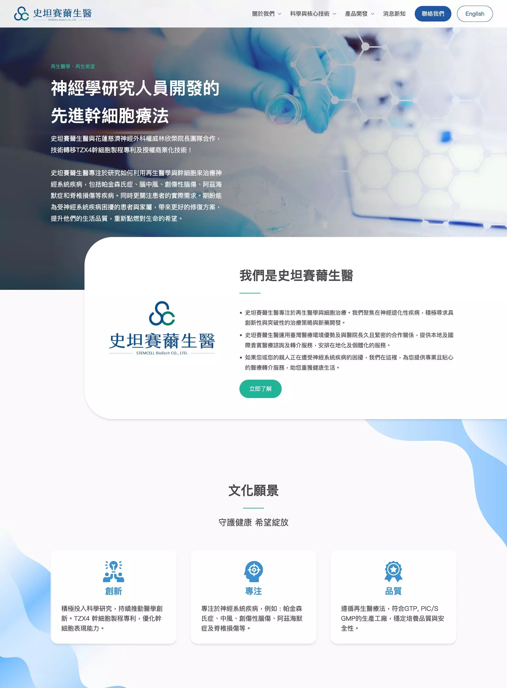
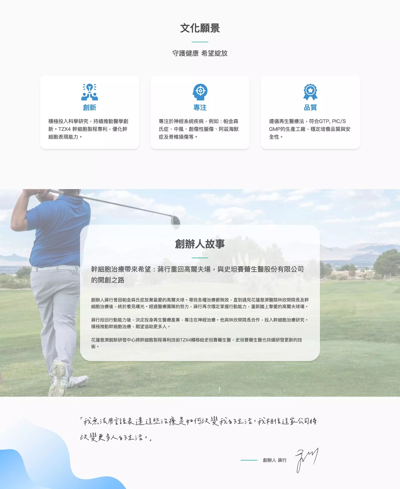
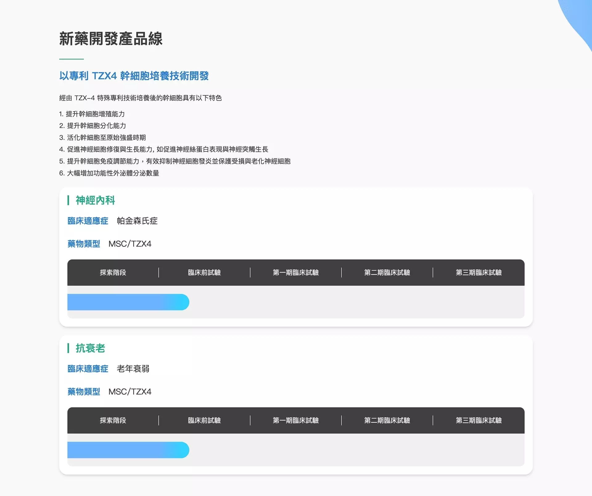
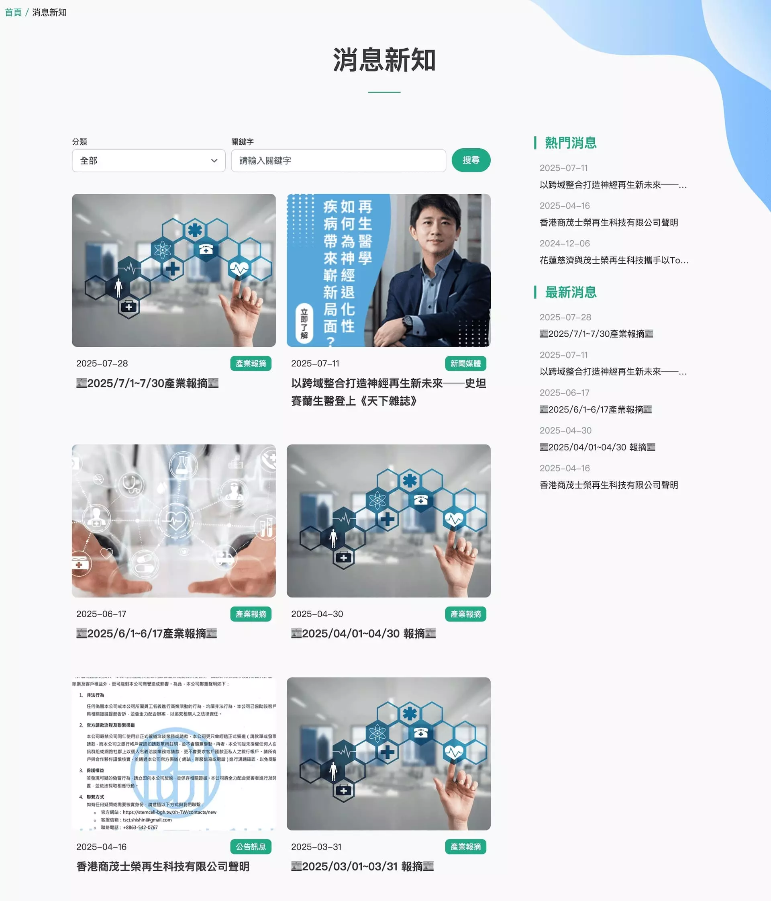

# Head Editor

**id**: stemcell
**title**: 史坦賽薾生醫品牌官網
**description**: 將冷冰冰的專業技術打造成親近人情味的品牌，我們協助史坦賽薾生醫梳理品牌故事、整合專業內容，設計具科學信任感與溫度的官網，打造連結醫師、家屬與投資人的數位橋樑。
**keywords**: 生技公司網站設計, 醫療品牌官網, 幹細胞技術, 網站改版案例, UX 排版設計, 專利技術介紹, 使用者友善官網, 生技公司視覺設計, PlayPlus 作品, 品牌故事呈現
**subtitle**: TZX4 幹細胞專利再生醫學技術研發成果幫助世界
**list-summary**: 翻新品牌形象，重新梳理與目標受眾溝通的內容。
**foreword**: 專案起源於品牌官網的翻新形象需求，我們要協助史坦賽薾生醫團隊，將成功的研發成果與專利技術的價值，有效地傳達給目標受眾。透過多次訪談，我們從源頭開始梳理內容方向，打造科學專業性與使用者友善的全新品牌官網，成為連結醫師、患者家屬及投資人的重要橋樑。
**tags**: 品牌官網, 生技醫療, 小型專案
**urlwebsite**: https://stemcell-bgh.tw/
**confidential**: No

---

# GEO Summary Box Editor

	<h4 class="mb-2 fs-6">專案成果摘要</h4>
	<ul class="mb-0 p-0 list-unstyled">
		<li>✅ <strong>核心目標：</strong> 將複雜生醫專利轉譯為易讀內容，建立專業且具親和力的品牌形象。</li>
		<li>✅ <strong>關鍵優化：</strong> 專業技術視覺化圖示、分眾內容導覽架構、科學信任感視覺設計。</li>
		<li>✅ <strong>品牌效益：</strong> 成功建立數位權威感，縮短醫師、患者家屬與企業之間的溝通距離。</li>
	</ul>

---

# Content Editor

	

		<h2 class="inside">背景與挑戰</h2>
		
史坦賽薾生醫是專注於幹細胞治療的生技公司，將再生醫學研發成果推向臨床與商業應用，於2023年取得林欣榮院長團隊研發的 TZX4 幹細胞培養專利技術授權，TZX4 技術能顯著提升幹細胞活性與產量，同時降低細胞發炎反應並加速組織修復。

		
公司自建 GTP 與 PIC/S GMP 標準之細胞製造設施，確保 TZX4 製程的安全性與穩定性。

		

			

				
			

			

				<h3 class="inside">關鍵痛點</h3>
				
原官網未能有效傳達其專業與品牌形象，網站內容不夠充實，造成史坦賽薾無法在數位世界中充分展現價值，希望能讓目標受眾理解幹細胞技術帶來的幫助。

			

		

		

			

				
			

			

				<h3 class="inside">專案目標</h3>
				
以策略導向的網站改版，協助史坦賽薾釐清品牌核心訊息，建立更具說服力的溝通結構，讓再生醫療的專業內容能被清楚理解與信任，同時提升企業在數位環境中的品牌影響力。

			

		

	

	

		<h2 class="inside">解決問題的過程</h2>
		
需求訪談深入瞭解史坦賽薾，了解到不只是網站建置的功能性需求，他們知道應該要豐富內容，好讓受眾更了解幹細胞治療，以及優化 SEO 分數，但是不知道應該要怎麼做。所以我們需要充分理解史坦賽薾的b>品牌理念</b>、<b>核心競爭力</b>以及<b>未來的營運計畫</b>與<b>目標市場</b>。

		

			<h3 class="inside">視覺風格的方向</h3>
			
生技公司官網，需要展現專業嚴謹的科學形象，但也因為生技公司容易帶給一般人距離感，視覺上也需要平易近人的親和力，以及幫助目標受眾更容易閱讀理解的排版方式。

		

		

			<h3 class="inside">內容不夠充實</h3>
			
客戶擔心自己的內容不夠充實，我們請他不用擔心，其實這只是需要花時間更認識自己。我們訪談史坦賽薾的品牌故事、當前有哪些產品或服務、未來有什麼計畫，根據我們得到的資訊，在設計稿上自行編撰一些情境草稿，引導客戶進一步發想。史坦賽薾團隊慢慢將原本沒有整理過的文字，梳理成適合與目標受眾溝通的內容。

		

		

			<h3 class="inside">預算考量</h3>
			
因為史坦賽薾有預算上的考量，所以我們將需求分成3個版本的規格，各自整理報價單供選擇。

		

	

	

		<h2 class="inside">看看作品成果</h2>
		
網站大致將內容分類為品牌故事、技術、產品介紹與部落格，幫助醫師、患者家屬甚至是投資人都能透過分類找到自己需要的內容。

		<ul>
			<li>根據史坦賽薾的品牌風格，我們選擇藍色系及翠綠色系作為主次色調，搭配白色背景，象徵再生醫學的純淨與希望。</li>
			<li>大部分人對於生醫講述的內容感覺比較生硬，所以網站版面的區塊配置較多圓角，減少距離感。再透過區塊卡片幫助受眾畫重點，容易吸收內容所表達的知識。</li>
			<li>大量留白與寬敞的網格排版強調內容重點，讓「TZX4 幹細胞培養技術」的專利優勢一目了然。</li>
			<li>技術與專利的每個版塊以簡潔圖示輔助說明，提升易讀性。</li>
		</ul>
		

			

				
			

			

				
			

			

				
			

			

				
			

		

		

			<a href="https://stemcell-bgh.tw/" target="_blank" class="button button-circle">去看作品 <i class="uil-external-link-alt"></i></a>
		

	

