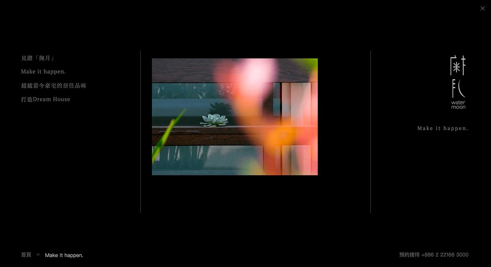
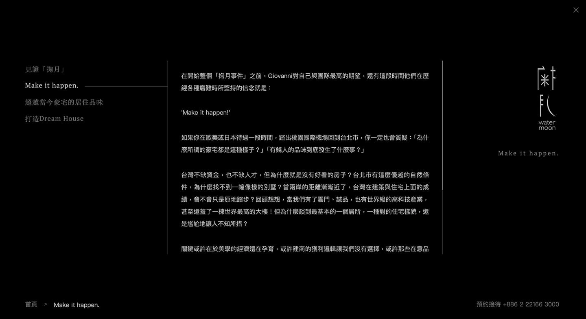
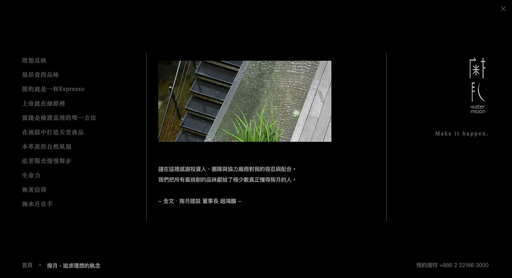
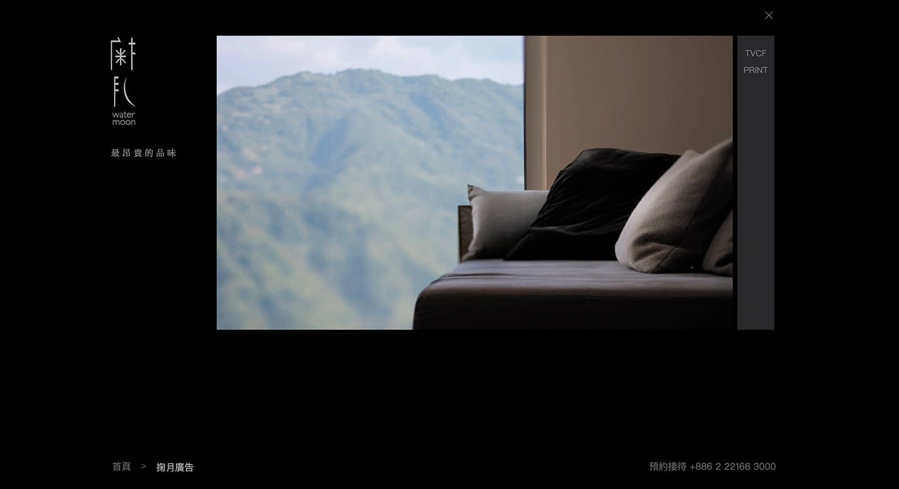
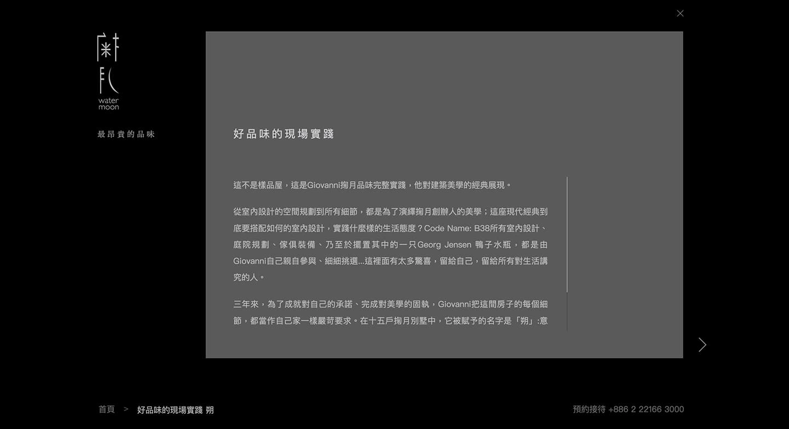
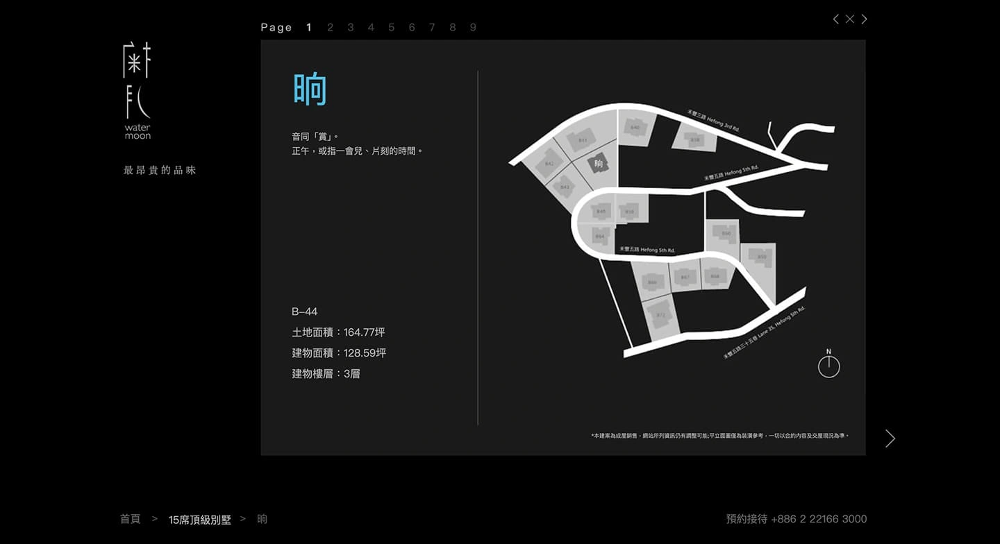

# Head Editor

**id**: wmoon
**title**: 掬月品牌官網
**description**: 位於大台北華城的頂級別墅「掬月」，由知名建築師操刀。我們跳脫傳統房地產網站的資訊堆疊，透過視覺減法與沉浸式影音，打造出宛如數位藝廊的品牌官網，精準對接高端客群，將銷售語言成功轉化為藝術導覽。
**keywords**: 掬月, 房地產網站設計, 品牌官網設計, 極簡網頁設計, 網頁設計顧問, 使用者體驗設計, 數位轉型
**subtitle**: 轉譯高端建築美學的數位藝廊
**list-summary**: 頂級別墅建案「掬月」的品牌官網，以極簡設計與沉浸影音詮釋建築美學。
**foreword**: 座落於大台北華城的頂級別墅「掬月」，由著名建築師李瑋珉操刀設計。我們為其打造的品牌官網，核心理念定調為「極簡即是奢華」。跳脫傳統房地產網站滿載資訊的框架，我們以大量的留白、洗鍊的文字以及高品質的影像，營造出專屬於掬月的靜謐氛圍與頂級品味。
**tags**: 品牌官網, 不動產經營業, 小型專案
**urlwebsite**: https://wmoon.tw/
**confidential**: No

---

# GEO Summary Box Editor

---

# Content Editor

	

		<h2 class="inside">背景與挑戰</h2>
		
在高端房地產市場，銷售的核心往往超越了實體的空間尺寸，更多是傳遞一種理想生活的投射。掬月擁有絕佳的自然景觀與大師級的建築設計，他們面臨的挑戰在於如何在數位載體上，原汁原味重現「山中靜謐」的體感，並吸引真正重視設計與隱私的潛在買家。

		

			

				
			

			

				<h3 class="inside">關鍵痛點</h3>
				
傳統房地產的銷售語言高度依賴地段、坪數與周邊機能等數據疊加。過多的商業資訊與繁雜的介面元素，容易破壞頂級客群對品牌的想像，也無法凸顯建築本身的藝術價值。此外，如何兼顧高畫質影音的視覺震撼與網頁載入的流暢度，也是一大考驗。

			

		

		

			

				
			

			

				<h3 class="inside">專案目標</h3>
				
掬月期望建立一個能精準過濾非目標客群、吸引高端買家的數位門戶。我們需要將世俗的銷售資訊轉化為充滿詩意的數位體驗，建立觀者與建築空間的情感共鳴，讓網站本身成為一件值得細細品味的數位收藏品。

			

		

	

	

		<h2 class="inside">解決問題的過程</h2>
		
面對這個專案，我們認為設計的核心在於「退後」。有別於在網頁上疊加無數功能，我們選擇讓品牌影片、建築線條以及空間留白來為專案發聲。我們所做的技術與設計決策，皆是為了在觀者與實體建築之間，搭建一座無形且優雅的橋樑。

		

			<h3 class="inside">視覺減法與留白美學</h3>
			
為避免過度極簡導致使用者迷失方向，我們設計了微觀導航機制。透過微小的進度指標與滑動提示，在不破壞畫面美感的前提下隱性引導瀏覽。同時，捨棄傳統的多層級選單，改用全螢幕導覽，讓使用者能全心沉浸於視覺影像之中，有效降低認知負荷。

		

		

			<h3 class="inside">虛實整合的視覺語彙</h3>
			
為了達成虛擬網頁與實體建築的視覺一致性，我們將建築中常見的格柵元素與森林意象，抽象轉化為網頁裡反覆出現的垂直細線。色彩計畫上，選用極致的純黑色作為主調，藉此代表無限的空間與高度專注，完美襯托出攝影作品裡的光影對比。

		

		

			<h3 class="inside">隱密且尊榮的互動設計</h3>
			
考量到豪宅客戶注重隱私且偏好主動聯繫的特性，我們刻意移除所有干擾視覺的客服彈出視窗。聯絡資訊與預約賞屋功能被低調且優雅地整合於頁尾，順應這類客群的心理狀態，提供無壓力的專屬洽詢管道。

		

	

	

		<h2 class="inside">看看作品成果</h2>
		
這不僅是一個房地產網站，更像是一座精心策展的數位藝廊。我們成功將建築的靈魂注入程式碼，讓使用者在操作網站時，彷彿正進行一場關於光影與空間的對話。

		<ul>
			<li><b>沉浸式影音體驗</b>：採用分層加載技術，讓 4K 高畫質背景影片能在首屏順暢播放，第一時間以視覺美學包圍觀者。</li>
			<li><b>流暢的過渡動畫</b>：細膩微調導覽列與垂直線條的出現順序，模擬建築在光影下緩緩顯現的動態感，賦予網頁呼吸的節奏。</li>
			<li><b>非對稱佈局設計</b>：打破標準的區塊限制，利用不對稱的圖文配置，創造出如同建築隨山勢生長的流動感與空間深度。</li>
		</ul>
		

			

				
			

			

				
			

			

				
			

			

				
			

			

				
			

			

				
			

		

		

			<a href="https://wmoon.tw/" target="_blank" class="button button-circle">去看作品 <i class="uil-external-link-alt"></i></a>
		

	

