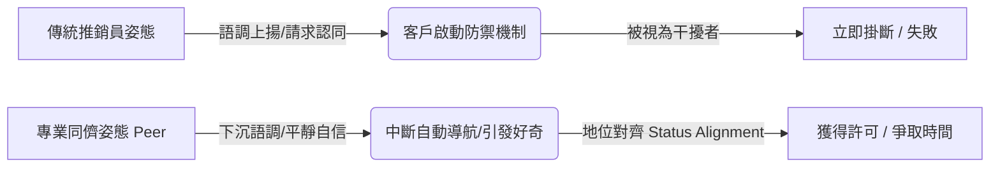
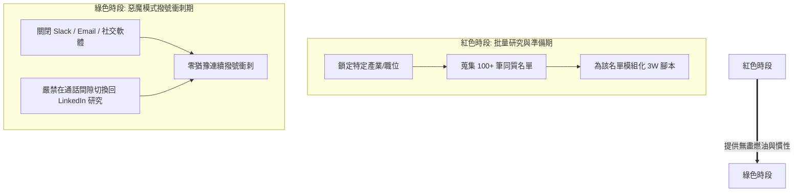
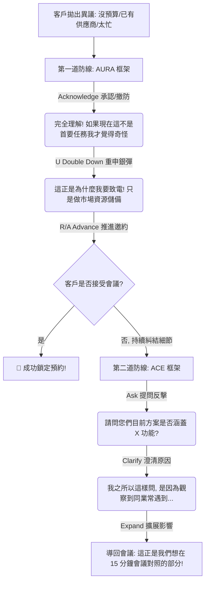
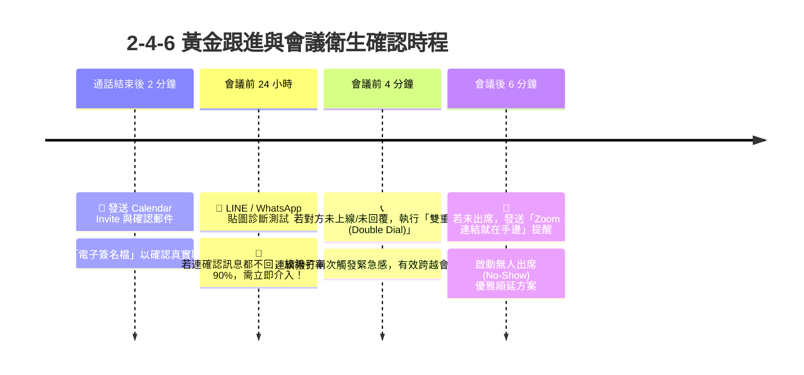
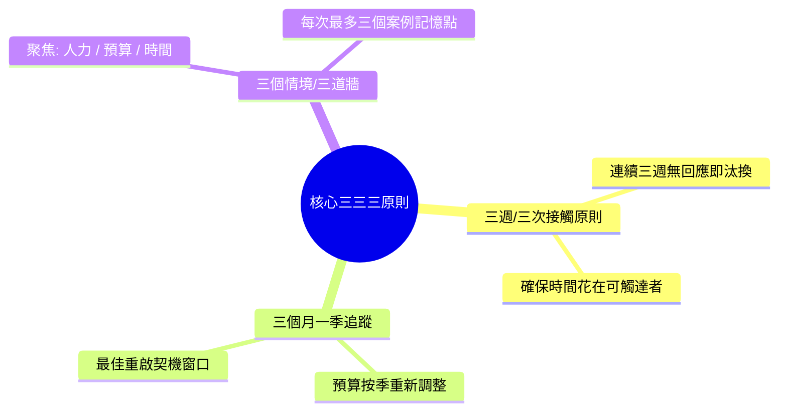

# 🚀 B2B Cold Call 新進人員業務指南：從 0 到 1 的陌生開發與高價值商務支配體系

> **📚 權威指導來源簡介**  
> 本指南彙整自全球與國內頂尖 B2B 銷售專家的實戰精華，融會貫通了以下核心知識體系：  
> 1. **後 AI 時代的深度商務關係拓展（小老闆充電站）**：著重於戰略篩選、核心證據洞察、區域文化差異與心理博弈。  
> 2. **銷售開發策略白皮書與標準作業程序（B2B 新手必修課）**：著重於優先級矩陣、決策權限識別、非辦公時間突圍與「三三三原則」。  
> 3. **系統化冷撥與 SDR 產能引擎（Cold Call Course）**：著重於專家聲調、模式中斷、問題主張（毛茸茸棒棒糖）與宮城先生導流法。  
> 4. **3W 公式與每日 100 撥打傳奇體系（Connor Murray）**：著重於「銷售時間」心法、下沉語調、彈簧蓄力、時區瀑布與 AURA/ACE 異議處理。  
> 5. **IBM 亞太區高階商務與決策戰略（The IBM Way）**：著重於「兩好三壞」模型、成交三要素、創新交易結構設計與銷售複利。  
> 
> **🎯 指南定位**：這不只是一份電話銷售話術手冊，而是一套引領新進業務人員從「恐懼陌生撥號的推銷員」，成長為「主導流水線（Pipeline）與高階決策溝通的戰略商務顧問」的全方位行動綱領。

---

## 🧭 前言：後 AI 時代的銷售重塑與業務職人精神

在資訊過載與 AI 自動化生成內容（AIGC）氾濫的後工具時代，許多標準化的執行動作正迅速被演算法與機器人取代。然而，在 B2B 的高客單價與複雜採購環境中，**「銷售力」與「人際溫度」**不僅沒有貶值，反而成為最稀缺、最具溢價能力的終極競爭力。

### 1. 破除推銷迷思：銷售是「價值對接」與「觀點認同」
大眾常將銷售與「求人、欺騙、低地位、滔滔不絕」劃上等號，這是新進業務人員職涯最大的心理障礙（冒名頂替症候群 Imposter Syndrome）。
*   **本質重塑**：在真正的 B2B 專業領域，銷售是**「價值對接」與「解決問題」**的過程。你不是在求客戶買東西，而是作為一個專業的診斷者，識別對方的企業痛苦（Pain Point）後，提供具體的解藥。
*   **全場景銷售力**：銷售力本質上是「觀點對接與獲取認同」的能力。求職是證明自己是對的候選人；晉升是向主管銷售你的潛力；甚至日常相親、人際溝通，都是透過觀察對方需求（如 commuting 疲勞）並提供幫助（接送方案），將「資源」轉化為「對方感知的價值」。

### 2. 新進業務職人的三大核心素養
要在 B2B 陌生開發的戰場中屹立不搖，必須建立堅不可摧的心理基石：

| 職人核心特質 | 內涵定義與實踐原則 | 實戰商務效益 |
| :--- | :--- | :--- |
| **1. 韌性 (Resilience)** | **接受 70% 的擊球失敗率**。頂尖棒球打者的打擊率僅三成，冷撥開發的常態就是拒絕。將每一通電話視為機率演算法的一部分，而非對個人的否定。 | 縮短遭遇掛斷後的「心理恢復期」，在長達數月甚至數年的銷售長跑中保持穩定的工業級產出。 |
| **2. 利他心 (Altruism)** | **先診斷，再開藥**。絕不急於推銷自己的產品目錄（SKU），而是站在客戶的業務痛點、升遷壓力與企業風險角度思考。 | 將低階的「買賣推銷關係」升格為高階的「戰略顧問夥伴關係」，大幅擴張客戶終身價值（LTV）。 |
| **3. 誠信複利 (Integrity)** | **不奸巧、不欺瞞**。在 B2B 的小市場圈子（如台灣、亞太區）中，聲譽就是你的資產負債表（P&L）。 | 「當一個說話算話的好人」是最低成本的長線行銷。今日的基層窗口將成為明日的決策者，誠信將累積為巨大的交易複利。 |

---

## 👑 第一篇：戰略定位與心法修煉 (Mindset & Strategic Positioning)

### 1.1 Level 0：進場前的「產品內功」絕對紀律
在撥打任何一通電話、發出任何一封 Cold Email 之前，業務人員必須遵守強制執行的 Level 0 紀律：**投入至少 7 天的時間（包含下班研讀），深度掌握公司產品的競爭優勢、技術底層邏輯與解決客戶痛點的商業機制**。
> ⚠️ **戰場鐵律**：如果你無法在 30 秒內清晰論述「為什麼客戶必須與我們合作」以及「不與我們合作會損失什麼」，任何通話技巧與話術腳本都是空談！

### 1.2 權威感與地位對齊（Status Alignment）
冷撥成功的勝負決定於通話接通後的**「前 7 秒」**。當陌生聲音出現時，客戶大腦會瞬間啟動「陌生人危險（Stranger Danger）」的自動防禦機制。
*   **平庸者的死穴**：聽起來像在「乞求」對方的時間與認同，低聲下氣，瞬間將自己的社會地位拉低至「干擾者 / 推銷員」。
*   **專家同儕心態（Respected Peer）**：你必須將自己定位為與對方平起平坐的**「專業同儕」**。同儕不會卑躬屈膝，同儕說話時帶著一種「我帶著市場洞察與解決方案，本就屬於這場高階對話」的平靜與自信。



### 1.3 ICP 與 NICP：精準篩選的策略轉型
對於高階 BD 而言，時間與精力是公司最昂貴的資源。因此，**「拒絕不對的客戶」比「獲取客戶」更重要**。盲目追求名單數量只會導致專業能量的無效磨損。

#### 從「表面訊號」轉向「核心證據」
資深 BD 不會被企業的表面名氣或熱門標籤迷惑，而是透過系統性研究，尋找企業確實存在痛點的**「核心證據」**：

| 篩選維度 | 表面訊號的陷阱（乍看合適，實則浪費時間） | 核心證據與實質契合度（專家精準定位） |
| :--- | :--- | :--- |
| **技術堆疊** | 該產業目前在媒體上很熱門、概念很廣。 | 透過研究其 **JD (Job Description) 與 RNR**，確認內部正招募相關系統操作人員，證實有工具汰換或整合需求。 |
| **商業規模** | 知名國際大品牌、網站流量極高。 | 深入評估其內部營運邏輯、決策鏈條與毛利結構是否與我方解決方案產生協作效應。 |
| **決策動機** | 對方窗口口頭表示「對新科技有興趣」。 | 發現其企業內部存在明確的業務破口、迫切的數位轉型痛點或被競品搶單的外部壓力。 |
| **競爭狀態** | 正在使用競品（盲目試圖挖角）。 | 透過公開資訊或同業交流，觀察其對現有系統的不滿、當機紀錄或業務擴張瓶頸。 |

#### 開發優先級矩陣
將蒐集到的潛在名單依據**「預算」與「意願」**進行嚴格歸類，集中火力進攻最高產值的目標：

```
                    【 高意願 / 具需求 】                  【 低意願 / 無意識 】
              +-----------------------------------+-----------------------------------+
              |      🚀 第一優先（A 類名單）      |      💡 價值導引（B 類名單）      |
【 有預算 】   |  核心進攻目標！應投入最大資源與  |  具備成交潛力與購買力。需透過投   |
              |  高階客製化展示，追求快速成交。   |  報率數據與產業情報引發其競爭心。 |
              +-----------------------------------+-----------------------------------+
              |      🌱 長期培育（C 類名單）      |      ⛔ 果斷放棄（D 類名單）      |
【 無預算 】   |  目前無法成交。改以「資訊交換」  |  符合「三三三原則」汰換標準。立   |
              |  維護，作為情報源或明年度儲備。   |  即停止開發，避免浪費昂貴時間！   |
              +-----------------------------------+-----------------------------------+
```

### 1.4 跨國市場差異化：區域防禦機制與滲透戰術
在 B2B 的國際賽局中，「一招走天下」或標準化罐頭信件是致命失誤。不同區域的商業溝通文化與防禦機制迥異，必須因地制宜：

| 市場區域 | 常見防禦機制與文化特質 | 專家級戰略突破路徑 | 「So What?」戰略意義 |
| :--- | :--- | :--- | :--- |
| **🇹🇼 台灣 (Taiwan)** | 商業步調直接，但有**嚴格的總機過濾系統 (Gatekeeper)**。 | **Cold Call (電話陌生開發)** 為核心，搭配 LinkedIn 關鍵字與「非辦公時間突圍法」繞過總機。 | 展現強大的落地執行力與積極度，電話直接對談的轉換率在台灣仍居冠。 |
| **🇭🇰 香港 (Hong Kong)** | 節奏極快，**普遍無總機文化**，主管極不習慣接聽陌生推銷來電。 | 轉向 **LinkedIn 深度互動** 與 **極致精煉的 Cold Email**。 | 因無總機，Email 常直達 **C-Level** 收件匣。容錯率為零，文字品質決定生死。 |
| **🇨🇳 中國 (China)** | 商業生態高度依賴「關係」與「信任圈」，對陌生供應商郵件信任度趨近於零。 | 依賴 **代理商 (Agency) 推薦**、參與線下封閉研討會，或透過人脈網絡引薦。 | 將信任成本轉嫁給已存在的商業關係鏈，直接跨越冷啟動的信任鴻溝。 |

---

## 🔋 第二篇：彈簧蓄力與情報蒐集 (Preparation & Intelligence Gathering)

### 2.1 餐粉準備 (Meal Prep) 與彈簧蓄力 (Coiling the Spring)
頂尖開發者（Daily 100 Dials 的傳奇銷售）與平庸者的最大差別，在於對**「執行」與「準備」的極致分離**。
*   **平庸者的錯誤循環**：撥一通電話 $\rightarrow$ 遭掛斷 $\rightarrow$ 打開 LinkedIn 研究下一家公司 10 分鐘 $\rightarrow$ 猶豫焦慮 $\rightarrow$ 再撥一通。這種在「分析/邏輯腦」與「執行/對話腦」之間頻繁切換的行為，會引發嚴重的**環境切換疲勞（Context Switching Fatigue）**，導致一天只能打 20-30 通。
*   **彈簧蓄力法則**：正如健身高手的「餐粉準備（Meal Prep）」，你不會在星期二中午肚子餓時才開始洗菜煮飯。你必須在**每季初或每週指定時段（如星期五下午紅色時段），執行大規模的「清單狂歡（List-building Bonanza）」**。



#### 同質化標籤分類 (Homogeneous Segmenting)
不要將不同產業、不同職務的人混在同一批撥打清單中。將名單依據**「產業 + 職位（Persona）」**進行高度同質化分組。
*   **實戰例子**：今天早上 08:30 - 10:00，**只撥打「生技醫療業的 CFO / 財務長」**。
*   **優勢**：你的大腦會進入強烈的流暢慣性，你前一通講的「臨床試驗預算追蹤、研發資本化痛點」，下一通完全不需要重新思考，可以直接以更流利的語速與更高的權威感輸出！

### 2.2 多維度名單採集渠道與決策者定位
優秀的 BD 不能只被動依賴公司行銷部給予的潛在名單（精準度通常不足 20%），必須建立系統化的市場挖掘能力：

| 獲取渠道 | 建議工具與觀察重點 | 可獲取之關鍵情報 | 心理觸發與實戰戰略用途 |
| :--- | :--- | :--- | :--- |
| **1. 政府與商業公開登記** | 進出口登記資料、經濟部商業司登記 | 老闆姓名、董監事名單、公司註冊地址與直撥電話 | **直接獲取老闆手機或直撥號碼**；透過董監事姓氏推敲家族企業結構，用於「關係拉近法」。 |
| **2. 數位擴充與工具挖掘** | **Snov.io**、Apollo、Lusha、LinkedIn Sales Navigator | 特定決策職稱（如 VP of Product, Head of Procurement）的個人工作 Email 與手機 | 跳過 info@ 通用客服信箱，直接把資訊送達具備決策權的核心窗口。 |
| **3. 競品成功案例破口** | 競品官網的 Case Studies、客戶見證 | 誰正使用競品？他們當初導入是為了解決什麼痛點？ | **尋找「痛點破口 (Pain Point Break)」**。已經用競品代表需求已驗證，研究競品的未解缺陷，提供降維打擊的替代方案。 |
| **4. 產業排行榜與流量監控** | 產業公會排名、SimilarWeb 流量前三名巨頭 | 行業領頭羊企業、預算充足且具備數位實驗精神的指標客戶 | 領頭羊客戶成交後，可作為「產業社會證明（Social Proof）」，通殺該行業中後段廠商。 |
| **5. LinkedIn JD 逆向工程** | LinkedIn / 104 職缺描述 (Job Descriptions) | 企業目前正在使用的**技術棧 (Tech Stack)** 與軟體系統 | 最高階觀察法！例如看到對方誠徵「熟悉 GA4 與 Salesforce 的工程師」，直接預知其內部 CRM 整合痛點。 |

#### 決策門檻與職能層級辨識
在 B2B 陌生開發中，辨識「關鍵決策者（Key Person, KP）」的層級至關重要，避免在無授權人員身上虛耗時間：
*   **10 萬台幣以下合約**：決策權通常在**中高階主管**（如行銷經理、採購經理、IT 經理），可直接對其發動產品功能與效率攻勢。
*   **10 萬台幣以上 / 大於 5000 美金合約**：決策權必然上升至**C-Level、副總經理、老闆或董事會**。此時溝通重點必須立即從「功能操作」切換為「財務 ROI、企業風險管控與戰略布局」。

### 2.3 數位與 AI 工具的效能與致命邊界
在現代 BD 流程中，AI 工具（如 Clay、ChatGPT、自動化序列）是強大的加速器，但絕對不能盲目依賴：

| 工具應用場景 | 實際產能效能 | 💡 專家警告：AI 的致命邊界與限制 |
| :--- | :--- | :--- |
| **名單整合與自動 enrichment (Clay 等)** | 整合跨平台數據，快速補全企業營業額、員工人數與社群鏈結。 | **模式猜測風險**：AI 猜測 Email pattern 時，若遇到亞洲企業特殊的命名規則（Naming System），錯誤率極高。**「拼錯對方的名字或職稱，是 B2B 關係中最迅速、最徹底的死法！」** |
| **Cold Email 輔助生成 (GPTs / LLMs)** | 結合官網資訊，在幾秒鐘內產出結構完整的開發信件初稿。 | **文化與語境盲區**：AI 缺乏對台灣、亞洲商業語境的人情溫度，產出的文字常有濃厚的「翻譯腔」與「公關罐頭感」，必須經由人工進行人性化潤飾。 |
| **開發溝通與背景輔助** | 快速總結客戶產業的最新法規變動與一般性痛點。 | **無法看透隱形政治牆**：AI 永遠無法理解 B2B 決策背後的**「歷史原因與內部政治糾葛」**（例如：副總與 IT 主管的權力鬥爭、上次導入失敗的創傷），這必須靠業務人工 Qualify 診斷。 |

---

## 🎙️ 第三篇：聲調控制與 3W 高轉化通話架構 (Tonality & Script Architecture)

### 3.1 語調控制的心理學魔術（佔比 90-95%）
在 Cold Call 中，文字內容決定你「說什麼」，但**語調（Tonality）佔了通話成敗的 90% 到 95%**，它決定了對方「相不相信你、尊不尊重你」。

#### 下沉式聲調 (Downward Inflection ↘) vs. 向上聲調 (Up-tone ↗)
*   **向上聲調（↗，致命錯誤）**：語句末尾音調上揚。在心理學上，這釋放出「不自信、尋求許可、乞求認同」的信號。對方潛意識會直接將你標籤為「打擾者」，瞬間觸發「戰或逃」的抵抗心理。
*   **下沉式聲調（↘，專家必勝）**：在句尾語調刻意下沉、放慢。這象徵著**「權威、平靜與假設性框架（Assumptive Frame）」**。聽起來就像公司內部的高階合夥人在跟另一位老同事對話，讓對方大腦放棄防禦。

```
【 錯誤：被動式向上聲調 ↗ 】 
「您好，我是某某公司的陳小明... 請問您現在有空嗎↗？如果不打擾的話，我想下週跟您約個時間↗...」
 ❌ 釋放被動與卑微信號，給予客戶 100 種掛斷電話的藉口！

【 正確：專家級下沉聲調 ↘ 】 
「陳總監，我是來自 [公司名] 的陳小明。我主要是想在下週安排 15 分鐘與您對接，了解您的優先事項。下週三或週四的時間您方便嗎↘。」
 🟢 展現對等地位與假設性框架，讓對手順著你的邏輯思考時間！
```

#### 被動語言與強勢替代詞 (Assumptive Vocabulary)
廢除所有讓自己顯得被動、不確定的詞彙，全面替換為專業的假設性主覽語句：

| 應禁用的被動/卑微詞彙 (Passive / Hopeful) | 專家級強勢替代詞 (Assumptive / Direct) |
| :--- | :--- |
| 「如果您有空的話... / 如果您不排斥的話...」 | **「我想在下週劃分出 15 分鐘的時間...」** |
| 「不知道有沒有這個榮幸跟您拜訪...」 | **「讓我們在下週對齊（Align）一下這部分的資訊...」** |
| 「如果您對這個產品感興趣的話...」 | **「為了協助您評估未來的策略資源...」** |
| 「看您什麼時候方便，我都可以...」 | **「您的行事曆在下週三下午，還是週四上午比較合適？」** |

#### 克服通話恐懼的生理與肌肉訓練
1.  **站立撥號**：站立能完全開展橫膈膜與肺部，讓聲音有深厚的共鳴、明確的斷句感與強大的穿透力。
2.  **微笑撥號**：在講話時面帶微幅微笑，能生理性微調聲帶緊繃度，使聲音在冷靜專業之中，自然帶有「溫暖與人際韌性」。
3.  **肌肉記憶訓練**：每日累積 40~100 通的重複撥號，將開場白練至完全不用思考的肌肉記憶，讓你的大腦能 100% 專注於「聆聽客戶的呼吸與語調變化」。

### 3.2 黃金前 7 秒與模式中斷（Pattern Interrupt）
客戶每天接聽無數推銷電話，大腦內建了「聽到推銷話術，0.5 秒直接掛斷」的自動導航程序。你必須使用**「模式中斷（Pattern Interrupt）」**與**「假定性客套（Assumptive Formality）」**強力奪回對話主導權。

#### 🚫 新手絕對禁忌開場白
*   **「請問我現在打擾到您了嗎？」**：直接承認自己是個干擾者，把掛斷電話的槍口遞給對方。
*   **「您今天過得好嗎？/ 吃過飯了嗎？」**：如果在陌生來電中用過度熱情的語調說這句話，會散發出濃烈的**「業務臭味（Sales Breath）」**，對方立刻警覺你要推銷。
*   **「我是某某公司的業務，我們公司是做...」**：過早暴露產品推銷意圖，引發防衛。

#### 🟢 五大高勝率專家開場模組

##### 1. 誠實風險法 (The Honest Gamble - Kyle Coleman 模式)
> 「陳總，這是一通未經預約的冷撥電話。您想賭一把，給我 30 秒鐘聽聽看為什麼我打給您，講完後您再決定要不要直接掛我電話，可以嗎？(↘)」
*   **心理機制**：運用「殘酷的誠實」與自嘲幽默，瞬間打破防備，90% 的高管會因為欣賞你的坦率而笑了出來並給予 30 秒。

##### 2. 許可式時間法 (Permission-Based Opener)
> 「林經理，我知道我這通電話打得很突兀。您現在想直接掛斷，還是願意給我 27 秒的時間說明致電原因，您再評估我們是否值得繼續聊？」
*   **心理機制**：給予對方具體的奇數秒數（27秒），產生精密感，並主動把控制權（要不要掛斷）交還給對方，降低心理摩擦。

##### 3. 同儕社會證明法 (Heard the Name Tossed Around - Armand 模式)
> 「張總監，我是 [公司名] 的 [姓名全名]。我們目前正為我們業界的其他幾位 [如：零售業行銷總監] 處理 [某痛點]，不確定您在業界交流時，有沒有聽過我的名字？(↘)」
*   **心理機制**：（對方通常答：沒有。）「沒關係，看來我還沒有我想像中那麼出名！我之所以致電，是因為...」巧妙借用行業同僚的威信，模仿內部推薦的自信口吻。

##### 4. 訂單/商機導向法 (Order Bait - 最強誘餌)
> 「王廠長您好，我在我們官網/進出口數據上注意到貴司目前 [某型號/某產品線] 有外銷北美市場的產能佈局。我手邊正好有一個關於該市場通路切入的具體商機與資源，想跟您確認貴司目前的接單與合作意願。」
*   **心理機制**：絕不說「我要賣你系統」，而是說「我有商機/訂單情報要跟您對接」，沒有任何企業老闆會拒絕可能上門的生意！

##### 5. 關係拉近與姓氏推敲法 (The "Xiao-Huang" Tactic - 台灣家族企業特效)
> 「您好，請問小黃（或：黃副總）在嗎？(↘)... 我是在 5 月初的產業交流會上，聽說黃先生是負責貴司外銷業務決策的核心，如果他目前在忙，能否請您幫我接洽負責這塊的代理窗口？」
*   **心理機制**：在台灣與亞太中小企業中，精準道出核心關鍵人的姓氏或歷史聯繫時間點，能產生極強的「熟人感」，讓總機或窗口不敢怠慢。

### 3.3 3W 價值陳述與問題主張（Problem Proposition）
一旦你贏得了開場的 30 秒，你絕對不能開始介紹產品功能，你必須進行**「3W 價值陳述」**與**「問題主張」**。
> 💡 **核心定義**：冷撥號的目的，是銷售對方行事曆上 **15 到 30 分鐘的時間**，而不是銷售你的系統或產品！

#### 3W 價值陳述公式 (Who, Why, What)
*   **Who (你是誰 - 建立合法性與權威)**：必須使用**「全名 + 戰略支援身份」**。
    *   *話術*：「我是來自 [公司名] 的 **[姓名全名]**，我是在我們公司負責支援 [對方產業，如：半導體製造業] 數位轉型項目的**戰略支援對接人**。」
*   **Why (為何致電 - 優先事項 + 挑戰 + 我們如何解決)**：
    *   *話術*：「我今天致電，是因為我們觀察到許多像您這樣的 [職稱，如：營運長]，在應對 [市場挑戰，如：ESG 碳盤查合規] 時，普遍遇到 [具體痛點] 的壓力。我們團隊目前正透過 [核心解決方案/技術]，協助像 [知名同業] 這樣的企業完全消除這個摩擦。」
*   **What (想要什麼 - 銷售時間，假定性邀約)**：
    *   *話術*：「我知道這通電話很突兀，我不是要在現在推銷任何東西。我主要是想在下週劃分出 15 分鐘，向您簡報這套行業對標數據。**您的行事曆在下週三下午，還是週四上午比較方便？(↘)**」

#### 「毛茸茸棒棒糖 (Hairy Lollipop)」理論：具體化痛點
傳統推銷常使用模糊的價值主張（如「我們能幫您省錢、提高效率」），這毫無記憶點。頂尖銷售會使用**「毛茸茸棒棒糖」**理論——**描繪出一個具體、令人焦慮、甚至覺得噁心與麻煩的痛苦細節**，讓對方大腦瞬間「看到並感受到」那個痛！

| 模糊的傳統宣傳（無感，容易被忘記） | 🍭 毛茸茸棒棒糖式痛點描繪（具體、痛感強烈、展現內行） |
| :--- | :--- |
| 「我們的系統能提升貴司的財務結帳效率。」 | 「想像一下，您的財務長在每個月底結帳會議前的晚上 11 點，還必須**把印出來的手動報表對齊光源，試圖用肉眼找出 Excel 試算表裡隱藏的那一筆跨欄公式錯誤**，那種焦慮與疲憊感...」 |
| 「我們提供法務合約管理與帳單整合。」 | 「您的法務團隊辛辛苦苦打了半年的官司贏了，卻因為**帳單 PDF 裡一處微小的編號誤植，被保險公司冷冰冰地直接退件**，導致那筆幾百萬的帳款又被拖延了三個月才入帳...」 |
| 「我們的 CDP 系統能優化客戶資料庫。」 | 「您的行銷和客服客服人在接到 VIP 客戶電話時，必須**在三個不同的系統視窗間瘋狂複製貼上，看著瀏覽器一直轉圈圈當機**，還被客戶抱怨為什麼連自己的購買紀錄都查不到...」 |

#### 價值交換與行政簡報 (Value Statement & Exchange)
在陌生電話中，「舉證責任」在業務身上。你不能憑空索取對方的時間，你必須**「手心向下」**，先提供市場情報作為交換：
> 「陳總，我們團隊近期針對台灣製造業，彙整了一份非常紮實的**『Q3 供應鏈自動化對標簡報 (Executive Briefing)』**，裡面紀錄了前五大車廠如何解決上述 [痛點] 的真實數據。**即使我們雙方最後評估沒有合作空間，這份對標數據對您明年度的部門預算規劃也一定有具體參考價值**。這也是為什麼我想跟您約 15 分鐘線上會議對齊的原因。」

#### 低摩擦行動呼籲 (Low-Friction CTA)
將會議重新定義為**「測試驅動（Test Drive / 資訊對照）」**，而非正式的買賣談判。降低對方答應會議的心理門檻：

| 高壓/高摩擦 CTA ❌ (推銷汽車，立刻被拒) | 低摩擦/對齊式 CTA 🟢 (試駕汽車，成功率翻倍) |
| :--- | :--- |
| 「下週二下午兩點，我可以去貴司為您做整套產品的詳細 Demo 展示嗎？」 | 「您是否**排斥**在下週撥出 10 分鐘，單純看一看我們是如何幫同業處理這個問題的？」 |
| 「您們目前對導入新的 ERP 系統有預算跟採購計畫嗎？」 | 「我完全不預期您現在有任何預算。這場短短的交流，只是為了讓您將來在評估時，手頭能有最好的 1, 2, 3 種對標備案。下週三或週四哪天方便？」 |

---

## 🛡️ 第四篇：繞過守門人與異議處理防禦盾 (Gatekeepers & Objection Handling)

### 4.1 守門人 (Gatekeeper / 總機 / EA) 繞過術
總機、行政助理（EA）的職責就是「保護老闆的時間，過濾所有騷擾行銷」。面對守門人，如果你表現得像個禮貌過頭、語調上揚的推銷員，你絕對會被無情攔截。你必須展現出**「內部圈內人（Insider）」**的行為模式。

#### 總機穿透三層戰術 (The Triple Bypass Approach)
1.  **第一層：滑行通過 (Slide By - 極簡冷靜法)**  
    *   *話術*：「您好，我是陳小明，請幫我轉接林總經理。(↘)」  
    *   *要領*：語氣平靜、直接、極簡，絕不主動報上自己公司是「做什麼服務的」，聽起來就像客戶或老闆的老朋友打來。
2.  **第二層：背景提供 (Contextualize - 借用同僚影響力)**  
    *   *守門人追問*：「請問您是哪裡找？有什麼事嗎？」  
    *   *話術*：「我是 [公司名] 的陳小明。我目前正與貴司**在深圳/新竹辦公室的其他幾位部門主管協作**，處理一些關於 [專業技術名詞] 的專案，我需要跟林總確認最後的架構對齊。」
3.  **第三層：社會證明 (Social Proof - 資料跟進法)**  
    *   *話術*：「是關於我週一寄給林總的那份**『Q3 供應鏈成本優化白皮書』**的後續追蹤，請幫我接通他的分機。」

#### 時間差突圍戰術 (The Off-Hours Assault)
針對台灣與亞太區的中小企業、製造業與工廠，這是一招殺手鐧：
*   **黃金時間窗口**：在**早上 08:00 之前**，或**晚上 18:30 之後**撥打電話。
*   **戰略邏輯**：此時總機與行政助理通常尚未上班或已經下班，但**勤奮的企業老闆、核心總經理或二代接班人，通常都極早到辦公室或加班至深夜**。這時撥打公司直撥線或代表號，接起電話的極高機率就是 KP 老闆本人！

### 4.2 雙擊留信法 (The Double Tap Voicemail)
當電話轉入語音信箱時，多數新手會感到沮喪並掛斷。記住：**留語音信箱的目的，絕對不是期待對方回電（主管回電率低於 2%），而是為了「將你的 Email 開信與回覆率加倍」！**
*   **雙擊戰術操作**：在撥電話的同時，發送一封精心寫好的 Cold Email。若轉入語音，留下以下極簡訊息：
> 「林總您好，我是 [公司名] 的陳小明。我剛剛發送了一封標題為**『關於貴司 [某痛點] 的 Q3 對標數據』**的郵件給您。**您不需要回覆這通語音留言**，我只是想提醒您留意收件匣。如果對信中的對標數據有興趣，我們再從郵件對接即可。祝您順心。(↘)」
*   **戰略效果**：「不強求回電」釋放了極大的心理平靜感，主管聽完後會立刻產生好奇，打開收件匣閱讀你的信件！

### 4.3 兩階段異議處理防線：宮城先生導流法 (Mr. Miyagi)
> 🥋 **異議處理心法**：客戶的異議（「沒預算」、「不需要」、「太忙了」）通常不是真正的拒絕，而是對「被陌生打擾」的反射性防禦。頂尖銷售就像電影中的**「宮城先生（Mr. Miyagi）」**——絕不正面阻擋或與對手的力量對抗，而是**順著對方的力量將其導流**，重新轉換為對話價值。



#### 第一道防線：AURA 框架 (再次銷售時間)
當客戶拋出第一個反射性異議時，使用 AURA 框架順勢化解：
*   **A (Acknowledge) 承認與驗證**：立刻站在對方立場，撤除鬥爭防線。
*   **U (Double Down) 重申銀彈語句**：強調在當前處境下，交流反而更有價值。
*   **R/A (Reassert / Advance) 推進**：再次以假定性語調提出時間邀約。

#### 第二道防線：ACE 框架 (建立專業公信力)
若客戶未接受 AURA，開始跟你糾結技術或流程細節，這代表**你已經贏得了討論權**！此時啟動 ACE 框架展示專家公信力：
*   **A (Ask) 針對性提問**：提出一個只有行家才懂的深層痛點問題。
*   **C (Clarify) 澄清原因**：用「我之所以這樣問，是因為...」橋接你的行業洞察。
*   **E (Expand) 擴展影響並收口**：將問題擴大至企業經營成本，最後將對話收口於「這正是會議中要探討的」。

---

### 4.4 實戰異議處理話術寶典 (Objection Handling Matrix)
以下針對 B2B 開發中最致命的三大異議，提供標準化的「宮城先生 + AURA/ACE」解法：

#### 異議一：「我們現在沒有預算 / 今年預算已經用完了。」
*   **🥋 宮城先生 AURA 導流法**：  
    > 「林總，**我完全理解，坦白說，在現在的大經濟環境下，要拿預算確實比以前嚴格得多；如果您現在跟我說有充足的預算，我反而會感到驚訝 (Acknowledge)**！  
    > **這其實正是我今天致電的原因 (That's actually why I called - 銀彈語句)**。我完全不預期您現在有任何採購預算。這場短短 15 分鐘的交流，單純是為了讓您在面對明年度預算規劃時，手頭能有 1, 2, 3 種最好的行業對標方案作為儲備參考 (Double Down)。  
    > **為了將來的資源佈局，下週三下午還是週四上午，您方便對齊一下這份報告？(Advance ↘)**」

#### 異議二：「我們已經有配合的供應商了 / 目前系統用得好好的。」
*   **🥋 宮城先生 AURA 導流法**：  
    > 「張經理，這是最理想的狀態！**我們許多最堅定的長期客戶，在與我們接觸前，也都是使用 [某競品/現有供應商] 的服務 (Acknowledge)**。  
    > **這其實正好是我打給您的原因 (Double Down)**。我們經常與該供應商的系統並存協作，專門用來補足他們在 [例如：自動化跨表整合 / 跨國數據同步] 上面的運作缺口。我們並非要您現在更換廠商，只是想為您展示同業是如何進行互補應用的。  
    > **下週二或週三，哪個時間方便我們花 10 分鐘做個資訊交換？(Advance ↘)**」
*   **🔥 進階 ACE 反擊法（若客戶仍猶豫）**：  
    > 「張經理，我可以請教一個具體問題嗎？當您提到已有配合廠商時，**請問目前的架構是否也涵蓋了 [如：實時 AI 數據洗淨] 的功能？(Ask)**  
    > **我之所以會特別請問這個問題 (The reason I ask is - 橋接語句)**，是因為我們觀察到即使導入了現有系統，多數同業在該環節仍需要 3 個工程師手動處理，導致隱性的工時成本狂飆 (Clarify)。  
    > 這正是我們如何協助同業減少 40% 浪費的核心，我們在下週會議中用 5 分鐘看一下對照數據如何？(Expand ↘)」

#### 異議三：「我現在太忙了 / 最近公司排不上這個順位。」
*   **🥋 宮城先生 AURA 導流法**：  
    > 「王總，**您完全不用解釋，看您公司近期在海外展店的節奏，我就知道您現在行事曆一定絕對是滿檔的 (Acknowledge)**！  
    > 為了不讓我和我的團隊將來在錯誤的時間一直持續打擾您，**我可以挑選一個多選題請教您嗎？(Split / 拆分原因)**  
    > 是因為這個痛點目前在貴司確實完全不存在？還是說痛點存在，只是目前有其他更迫切的專案佔據了優先順位？  
    > （若對方答：有痛點但現在太忙）：太好了，那我完全不打擾您現在的進度。我們把時間**往後順延到下個月的第三個禮拜二**，我先為您留 15 分鐘，屆時我們再來檢視這份數據，您看如何？(Advance ↘)」

---

## ⏱️ 第五篇：時間管理、紀律與量化產能引擎 (Time Management & Metrics Engine)

### 5.1 紅、黃、綠高效時間管理架構
頂尖 2% 業務與平庸者的分水嶺，在於對**「深層工作（Deep Work）」**的紀律捍衛。嚴格實施行事曆化管理（Calendar Blocking），絕對不將不同性質的任務混雜在一起！

```
【 每日黃金時間分配範例 】
08:00 - 09:30  🟢 綠色時段 (東岸/台灣早盤衝刺) -> 進入惡魔模式，零猶豫連續撥打！
09:30 - 11:00  🟢 綠色時段 (中部時區早盤衝刺) -> 專注通話，嚴禁研究！
11:00 - 14:00  🟡 黃色時段 -> 執行預約好的 Discovery Call 會議、發送跟進信件、用餐休整。
14:00 - 16:00  🟡 黃色時段 -> 內部會議、客戶提案準備、客服行政對接。
16:00 - 18:00  🟢 綠色時段 (尾盤黃金衝刺)     -> 主管收尾放鬆時段，接通率極高！
18:00 - 19:00  🔴 紅色時段 (餐粉準備)         -> 批量蒐集明日 100 筆名單與 3W 腳本。
```

*   **🟢 綠色時段 (Green Hours - 撥號產能期)**：唯一的任務就是**「射門（對話）」**！必須完全關閉 Slack、Email、LINE 與手機通知。進入**「惡魔模式（Demon Mode）」**，結束一通立刻按下一通，保持高度的語調動能與節奏感。
*   **🟡 黃色時段 (Yellow Hours - 會議與追蹤期)**：處理已預約的會議、撰寫提案報告、進行跨部門協調與發送課後確認郵件。
*   **🔴 紅色時段 (Red Hours - 批量研究與準備期)**：下班前的專屬時段。執行前述的「彈簧蓄力」，批量採集次日或次週要撥打的同質化名單，確保綠色時段有充足彈藥。

#### 跨時區瀑布戰術 (Time-Zone Cascade)
若你負責跨國或跨區域市場開發（如：同時負責台灣、東南亞、北美或中國），可利用地理時差，讓你在一天之內**多次擊中各地的「清晨黃金時段」**：
1.  **08:00 - 09:30**：進攻**東岸 / 時區較早**的市場（主管開會前的清晨）。
2.  **09:30 - 11:00**：進攻**中部 / 台灣本地**市場（剛開完晨會開始辦公）。
3.  **11:00 - 13:00**：進攻**西岸 / 時區較晚**的市場（利用他們的早盤開工時間）。
4.  **16:00 - 18:30**：進攻**本地尾盤**（主管結束一整天會議，心情放鬆，最容易接電話與聊天）。

---

### 5.2 黃金三大轉化指標與「2-4-6」跟進紀律
開發是一場可以用數據科學優化的遊戲。透過追蹤漏斗指標，你能徹底消除被掛電話的情緒波動，將專注力轉向「引擎調校」：

| 核心漏斗指標 | 頂尖 vs. 平庸基準 | 💡 專家級優化戰略與調校手段 |
| :--- | :--- | :--- |
| **1. 接通率 (Connect Rate)** | 平庸：5.5%<br>**頂尖：13.3%+** | **號碼軌跡標記紀律**：絕對不把時間浪費在打錯過兩次的號碼上！將系統名單嚴格標記為：**🔴 紅色（空號/無效/離職）**、**🟡 黃色（總機轉接/待確定）**、**🟢 綠色（KP 直撥手機/黃金號碼）**。綠色號碼是你的核心資產！ |
| **2. 預約率 (Set Rate)** | 平庸：2 筆/週<br>**頂尖：18 筆/週** | **9 倍產能的秘密**：來自於廢除「產品介紹」，全面改用前述的**「3W 公式 + 毛茸茸棒棒糖（痛點主張）+ 低摩擦測試邀約」**。 |
| **3. 出席率 (Show Rate)** | 平庸：50% 放鴿子<br>**頂尖：85%+ 出席** | 嚴格執行以下**「2-4-6 跟進紀律」**與**「會議衛生確認」**！ |

#### 🔥 確保見面率：2-4-6 跟進法與 Double Check 衛生原則
在電話中答應開會，不代表會議一定會發生。為了消滅「放鴿子（No-Show）」，掛斷電話後必須執行精密的確保動作：



1.  **驗證電子簽名檔**：確認郵件寄出後，請對方回覆一個「OK」。透過對方回信中的**「電子簽名檔（Email Signature）」**，再次核實他的精確職稱、所屬部門與分機，確保他是真正有權限的 KP！
2.  **LINE / 通訊軟體貼圖診斷法**：在台灣與亞太市場，加客戶 LINE 或 WeChat 是最強的診斷工具。會議前一天發送確認訊息與貼圖，**如果對方讀取了卻連貼圖都不回覆，該會議被放鴿子的機率高達 90%**！此時應及時撥打電話重新對齊，避免傻等浪費時間。
3.  **物流與心理投資額測試**：在通話結尾，刻意詢問細節：「請問下週會談時，貴司會議室是否有 HDMI 投影設備？」、「請問黃副總會一同出席嗎？您們是一起在會議室還是分開上線？」**客戶願意為你確認的細節越多，其「心理投資額」就越高，放鴿子的機率就越低**。
4.  **4 分鐘雙重撥號戰術 (Double Dial)**：會議時間已到，對方卻沒進 Zoom 視窗？在第 4 分鐘時，撥打他的手機。若沒接，**在掛斷後 3 秒內「立刻再撥打第二次」**！連續兩次的來電會讓高管大腦觸發「是否有緊急重要事項」的直覺而接起電話，這時你優雅提醒：「林總，我看您正在忙，我們的 Zoom 會議室已經為您開放了，連結在您郵件頂端。」
5.  **無人出席 (No-Show) 優雅恢復方案**：如果對方最終還是沒出現，**絕對不要在行事曆上直接刪除該會議，也不要發信責怪對方**！將會議直接在系統上往後順延 3 到 4 天，並寄信：「林總，知道您今天臨時有緊急業務要處理。我們團隊已經為您準備好那份 15 頁的 Q3 產業對照報告，**我直接將會談時間順延至本週五下午兩點**，請您看看新的行事曆時間是否合適。」

---

### 5.3 每日 100 撥打的傳奇之路：數學遊戲與方差
要成為公司內部無人能及的「傳奇業務（Legend Status）」，你必須理解冷撥開發本質上是一場**可被算計的數學遊戲**。

#### 每一通電話的「內在財政價值公式」
許多新手害怕撥號，是因為把「沒人接」或「被掛斷」當作零價值。頂尖高手使用以下公式，將每一通撥打賦予明確的金錢價值：
$$\text{每通撥打價值} = \frac{\text{總獎金或業績目標}}{\text{達成目標所需之總撥打次數}}$$
*   **實戰試算**：假設你這一季的業務目標是預約 30 個合適的 Discovery Call，達成後你能獲得 $100,000 的業績獎金。經計算，預約 30 個會議大約需要撥打 3,000 通電話。
*   **心理重塑**：$100,000 / 3,000 = **$33.3 元**。這意味著，**你手把拿起來、按下撥號鍵、就算對端是空號或是遭到被對方罵一句掛斷，那一個瞬間你就已經為自己的銀行帳戶賺進了 $33.3 元！** 當你深刻理解「每天打 100 通 = 每天穩賺 $3,330 元積蓄」時，恐懼感會徹底消散，轉化為純粹的工業級執行動力！

#### 方差 (Variance) 與連勝 (Hot Streaks)
數據追蹤能幫你熬過機率的「方差」。你可能會在星期二上午連續撥了 50 通電話，完全沒有一個人接聽或答應（處於方差谷底）；但只要你維持紀律繼續打，往往會在第 60 到 70 通時突然遇到**「連勝（Hot Streaks）」**——連續 3 位老闆親自接聽並一口氣預約 3 場高價值會議！**維持 Daily 100 Dials 的量能，是你度過機率方差、確保收入穩定的唯一護城河。**

#### 自我覆盤 (Game Tape Review)
頂尖業務會像 NBA 職業球員看比賽錄影帶一樣，每週五下午抽查自己本週的 5 通電話錄音進行覆盤：
*   *我的 3W 陳述有控制在 30 秒內嗎？*
*   *我在聽到客戶說「沒預算」的時候，我的語調有沒有忍不住上揚↗？*
*   *我是在哪個字眼讓對方產生了防備，進而給了他掛電話的藉口？*

---

## 🦅 第六篇：高階商務談判與長期成交體系 (Advanced BD & Closing Mastery)

當你成功透過 Cold Call 爭取到會議，你的身份就正式從「開發獵人（SDR/BDR）」升級為**「高階商務談判顧問（Account Executive / Partner）」**。要拿下數十萬甚至數千萬的 B2B 訂單，必須運用 IBM 亞太區顧問的頂級決策框架。

### 6.1 「兩好三壞」商務決策模型
在 B2B 複雜的採購生態中，客戶公司內部的決策鏈條極長（使用者、IT 主管、採購經理、財務長、CEO）。你的提案如果沒有全盤考量，就會陷入停滯。

#### 「兩好」：多維度利益對齊
1.  **整體好 (Win-Win)**：你的解決方案必須對客戶企業的營運有整體投報率（ROI）貢獻，同時也保證我方公司在 P&L（損益表）上有健康的利潤，不接虧錢賺流水的爛單。
2.  **個人好 (Political Navigation - 政治導航)**：這是高階 B2B 最致命的秘密！你必須讓客戶內部的利害關係人（例如：力挺你的副資訊長或採購經理）在對他老闆報告這件案子時，**「有亮點、有面子、能升遷，且絕對不會背鍋」**！確保你的合約流程與資安條款不會冒犯任何內部的政治領地。

#### 「三壞 (Why 三問)」：商機的靈魂拷問
如果你的商機在系統裡卡了幾個月簽不下來（Slipped Deals），絕對是因為以下三個問題中有一個無法回答：

```
                    【 為什麼客戶到現在還沒簽約？ 】
                                    │
         ┌──────────────────────────┼──────────────────────────┐
         ▼                          ▼                          ▼
   1️⃣ Why Buy?                 2️⃣ Why Me?                 3️⃣ Why Now?
(為什麼他要買/痛在哪?)         (為什麼選我們/差異化?)     (為什麼是現在? 緊迫性)
 核心業務痛點不夠痛，       競品也能做，我們缺乏不可   ⚠️ 最常見的延遲原因！
 只是「有也不錯」的痛點。   替代的獨家技術或戰略價值。 缺乏不作為的代價量化。
```

> 🚨 **Why Now? 的戰略致命性**：在 IBM 的大型商機管理中，**「無法論述 Why Now（為什麼是現在）」是訂單延遲最主要的原因**。客戶總是有延後採購的慣性。你必須為客戶量化**「不作為的代價 (Cost of Inaction)」**——如果這個月不導入我們的系統，下一季電商大促會因系統當機損失多少營收？合規法規截止日前未完成會被罰款多少？**沒有緊迫性，就沒有成交！**

### 6.2 成交三要素 (The Closing Trinity)
每一筆交易的達成，皆由這三個核心要素獨立或協同驅動：**產品 (Product)、價格 (Price)、關係 (Relationship)**。
*   **產品極致**：如 Porsche 保時捷、NVIDIA 晶片，產品具有壟斷性優勢，客戶不計價格與關係搶著買。
*   **價格極致**：如超商「第二件六折」、破盤促銷，以極低成本改變購買偏好。
*   **關係極致（B2B 的王牌）**：在長週期的 B2B 商業行為中，**「關係（Relationship）」最大的戰略價值，在於「繞過比較成本（Bypassing the Competition）」！**
> 💡 **關係戰略深度解析**：就像人生的第一張人壽保單，通常是向最信任的親友或學長購買，你甚至不會去比較 B 公司或 C 公司的條款與價格。**在 B2B 領域，深厚的信任關係能讓你「在競爭對手連投標資格都還沒拿到之前，就直接進入規格與成交的對齊階段」！**

---

### 6.3 創新交易結構設計 (Deal Structure)：IBM x Red Hat 實戰解析
當客戶對未來有風險疑慮、不願意簽署長約，而我方公司總部又強力要求長期承諾時，平庸的業務只會「降價求售」，頂尖的顧問會進行**「創新交易結構設計（Deal Structure）」**。

#### 實戰案例背景：數十億級全球併購後的市場困局
*   **困局**：IBM 收購開源技術巨頭 Red Hat 後，台灣金融業客戶對開源架構非常感興趣，但**「可視界線只敢看第一年」**，擔憂後續技術變數，極度抗拒簽署三年長約。同時，**大中華區總部強力要求「必須看到長期的市場承諾 (TAM/長約)」**，否則拒絕為台灣市場加派技術團隊人力！

#### 雙贏結構的設計魔法：風險分配與折扣轉換
IBM 亞太區顧問並未強迫客戶，而是設計了一套精巧的「風險分配協議」：
1.  **賦予「無條件解約選擇權」**：雙方名義上簽署**三年長期合約**，但條款中明確賦予客戶在**第一年結束時，擁有「無條件解約的權利」**。這瞬間消除了客戶對長期綁定的恐懼。
2.  **前置折扣與違約金的金流重組**：
    *   假設合約標準定價是每年 100 萬元（三年 300 萬）。
    *   我們設計：**第一年給予特惠價 80 萬元（前置折扣 20 萬）**。
    *   **雙贏條件**：如果第一年合作順利，客戶決定繼續履行第二、三年合約，這 20 萬就是我方贈送的「續約優惠」；**如果客戶在第一年結束時決定行使解約權，則客戶必須把第一年折扣的 20 萬元差額補齊還給我方**，作為已消耗服務的技術補償金！
3.  **戰略成果**：
    *   **對客戶 (Personal Win)**：毫無長約風險！就算解約也只是付了第一年的原價（100萬），資訊長可以向董事會完美交代。
    *   **對業務 (Company Win)**：我們成功向大中華區總部報備了一張**「總價值高達 280 萬的三年期長約」**！這份長約成為我們爭取總部加派數十位工程師團隊最硬核的籌碼，徹底將市場份額做大！

---

### 6.4 極端砍價應對與「魔鬼客戶」的轉化
在採購談判桌上，面對開口就說「這個價格打對折我才考慮」的極端砍價，必須冷靜應對，絕不輕易犧牲利潤。

#### 砍價動機二分法與防衛策略
1.  **真性預算限制（買不起 / 預算不夠）**：  
    *   *對策*：絕對不可以在規格不變的情況下直接降價（這會毀滅你的品牌價值與過往報價誠信）！你必須**「縮小範疇（Reduce Scope）」**或**「分階段導入（Phased Approach）」**。「陳總，如果今年預算上限是 50 萬，我們第一階段先導入核心的 3 個模組，把產線效率提上來，產生的利潤我們明年初再用來購買剩下的進階模組。」
2.  **心理博弈（探底線 / 採購績效要求）**：  
    *   *對策*：引導進行**「橫向與縱向比較」**。  
    *   *話術*：「林經理，以貴司在業界領頭羊的規模與採購量，我們現在報出的價格，絕對是全市場同等規模企業中**最公平的橫向價格**；您同時也可以對照貴司過去三年導入其他系統的**縱向投報率紀錄**，我們方案為您節省的 40% 隱性工時，在三個月內就會完全覆蓋這個差價。」

#### 魔鬼客戶：真正的「能力過濾器 (Competence Filter)」
新進業務最害怕遭遇講話嚴苛、挑剔刁鑽、毫不留情批評你產品的「魔鬼客戶」。
> 💎 **高階專家洞察**：那些一開始態度最兇殘、批評最犀利的魔鬼客戶，往往是商業戰場上的**「能力過濾器」**！他們通常「對事不對人」，初期的苛刻是為了測試你是不是個專業上道的強者。  
> **一旦你展現出強韌的抗壓性，用專業與誠信把他們提出的嚴苛問題一一徹底解決，這類魔鬼客戶會立刻對你肅然起敬！他們會從最難搞的敵人，轉化為你在整個行業中「忠誠度最高、甚至主動幫你向其他老闆轉介紹的瘋狂鐵粉」！**

---

### 6.5 創意破冰與長期經營維度

#### 突破決策者防線的非典型創意破冰
當理性功能介紹（Rational Brain）遇到瓶頸時，必須切換至感性腦（Emotional Brain），製造決定性的瞬間：

| 實戰創意戰術 | 具體執行案例與行動細節 | 🧠 戰略邏輯與心理學機制 |
| :--- | :--- | :--- |
| **1. 高多巴胺瞬間的「攔截式簡報」** | 在年度大型產業博覽會或研討會，鎖定目標企業 CEO 演講。在**演講剛剛結束、全場鼓掌、媒體與人群尚未湧入的前 30 秒黃金空檔**，快步上前遞交一份僅有 3 頁、為其量身訂製的**「該企業專屬成效優化報表」**。 | **鎖定多巴胺最高峰**！CEO 演講成功時處於極度興奮與自信的高點，此時心理防禦過濾器最弱。這份實體報告創造了「物理上不可跳過」的深刻記憶，短暫的見面能抵過發送 100 封 Email。 |
| **2. 地位反轉的「調酒師/Teacher B 策略」** | 業務開發不一定在會議室。帶著精緻的調酒皮箱，受邀去參與目標客戶的辦公室入厝派對 (Housewarming Party) 或公司包場活動，現場為高管調酒、講解品酒知識，讓主管們圍著你喊**「B 老師 / 專家」**。 | **地位反轉 (Status Shift)**！在非商務的專業利基點（如調酒、品酒）建立絕對的權威感，瞬間打破 Vendor（供應商）的低階框架，直接進入高層決策的核心朋友圈。 |
| **3. 極致共情的「情緒同步化」** | 針對正處於內部動盪、組織改組或面臨市場危機（如航空業停航事件）的目標客戶，**維持長達半年的定期問候、分享產業正面資訊，但「絕對不推銷任何一行產品」**，直到其局勢穩定。 | 建立**「情緒聯覺」**。將自己定位為「理解難處、願意共患難的長線夥伴」，而非唯利是圖的獵頭者。當客戶恢復元氣重新採購時，第一份訂單必然是屬於你的！ |

#### 數位時代的「去 AI 化」真實感 (LinkedIn 經營)
在 AI 罐頭公關文氾濫的 LinkedIn 上，**「真實的溫度」是最高級的奢侈品**。
*   **拋棄傳統完美公關稿**：不要再發那種「我很榮幸地宣布本公司獲得 XXX 大獎」配上罐頭商務圖庫的文章，這會引發受眾的視覺疲勞與 Uncanny Valley（恐怖谷）效應。
*   **手心向下的成長紀錄 (Humanity First)**：分享你工作中的「2.5 年挫折與成長心得」、拜訪客戶被掛電話後如何調適、甚至放上你生活化、參與調酒或加班吃泡麵的真實工作照。
*   **參與感黏著**：**「讓客戶參與你的成長過程，會將『產品信任』升格為無懈可擊的『人格信任』。」** 在 B2B 領域，換掉一個冷冰冰的軟體工具很容易，但要客戶切斷一段有溫度、看著你一路成長的專業職人關係，極難！

---

### 6.6 核心三三三原則與銷售複利
最後，將你的 B2B 業務職涯簡化為一套可以終身實踐的紀律方針：

#### 🌟 業務體系核心「三三三原則」
1.  **三週 / 三次開發頻次原則**：針對任何潛在名單，若在一週內撥打三次、連續三週皆無法觸達關鍵決策人，**果斷放棄並更換名單**。嚴格守護你的精力，確保時間永遠花在「可觸達、能溝通」的有效目標上。
2.  **三個月 / 一季追蹤週期原則**：針對有潛力、談得不錯但「目前暫無預算或需求」的 C 類客戶，**嚴格以「一季（三個月）」為週期進行重新聯繫**。企業的預算編列、人事異動與戰略目標通常按季調整，三個月正是捕捉新商機的最佳黃金窗口。
3.  **三個情境 / 三道牆溝通原則**：在任何通話、簡報或談判中，**永遠只圍繞著「人力、預算、時間」這三個核心阻礙進行深入，且每次溝通最多只提供「三個具體成功案例或記憶點」**。人的大腦認知資源有限，精煉的三個關鍵訊息能產生最犀利的穿透力！



#### 跨領域融合：利益相關者語言流利度 (Stakeholder Language Fluency)
隨著你跨入高階 BD 與主管層級，你必須具備「雙語能力」——既懂業務開發的市場語言，更要懂**「CFO 與執行長的財務語言」**。
*   當你在跟 IT 主管講話時，你用的是**「技術與系統穩定度語言」**。
*   當你走進 CFO 與老闆辦公室時，你必須立刻切換為**「損益表（P&L）、資產負債表、營運現金流與 EBITDA 投報率語言」**！這種能夠在不同層級間流暢切換的「利益相關者語言流利度」，是保證你的提案能在大企業董事會一錘定音的終極權威。

#### 📈 終極目標：終身銷售複利 (Sales Compounding)
B2B 業務開發不是一份消耗體力的短暫工作，而是一場關於**「人、局、江湖」的終身修煉**。
在這個戰場上，你在第一年撥出的那 3,000 通被掛斷的電話、你在面對極端砍價時堅守的誠信原則、你對魔鬼客戶展現的專業韌性，都會像滾雪球一樣，在第三年、第五年、第十年累積成龐大的**「信任複利」**。

> **🏁 結語寄語**  
> 陌生開發（Cold Call）從來不是一場隨機碰運氣的體力活，而是將語言結構化、將痛點具體化、將執行數據化的專業職人運動。  
> 現在，挺起胸膛，放慢你的語速，將聲調優雅地下沉（↘），進入你的惡魔衝刺模式。  
> **拿起電話吧！去銷售時間，去對接價值，去建立屬於你在 B2B 商場上的傳奇名聲！**

---
*本指南由 Antigravity 團隊彙編，專供 B2B 業務團隊內部培訓與實戰覆盤使用。*
