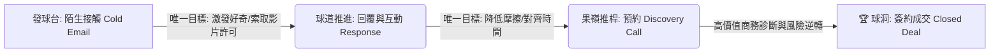
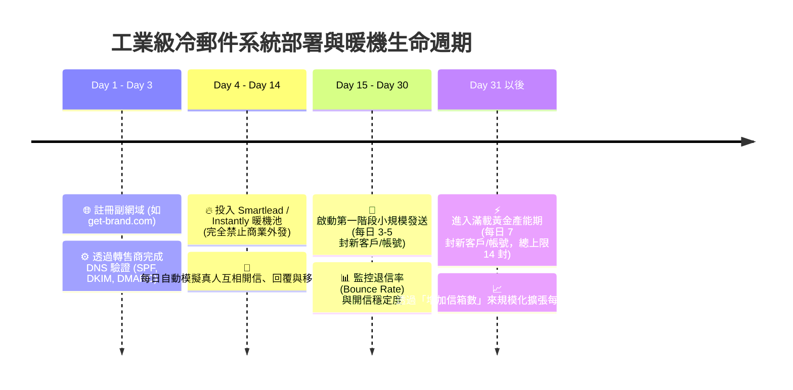
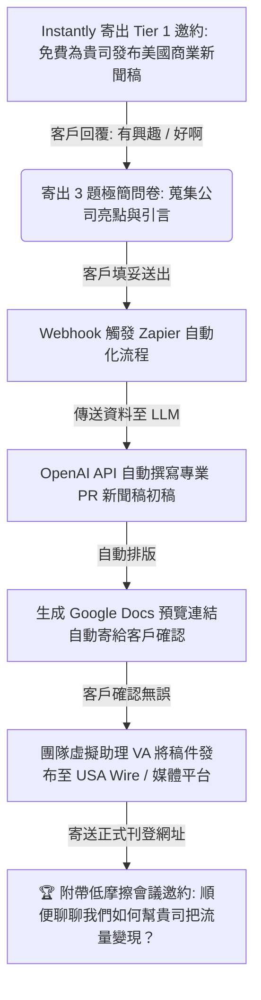
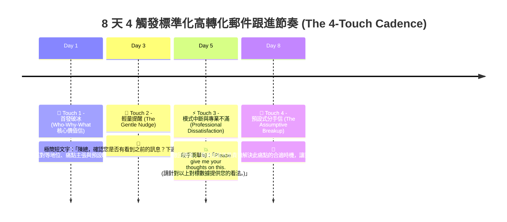

# 🚀 B2B Cold Mail 新進人員業務指南：從 0 到 1 的陌生開發與高轉化郵件商務體系

> **📚 權威指導來源簡介**  
> 本指南彙整自全球頂尖 B2B 銷售開發、冷郵件（Cold Email）與商務增長專家的實戰精華，融會貫通了以下四大核心知識體系：  
> 1. **Connor Murray (Who-Why-What 框架與預設式開發)**：著重於三段式核心架構、預設式語言（Assumptive Language）、Persona 階層矩陣、ABAB 追蹤節奏、48 小時記憶黃金期與「賣會議不賣產品」的異議處理庫。  
> 2. **Lead Gen Jay (信任赤字與領先磁鐵增長引擎)**：著重於破除冷開發信任赤字、Give Value First 心理學、領先磁鐵三層架構（Tier 1 敲門磚微服務）、藍海池塘選擇、名單槓桿與 AI 自動化 PR 交付機器。  
> 3. **Mastery and High-ROI (YC 實戰指南與郵件系統運營 SOP)**：著重於高爾夫球心法（只推下一步）、YC 轉化漏斗基準、網域信箱基礎建設與 14 天暖機鐵律、轉售商經濟效益、罕見共同點（Uncommon Commonalities）、風險逆轉與工業級發送紀律。  
> 4. **Patrick Dang (高開信主旨心理學與 H2H 專業溝通)**：著重於主旨與首句的「橋樑原則」、五年級生閱讀理解力、四大高勝率主旨公式（極簡好奇、價值主張、痛點解決、特定參考）、痛點文案公式與 A/B 測試實戰。  
> 
> **🎯 指南定位**：這不只是一份開發信撰寫技巧與罐頭模板手冊，而是一套引領新進業務人員從「發送垃圾郵件的推銷員」，成長為「掌握技術架構、精通人性心理與自動化規模增長的頂尖 B2B 商務策略顧問」的全方位行動綱領。

---

## 🧭 前言：後 AI 時代的郵件開發重塑與業務職人精神

在 AI 自動化生成內容（AIGC）氾濫與收件匣資訊爆炸的今日，決策者（CEO、高階主管、採購決策者）每天面臨數以百計的推銷信件轟炸。傳統的「群發廣告（Shotgun Spam）」或「虛假關懷的 LinkedIn 大師套路」早被大腦自動過濾，甚至會對企業品牌聲譽造成毀滅性打擊。

然而，在 B2B 高客單價與複雜採購環境中，**「高度相關的冷郵件開發（Highly Relevant Cold Email）」**依然是投資報酬率（ROI）最高、最可規模化且最具預測性的商業增長引擎（具備 35x 至 45x 的 ROI）。成功的關鍵，在於徹底重塑開發心態與執行紀律。

### 1. 破除冷郵件迷思：從「乞求施捨」到「專業對等與商譽餽贈」
新手業務在撰寫冷郵件時，最常見的心理障礙是「卑微感」——自認是個不受歡迎的干擾者，用低聲下氣的語氣請求對方「賞賜」15 分鐘。
* **垃圾郵件 (Spam) vs. 專業冷郵件 (Cold Email)**：垃圾郵件的核心是**「索取（Ask）」**，內容缺乏研究、對象不明、充滿誤導與促銷字眼；專業冷郵件的核心則是**「提供價值（Give Value First）」**，源於良好的商業協作意圖，透過深度洞察對方痛點，尋求雙贏的對話機會。
* **專業同儕定位 (Respected Peer)**：你不是在求客戶買東西，你是受公司委託、負責支援該產業或該區域的**「戰略商務對接人」**。你出現在對方的收件匣，是為了診斷企業業務摩擦並提供解藥，你與對方的社會地位是完全對等的。

| 比較維度 | 垃圾郵件 / 舊式推銷 (Old Way) | 領英銷售大師套路 (LinkedIn Guru) | 實戰派企業商務顧問 (New Way) |
| :--- | :--- | :--- | :--- |
| **首行邏輯** | 盲目群發：「恭喜！我們是頂尖的系統供應商...」 | 虛假客製化：「看到您的文章/恭喜升遷/我們是校友...」 | **直接表明身分與職責，平鋪直敘對接目標（專業對等）。** |
| **核心目的** | 試圖在郵件裡直接推銷產品與方案功能。 | 兜圈子寒暄，最後被動地問「值得聊聊嗎？」 | **建立商譽與能力證明，唯一目標是「賣出 15 分鐘會議」。** |
| **收件人感受** | 覺得被打擾、被當成推銷獵物，立即檢舉。 | 感到虛偽與厭煩，看穿這是自動化模板。 | **感到驚喜、好奇，覺得自己的業務痛點被內行人理解。** |
| **典型回覆率** | 慘澹的 0.1% ~ 1%，且多為罵人或退訂。 | 約 1% ~ 2%，常被已讀不回。 | **高達 10% ~ 20%+ 的正向會議邀約率。** |

### 2. 信任赤字與高爾夫球心法：為什麼第一封信絕對不能推銷？
在冷開發的環境中，你面對的是巨大的**「信任赤字（Trust Deficit）」**。對方完全不認識你，對你的好感度為零甚至為負。
* **高爾夫球心法 (The Golf Analogy)**：陌生開發就像打高爾夫球。你的最終目標是將球推進球洞（簽約成交），但你絕對不可能在距離數百碼的發球台就直接拿「推桿（Putter）」試圖一桿進洞！試圖在首封郵件就要求成交或要求冗長簡報，如同在發球道上用推桿，只會導致信任崩潰。
* **唯一使命**：冷郵件的唯一目標是**「把球打上果嶺——進入下一個微小動作（Next Step）」**（例如：引起好奇、得到「可以寄一段 2 分鐘對照影片給您看嗎？」的許可）。



### 3. 新進郵件開發職人的三大核心素養
要在 B2B 郵件開發戰場建立持續產單的流水線（Pipeline），新進人員必須內化三大職業素養：
1. **工程化嚴謹（Technical Discipline）**：深刻理解「送達率（Deliverability）」高於文案才華。如果技術設定錯誤致使信件進垃圾箱，再美妙的文案也等於零。
2. **極致利他與餽贈（Altruism & Reciprocity）**：把「手心向下」當作信仰。在索取任何時間之前，先給予對對方業務有立即價值的「領先磁鐵（Lead Magnet）」，觸發心理學上的互惠原則。
3. **科學化實驗與長線誠信（Scientific Iteration & Integrity）**：將每一次發信視為 A/B 測試的科學實驗，用數據推翻錯誤假設；在文字溝通中嚴守誠信，絕不用騙點擊的「主旨誘餌」，因為在商業圈中，聲譽是累積複利的唯一帳本。

---

## 🛠️ 第一篇：技術地基與發送基礎建設 (Infrastructure & Deliverability Mastery)

> ⚠️ **戰場鐵律**：B2B 行銷郵件中有高達 16.99% 根本無法抵達收件匣，主因在於技術配置失當！**絕對嚴禁使用公司主網域發送冷郵件**，否則一旦被標記為垃圾信，將導致公司主網域通訊系統崩潰，嚴重影響日常業務與客戶聯絡！

### 1.1 網域隔離與單點故障防禦
網域信譽（Domain Reputation）是冷郵件開發系統的命脈。為了保護品牌名譽與主網域安全，必須建立隔離的發送基礎建設：
* **採購副網域（Secondary Domains）**：購買與公司主品牌高度相似的獨立網域。例如公司主網域是 `carrots.com`，請註冊 `gocarrots.com`、`getcarrots.com`、`trycarrots.com`。
* **多網域分散風險（Diversification）**：切勿將所有發送量壓在單一網域上。透過多個副網域分擔產能，即使其中一個網域因突發檢舉受到限制，整個開發機器仍能正常運作，消除單點故障（Single Point of Failure）。
* **推薦網域註冊商**：GoDaddy、Namecheap、Porkbun。

### 1.2 信箱獲取策略：官方採購 vs. 轉售商 (Resellers) 經濟效益
直接向 Google Workspace 或 Microsoft 365 採購企業信箱，不僅成本高昂，且後台管理極其繁瑣，稍有不慎就因大規模外發被官方嚴格監管限制。資深開發團隊會透過專業的**轉售商（Resellers）**配置專用發送帳號：

| 比較維度 | 直接向官方採購 (Google / Microsoft) | 透過轉售商採購 (如 Zap Mail, Inbox Kit) | 💡 專家評估與建議 |
| :--- | :--- | :--- | :--- |
| **平均月成本** | 高（約 $10 - $16 美元 / 每個帳號） | **極具優勢（約 $3.50 美元 / 每個帳號）** | 轉售商能節省近 75% 基礎建設預算，適合規模化佈局。 |
| **設置效率與管理** | 低（需手動繁瑣設定 DNS/DKIM，管理極耗時） | **極高（支援 API 自動化規模配置與管理）** | 轉售商專為 Outbound 團隊設計，大幅降低 IT 維護工時。 |
| **發送工具相容性** | 標準 API 串接 | **已針對 Smartlead / Instantly 深度優化** | 支援無縫導入 Smart Senders 跨信箱負載平衡。 |
| **封號與遞送風險** | 官方對冷發送監管嚴苛，遭遇檢舉易被連坐 | **專門針對外發隔離優化，風險承受與恢復力強** | 轉售商帳號是構建大規模工業級發送池的最佳選擇。 |

### 1.3 14 天暖機鐵律 (Warm-up Protocol) 與綠色清單邏輯
新採購的網域和帳號沒有任何信譽積分，若立刻寄信給潛在客戶，會被 Google / Microsoft 伺服器直接列入自動攔截名單（Block Lists）。
* **14 天強制暖機協議**：任何新註冊的信箱，在進行正式商業發送前，**必須強制放入暖機池（Warm-up Pool）運行至少 14 天**！嚴禁早發，偷跑一天都可能導致網域信譽永久受損。
* **綠色清單運作邏輯**：使用 **Smartlead、Instantly 或 Email Bison** 等自動化工具的暖機功能。系統會自動利用你的信箱與全球數萬個真實/健康帳號互相寄信、自動開信、自動回信、並將被誤入垃圾箱的信件「移出至收件匣（Mark as Not Spam）」。這套真實演算法互動能快速為你的帳號掛上「健康信任標籤」。



### 1.4 名單清洗與零跳出率紀律 (List Verification & Volume Limits)
**高跳出率（Bounce Rate / 退信率）是導致信箱遭到停權、網域黑名單的頭號死因！**當伺服器發現你寄出的信件大量遭遇「無此帳號 (550 User Not Found)」，會立即判定你為隨機群發的駭客或垃圾蟲。
1. **強制清洗名單**：從 Apollo.io、LinkedIn 或任何渠道採集的名單，**在導入發送工具前，必須經過第三方驗證工具清洗**（推薦使用 **Lead Magic、NeverBounce 或 Million Verifier**）。
2. **10% 死亡紅線**：僅保留驗證狀態為「Valid / Deliverable」的信箱。**若名單的預估退信率高於 5%，請立即停機重整；若無效地址超過 10%，嚴禁執行序列發送！**
3. **單一帳戶安全發送限額**：
   * 為了保持帳號在 ISP 伺服器眼中的「極致真人化」，**每個信箱每日最多只寄給 7 位「新潛在客戶（New Prospects）」**。
   * 加上自動化跟進信件（Follow-ups），**每個信箱每日總發送量嚴格控制在 14 封以內**！
   * **🚀 規模化擴張邏輯**：如果你希望每天寄出 700 封開發信，**做法絕對不是把 1 個信箱的限額拉到 700 封（必死無疑），而是採購配置 100 個健康信箱（100 x 7 = 700 封）！**這就是冷郵件系統的工業級橫向擴展。

---

## 🎣 第二篇：名單採集、藍海池塘與領先磁鐵設計 (Targeting & Lead Magnet Strategy)

### 2.1 釣魚心理學：池塘 (Ponds) 與魚餌 (Bait) 的精準配對
成功的冷郵件開發是一場精密的「市場釣魚博弈」。要捕獲高客單價的 B2B 大魚，你必須先弄清楚你在哪個**「池塘（Ponds - 潛在客戶聚集地）」**，以及你拋出了什麼等級的**「魚餌（Bait - 價值提議與領先磁鐵）」**。

### 2.2 領先磁鐵三層架構：為什麼 PDF 模板已死，而「微服務」是王道？
在信任赤字下，向陌生主管要求 30 分鐘開會，就像在馬路上向陌生人求婚。你必須運用 **Alex Hormozi 的價值領先（Give Value First）策略**——用對方無法拒絕的免費禮物，在 30 秒內讓對方驚豔！
* **時間耗損 vs. 經濟價值**：對繁忙的決策者而言，**「時間」比「金錢」更昂貴**。如果你送一本要花 1 小時閱讀的 50 頁電子書，你其實是在「索取」他 1 小時的命；最頂級的魚餌必須是**「高經濟價值 + 極低消耗時間（開箱即用）」**！

| 磁鐵等級 | 魚餌內容型態 | 經濟價值 / 吸引力 (1-10) | 典型會議邀約率 | 💡 專家觀點與執行戰略 (Consultant's View) |
| :--- | :--- | :--- | :--- | :--- |
| **🥇 Tier 1<br>(敲門磚微服務)** | **開箱即用的迷你服務、免費 PR 新聞發布、權威網站回連、Podcast 專訪** | **極高 (9-10)** | **10% ~ 20%+** | **最強敲門磚 (Foot-in-the-Door)**！直接送一項原本需付費的具體成果。例如：幫客戶寫好並發布一篇 Forbes/USA Wire 新聞稿。利用 AI 將你的製成成本降至 0，客戶卻獲取高價值，立刻建立無敵商譽！ |
| **🥈 Tier 2<br>(現成資產/工具)** | **軟體完整試用權限、即用型數據清單（如：行業買家名單）、自動化診斷工具** | **中高 (7-8)** | **5% ~ 10%** | **資產導向**！客戶拿到的不是「方法論」，而是「成果的一部分」。直接消除他的工作摩擦，快速縮短信任建立時間。 |
| **🥉 Tier 3<br>(基礎資訊型)** | **長篇 PDF 白皮書、電子書、一般檢查清單 (Checklists)、模板 (Templates)** | **低 (2-4)** | **1% ~ 3%** | **⚠️ 警告：模板與 PDF 在後 AI 時代已死！**隨處可見的 AIGC 讓資訊不再稀缺，這類餌極易被視為低成本垃圾信，僅能作為成交後的輔助文件，**絕不要用作冷開發開場！** |

### 2.3 藍海戰略與 ICP 逆向工程
* **避開紅海池塘**：嚴禁將主要精力放在廣告行銷代理商（Agencies）、醫生、律師或行銷顧問等市場。這些「紅海族群」每天收到數百封開發信，心理免疫與防衛心極強。
* **鎖定高利潤藍海**：專注於**「藍海傳統產業」**——如中大型製造業、生技醫療設備、傳統物流、連鎖餐飲或農業科技。他們較少被先進的數位 outbound 工具洗禮，對專業、誠懇的冷郵件反應率往往高出 3 到 5 倍。
* **技術棧逆向工程 (Tech Stack Verification)**：在發信前，使用 **Wappalyzer、BuiltWith 或 SimilarWeb** 掃描潛在客戶官網。例如，確認對方已經安裝了 Shopify 或 Salesforce，你在信中就能精準指出：「看到貴司目前系統是以 Shopify 為底層，我們專門為 Shopify 商家解決 [某具體痛點]...」這種內行話能瞬間擊碎防衛！

### 2.4 名單獲取三大槓桿與 B2B 安全防線
獲取 ICP 名單依據你手頭擁有的「資本」形式，分成三大槓桿路徑：

```
                      【 潛在名單獲取槓桿架構 】
                                 │
         ┌───────────────────────┼───────────────────────┐
         ▼                       ▼                       ▼
   💰 金錢槓桿 (Money)     ⚖️ 平衡槓桿 (Balance)     ⏳ 時間槓桿 (Time)
  使用 Apollo.io / Lusha  使用 Scrup / Lead Sniper  在 LinkedIn / FB 社團
  高速篩選營收、職缺與    從 LinkedIn / Google      手動挖掘決策者發文，
  高階決策者直接工作郵件  Maps 抓取大量一手公開     進行高度客製化互動。
  (適合預算充足團隊)      資料 (低成本、高精準)     (適合零預算起步新手)
```

> 🚨 **B2B 開發絕對安全防線**：冷郵件開發**嚴格限定於 B2B（企業對企業）環境**，收件地址必須是 `@company.com` 等企業網域！**絕對嚴禁發送冷郵件至個人的 `@gmail.com`、`@yahoo.com` 或 `@icloud.com` 帳號！**這不僅觸犯 GDPR 等資安與隱私法規，ISP 伺服器對個人帳號的檢舉懲罰極致嚴厲，發給個人帳號會瞬間毀掉你的網域信譽！

### 2.5 實戰：AI 驅動的「新聞發布 (PR)」自動化交付機器
為了讓 Tier 1 敲門磚服務（如送新聞發布）達到零邊際成本與高槓桿，資深團隊會構建自動化工作流：



> 💡 **顧問的增長思維**：對你而言，透過 AI 產生一篇新聞稿的成本不到 1 美元、耗時 3 分鐘；但對潛在客戶而言，他獲得了價值 $200 美元的媒體曝光與外部回連！當他看到正式報導時，他心裡會震撼：**「如果你們免費送的禮物都做得這麼極致，那付費與你們合作一定強得不可思議！」**

---

## 🧠 第三篇：高開信主旨與 H2H 心理學 (Subject Line Psychology & The Gatekeeper)

### 3.1 主旨的唯一守門人使命與「橋樑原則 (Bridge Principle)」
在冷郵件策略中，**主旨（Subject Line）是點擊與注意力的唯一守門人**。
* **守門人法則**：主旨的使命極端純粹——**不是要在主旨裡解釋產品，也不是要賣東西，它唯一的目的就是「讓對方把這封信點開」，並將閱讀的接力棒完美交給「正文的第一句話」**！
* **橋樑原則 (The Bridge Principle)**：主旨與第一句話必須是一座連貫的橋樑。如果你用了極度吸引人的主旨（例如：`關於貴司昨天的重大消息`），結果信件第一句卻是 `「您好，我們是便宜的 CRM 系統商...」`，這種「騙點擊（Clickbait）」的斷層會觸發讀者強烈的被欺騙感，100% 導致檢舉與封鎖。

### 3.2 廢除推銷臭味：垃圾標籤、驚嘆號與虛假客製化
在 B2B 領域，高階決策者對「推銷員的語言」有自動化的視覺免疫。以下元素必須在你的主旨和信件中徹底消滅：
1. **垃圾關鍵字 (Spam Words)**：**免費 (Free)、緊急 (Urgent)、限時優惠 (Limited Time Offer)、保證 (Guarantee)、便宜 (Cheap)、零風險 (No Risk)**。這些詞不僅讓人感覺像詐騙，更是郵件伺服器垃圾信過濾器的主要攔截目標。
2. **格式暴力 (Formatting Abuse)**：嚴禁使用**連續驚嘆號 (!!!)**、**全大寫英文 (ALL CAPS)** 或**在主旨加入多餘的貨幣符號 ($$$)**。
3. **虛假客製化 (Fake Personalization)**：千萬不要使用領英大師最愛的爛套路——**「看到您的文章 / 恭喜您最近升遷 / 注意到我們都畢業於 XX 大學...」** 現代高管每天看幾十封這種話，早就知道這是發信軟體自動抓取 LinkedIn 資料的變數填充，只會覺得你虛偽且浪費時間！

### 3.3 四大高勝率專家主旨公式與實戰拆解
實戰證明，**「越像真實同事、客戶或行內老朋友手寫的主旨，開信率就越無敵！」** 以下是四種經大數據驗證的頂尖主旨公式：

#### 1. 極簡好奇式 (Short & Curiosity - Connor Murray & Patrick Dang 首選)
> **公式**：2 至 4 個單字（中文 10 字以內），完全不帶營銷色彩，看起就像公司內部同事寄來的小詢問。  
> **冠軍案例**：  
> * `Appropriate person` (合適的對接人選)  
> * `Quick question` (簡短請教個小問題)  
> * `Need help with [對方領域, 如: 物流追蹤]`  
> * `[你的公司] / [對方公司] 介紹`  
> 
> 🔗 **必備橋接首句配合 (Bridge)**：  
> 當主旨是 `Appropriate person`，你的正文第一句必須是：*「陳總監，我目前正在尋找 [公司名] 內部負責 [如：北美線供應鏈自動化] 的戰略決策人選，不確定是否就是您？」*

#### 2. 價值主張式 (Value Proposition - 直球對決)
> **公式**：`明確結果 (Result) + 具體手段 (Method)`。直接揭示合作能帶來的戰略利益。  
> **冠軍案例**：  
> * `透過 AI 自動化降低貴司車隊營運成本`  
> * `使用 Shopify 專用模組提升 Q3 結帳轉化率`  
> * `協助 [對方公司名] 擴展海外通路營收`

#### 3. 痛點解決式 (Pain Point - 觸發同理與避損)
> **公式**：指出對方日常營運中最厭煩、最痛苦的細節，引發「你懂我的苦」的共鳴。  
> **冠軍案例**：  
> * `厭倦用 Excel 手動追蹤 1000 筆客戶名單嗎？`  
> * `正在為 Q3 歐盟碳盤查合規手續煩惱？`  
> * `如何消除貴司客服系統天天卡頓當機的摩擦`

#### 4. 特定參考式 (Specific Reference - 頂級公信力與 Ego 觸發)
> **公式**：引用近期發生的真實商業事實、新聞、獎項或對方參與過的公開訪談。  
> **冠軍案例**：  
> * `恭喜 [公司名] 入選 2026 數位轉型標竿企業`  
> * `很喜歡您在 [Podcast 頻道名] 關於半導體供應鏈的訪談`  
> * `關於貴司近期在深圳開設新廠的產能佈局`  
> * *(說明：這證明你真正花時間做了深度研究，對方基於「被重視」與「自我成就意識 (Ego)」，開信與回覆率極高！)*

### 3.4 決策者心理對決：500 強 CEO vs. 前線經理人
不同階級的 ICP 擁有截然不同的心理痛點與閱讀習慣，主旨與溝通策略必須因人而異：
* **面對 C-Level 高管 / 企業主 (CEO / CFO / COO)**：
  * **推薦策略**：**「極簡好奇式」或「特定參考式」**。
  * **心理機制**：老闆們時間極限寶貴，對細枝末節的產品功能毫無興趣，且對行銷術語反感。極簡的 `Quick question` 或 `Appropriate person` 能讓他在手機瀏覽時順手點開，一旦確認你是專業的商業對接人，他會非常樂意直接幫你把信件「轉寄委派（Delegate）」給底下負責的正確主管！
* **面對前線 / 中階經理人 (Head of Marketing / IT Manager / 採購經理)**：
  * **推薦策略**：**「痛點解決式」或「價值主張式」**。
  * **心理機制**：他們是天天在加班、親手面對系統當機或報表混亂的苦主。如果你的主旨能精準刺中他目前的業務痛點（如 `厭倦用 Excel 手動核對跨國帳單嗎？`），他會視你的來信為解救他職業疲勞的及時雨！

### 3.5 五年級生簡單溝通法則 (The 5th-Grade Reading Principle)
**「清晰勝過花哨（Clarity over Cleverness）。」** 根據大數據與實驗證實，**將開發信文案和主旨降低到「小學五年級生（甚至三年級）」的閱讀理解難度，能帶來超過 50% 的回覆率增長！**
* **廢除艱澀術語**：除非你是在寄信給資深軟體架構師，否則絕對不要在信中堆砌 `API Protocol、SaaS 底層優化、零信任全棧協同、矩陣式賦能` 等空洞術語。
* **講人話 (H2H - Human to Human)**：把複雜的技術轉換為大白話的結果。

| 領域 | 失敗的技術術語推銷 ❌ (認知負荷高，客戶看不懂也不想看) | 專家級五年級生大白話 🟢 (瞬間理解價值，回覆率飆升 50%) |
| :--- | :--- | :--- |
| **軟體開發** | 「我們提供全棧微服務架構的分布式 API 協同監控，能優化伺服器吞吐量與延遲冗餘。」 | **「我們能幫您的工程師隨時檢查網站有沒有當機，在客戶抱怨前 3 秒自動修好。」** |
| **行銷服務** | 「透過多歸因鏈路演算法與 CDP 數據治理，提高全網受眾的 ROAS 投報係數。」 | **「我們幫您把在 Facebook 浪費掉的無效廣告費省下來，讓真正想買的人看到。」** |
| **管理顧問** | 「導入精益六標準差流程改造與企業敏捷賦能模組。」 | **「我們幫您把財務部每個月月底要花 3 天趕出來的手動結帳報表，縮短到 10 分鐘自動產生。」** |

---

## ✍️ 第四篇：Who-Why-What 高轉化文案架構與語調轉化 (Copywriting & Tonality)

### 4.1 三段式黃金架構 (The Rule of Three)
人類大腦對書面資訊有天生的「三秒法則（Rule of Three）」偏好。一封能夠在 10 秒內引發決策者回覆的開發信，必須符合經典的 **Who - Why - What 三段式黃金骨架**，總字數嚴格控制在 **200 個中文字或 120 個英文單字以內**！

```
【 📧 專家級 Who-Why-What 高轉化冷郵件架構 】

┌─────────────────────────────────────────────────────────────┐
│ 1️⃣ WHO (你是誰 - 1 句話表明身份與支援職責)                │
│ 「陳總監您好，我是來自 [公司] 的 [姓名]，在我們團隊專門負責 │
│   支援 [台灣/亞太區半導體製造業] 的數位基礎設施優化。」     │
└──────────────────────────────┬──────────────────────────────┘
                               ▼
┌─────────────────────────────────────────────────────────────┐
│ 2️⃣ WHY (為何聯繫 - 痛點 / 成果 / How - 2~3 句話展示內行)    │
│ 「鑑於您負責貴司的物流營運，我們注意到許多同業目前在應對      │
│   [某挑戰] 時，普遍面臨 [具體行政痛點] 的摩擦。我們目前正   │
│   透過 [技術/解決方案 How]，協助像 [同業標竿] 的企業，大幅  │
│   優化 [成果 Outcome]，減少 40% 的手動作業浪費。」          │
└──────────────────────────────┬──────────────────────────────┘
                               ▼
┌─────────────────────────────────────────────────────────────┐
│ 3️⃣ WHAT (你想要什麼 - 預設式時間提案 CTA - 1 句話對齊)      │
│ 「我正尋求在下週安排 15 分鐘的簡短對齊，以便我們能作為您在  │
│   該領域的戰略參考窗口。下週二上午還是週四下午方便交流？」  │
└─────────────────────────────────────────────────────────────┘
```

* **Who（身份合法性）**：你不是在自我吹噓公司成立幾年，你是在宣告「我負責支援你的產業」，讓對方覺得你是個有用的資源。
* **Why（測試與成果展示）**：這是信件的靈魂！必須精煉交織三個要素：**優先事項（Priorities）、產出成果（Outcomes）與實現手段（How you do it）**。切記**將核心價值與數據成果進行粗體（Bold）標示**，方便主管掃視！
* **What（低摩擦預設邀約）**：絕不問「您有興趣嗎？」，而是明確給出二選一的時間選項。

### 4.2 痛點公式 (Pain Formula) 與視覺衛生原則
除了 Who-Why-What，你也可以在第二段（Why）靈活運用強大的**「痛點公式（Pain Formula）」**：
> **相關引言 (Relevant Intro)** $\rightarrow$ **痛點具體化 (Pain Statement)** $\rightarrow$ **大白話解藥 (Solution)** $\rightarrow$ **單一軟性邀約 (Single Soft CTA)**

#### 👁️ 視覺衛生鐵律：手機螢幕一屏法則 (Mobile Screen Rule)
* **58% 的高階主管是使用手機（iPhone / Android）在通勤或開會間隙查看郵件！**
* **1-2 句原則**：**每一個段落絕對不能超過 2 句話！**長篇大論、密密麻麻的文字塊（Thick Paragraphs）會引發極度的視覺疲勞與心理排斥，主管看一眼就會直接滑掉或刪除。
* **一屏通過測試**：寄出前在手機上預覽，整封郵件必須**「完全不需要往下滑動螢幕（No Scrolling Required）」**就能一口氣讀完！

### 4.3 語氣的權力反轉：從「被動乞求」到「預設式語言」
**語氣（Tonality）決定了你的商業社會地位。**被動、軟弱的語氣會讓客戶直覺認為你的產品沒人要，你是在乞求他的施捨；**「預設式語言（Assumptive Language）」**則建立的一種「我是行業專家，這場專業交流理所當然、且極具價值會發生」的自信權威。

| 卑微被動的推銷語氣 ❌ (乞求時間、缺乏自信，直接被無視) | 專家級預設式與強勢語氣 🟢 (專業對等、理所當然，贏得尊重) |
| :--- | :--- |
| 「不知道有沒有這個榮幸，能佔用您寶貴的 10 分鐘...」 | **「我正尋求在下週劃分出 15 分鐘的時間，與您對齊這份數據...」** |
| 「如果您對這方面有任何興趣的話，看什麼時候能聯絡...」 | **「讓我們在下週對接（Align），檢視如何支援您的年度優先事項...」** |
| 「請問您這個禮拜或下個禮拜會有空跟我講話嗎？」 | **「為了協助您的團隊規劃未來資源，下週二上午還是週三下午方便？」** |
| 「我們提供高層級概觀與教育資源，也許值得您看一眼...」 | **「請針對以下行業對標數據，給予您專業的見解與看法。」** |
| 「如果您不需要，我真的很抱歉打擾到您的工作了...」 | **「即使貴司目前暫無配置預算，這份通路的儲備對齊仍具備戰略價值。」** |

### 4.4 Persona 矩陣化與「罕見共同點 (Uncommon Commonalities)」
為了做到「規模化的客製化（Scaled Personalization）」，你不能把同一封信寄給所有人。你必須建立 **Persona（受眾階層）交叉矩陣**，並尋找能提升 2~3 倍回覆率的**「罕見共同點」**。

#### 三層級客戶痛點矩陣 (Persona Levels)
* **Level 1 (終端使用者 / 前線工程師 / 專員)**：只關心**節省時間、減少手動複製貼上、消除行政雜事摩擦、準時下班**。
* **Level 2 (中階管理層 / 經理 / 總監)**：只關心**部門 KPI 達成率、團隊產能效率、跨系統整合順暢度、在老闆面前有戰功**。
* **Level 3 (高階主管 / C-Suite / 老闆)**：只關心**投資報酬率 (ROI)、降低營運/法律/資安風險、營收增長、市場戰略對齊**。

#### 罕見共同點 (Uncommon Commonalities) 的殺傷力
尋找對象的「不尋常共通點」，能瞬間打破陌生人心防。但請注意：不要做令人毛骨悚然（Creepy）的私生活騷擾！
* **🟢 極佳的罕見共同點**：「張副總，注意到貴司近期在台中導入了與我們客戶 [某同業] 完全相同的自動化倉儲模組...」（展示行業深度）
* **🟢 極佳的罕見共同點**：「林經理，看到您在 LinkedIn 提到今年度部門的核心願景是解決跨境金流合規...」（精準扣住近期業務目標）
* **❌ 糟糕/怪異的共通點**：「我看到你是個男人，我也是個男人，我覺得我們很合...」或「我發現您昨天晚上在臉書按讚了某一家餐廳...」（太私密，引發厭惡）

### 4.5 降低決策摩擦力：首信的「三不鐵律」
在第一封冷郵件中，你的目標是建立信任與引發對話。任何會增加「閱讀與回覆摩擦力」的元素，都會殺死你的回覆率！
1. **🚫 絕對禁止加入 Calendly / 預約行事曆連結**：在初次接觸中直接丟一個 Calendly 網址給主管，潛台詞是：*「我很忙，我懶得跟你協調時間，你自己去點我的網址挑時間配合我吧！」* 這種高傲與推銷感會讓主管直接關閉信件。你必須手動提供二選一的時間，等對方回覆有興趣後，在後續信件才優雅地附上預約連結。
2. **🚫 絕對禁止附帶 PDF 附件、簡報或白皮書**：
   * **技術雷區**：帶有附件的冷信件會被企業資安防火牆直接判定為病毒或木馬，100% 遭到攔截！
   * **心理雷區**：如果第一封信就把 20 頁的產品型錄塞給對方，對方在沒和你講過任何一句話之前，就會自行翻看並挑剔細節，然後默默做出「不買/沒興趣」的決定！**記住：你的秘密武器是要留在會議桌上講的！**
3. **🚫 絕對禁止塞入過多外部網址**：整封信最多只保留 **1 個公司的簡潔官網網址（通常放在你的簽名檔中）**。任何多餘的部落格文章、YouTube 連鎖廣告連結，都會分散讀者的點擊注意力。

---

## ⏱️ 第五篇：ABAB 節奏、跟進紀律與異議處理庫 (Cadence, Follow-up & Objection Bank)

> 🔥 **大數據的殘酷真相**：約有 **70% 到 80% 的成功會議邀約（Meetings Booked），來自於第一封信之後的「持續跟進（Follow-up）」！** 頂尖業務與平庸者的最大差距，在於平庸者發完第一封信沒人回就放棄，而頂尖業務擁有紀律嚴明的自動化跟進流水線。

### 5.1 48 小時黃金記憶窗與 ABAB 旋轉排程
* **48 小時記憶衰退線**：在快節奏的 B2B 商業中，潛在客戶對陌生郵件的記憶生命週期只有 48 小時。超過 48 小時不跟進，你在對方腦海中的存在感就會完全歸零。
* **ABAB 自動導航日曆排程**：將你的潛在名單池劃分為 A 組與 B 組，實施高頻率的輪流觸發，讓自己每天都有新對話產出：
  * **星期一**：發送 **A 組**初信 / 跟進
  * **星期二**：發送 **B 組**初信 / 跟進
  * **星期三**：發送 **A 組**第二輪跟進
  * **星期四**：發送 **B 組**第二輪跟進
  * **星期五**：專注執行預約好的會議、覆盤數據、與進行「週末銷售備餐（List Meal Prep）」

### 5.2 8 天 4 觸發標準化跟進節奏 (The 4-Touch Sequence)
針對每一批新開發的高價值目標，嚴格執行以下**「8 天 4 次觸發」**的高效率跟進序列（追求在最短時間內「速戰速決」，取得明確的 Yes 或 No）：



#### ⚡ 深度解析：Day 5 「專業不滿與模式中斷」的殺傷力
在第 5 天的第三封跟進信中，**絕對不要再長篇大論重提產品優勢！** 只要發送一句極其簡短、帶有專家同儕「專業不滿（Professional Dissatisfaction）」的話語：
> **英文標準腳本**：`"Please give me your thoughts on this."`  
> **中文標準腳本**：`「陳總監，請務必針對上述的行業對標情況，給予您專業的見解與看法。」`  
> *(注意：這句話必須直接回覆在第一封信的討論串 Root Thread 之下！)*
* **心理學機制**：這是最強大的**「模式中斷（Pattern Interrupt）」**！當主管看到這種平靜、直接、甚至帶有一絲「我帶著高價值資料來找你，你怎麼沒回應？」的專家同儕姿態時，他的大腦會立刻觸發「戰或逃」與互惠愧疚感，**迫使他在手機上快速往下滾動，認真閱讀你第一封信的內容，並在 2 分鐘內給你回覆！**

#### 🛑 深度解析：Day 8 「預設式分手信 (The Breakup Email)」
到了第 8 天如果仍未獲回覆，請優雅地**主動撤回你的價值提議**。這在銷售心理學上叫作**「損失嫌惡與稀缺性推動（Loss Aversion）」**：
> `「林副總，看來近期貴司在 [某業務領域] 上確實有其他更迫切的專案在進行，目前可能不是我們對接這套優化資源的合適時機。我先停止後續的追蹤，讓我們將這份資訊對齊順延至下個季度。祝貴司 Q3 營運順利！」`
* **戰略效果**：當客戶發現你「要走了、不再追著他了」，他反而會產生「我是不是錯過了什麼重要行業資訊？」的緊張感。**許多長期無回應的 CEO，都會在這封分手信寄出後的 1 小時內突然回信：「等一下！我們最近真的很忙，你下週三下午可以跟我聊 15 分鐘嗎？」**

---

### 5.3 回覆銀行與異議處理秘笈：「賣會議，絕不賣產品！」
當你收到潛在客戶的回信時，如果對方提出的不是立刻答應會議，而是各種疑問或拒絕（異議 Objection），**新手的致命錯誤是在郵件裡開始寫 500 字的小論文辯論產品優勢、解釋技術細節！**
> 🥋 **異議處理終極心法**：**「賣的是會議（Sell the Meeting），而不是產品或方案功能！」** 你的每一次鍵盤敲擊，唯一的目的就是引導對方答應那 15 分鐘的對話。

把以下標準化的**「異議處理庫（Objection Bank）」**內化為肌肉記憶（收緊你的彈簧），讓你能在 1 分鐘內完成高情商、高轉化的優雅應對：

#### 異議一：「我們目前已經有配合的供應商了 / 我們已經在使用 [某競品] 了。」
* **❌ 平庸做法**：「我們的系統比 [競品] 便宜 20%，而且多了 A, B, C 功能，拜託給我們一次機會展示！」（引發客戶防衛，直接被拒）
* **🟢 專家解法（承認現況 + 重新定義為互補與戰略儲備）**：  
  > `「張經理，感謝您的坦率告知！這是最理想的狀態，我們許多最堅定的長期客戶，在與我們接觸前也都是使用 [該競品] 的方案。`  
  > `這次聯繫的目的，完全不是要說服您現在替換現有的供應商。我們主要是希望作為您的行業參考窗口，與您對齊這份互補數據，確保未來貴司在面臨業務擴張或合約到期時，手頭已有完成對接的戰略備案。`  
  > `為了將來的資源佈局，下週二下午 2:00 還是週三上午 10:00，方便我們用 10 分鐘做個初步對齊？」`

#### 異議二：「我們今年度沒有這個採購預算 / 預算已經凍結了。」
* **🟢 專家解法（將會議與金錢脫鉤 + 聚焦未來的年度規劃）**：  
  > `「林總，完全理解！坦白說，在當前大經濟環境下，如果您的部門現在還有未分配的閒置預算，我反而會感到驚訝。`  
  > `這其實正是為什麼我要在現在聯繫您。這次的交流與採購預算完全無關，單純是為了讓您將來在面對明年度預算規劃時，手頭能掌握最新的行業成本對照數據。`  
  > `不談預算，單純交換行業情報，下週三下午還是週五上午對您比較方便？」`

#### 異議三：「我現在真的太忙了 / 接下來這兩個月我們都排不出順位。」
* **🟢 專家解法（體諒疲勞 + 爭取微型預約或微動線承諾）**：  
  > `「王廠長，您完全不用解釋，看貴司近期在海外展店的節奏，我就知道您現在的行事曆絕對是處於極限滿檔的狀態！`  
  > `正因為您的時間極度寶貴，我才不希望在將來錯誤的時間打擾您。如果您不排斥，我們能否先約定在下個月的第三個星期二下午 2:00，先為您保留一個 15 分鐘的初步對接？`  
  > `或者，如果現在通話負擔太重，我是否方便直接寄一段 2 分鐘的【供應鏈對照數據短影片】給您，您在週末喝咖啡時順手在手機上看一眼即可？」`

#### 異議四：「我不是負責這個業務的人 / 這種事情不應該找我。」
* **🟢 專家解法（保持預設威信 + 請求上級轉派指引）**：  
  > `「感謝陳總監的指正！因為我們這套專案在同業中通常是由負責 [如：營運升級與 ESG 治理] 的核心主管主導，所以我第一時間嘗試聯繫您。`  
  > `為了不干擾您的業務，能否請您指引我，貴司內部目前具體是哪位主管負責 [具體痛點領域] 的決策？如果方便，我再請他安排 10 分鐘的對接，非常感謝您的協助！」`

---

### 5.4 實戰漏斗與 A/B 測試優化法：10,000 封數據挑戰
郵件陌生開發本質上是一場**可被精密的數學與統計學算計的遊戲**。要從新手蛻變為公司內部的傳奇業務，你必須敢於用大量數據來調校你的發送引擎。

#### 🏆 Y Combinator (YC) 實戰開發轉化漏斗基準
不要因為今天寄了 20 封信沒人回就情緒崩潰。牢記 YC 培育矽谷頂尖新創的標準開發漏斗數學：
* **800 封發送 (Sent)** $\rightarrow$ **50% 開信率 = 400 封開信 (Opened)** $\rightarrow$ **10% 回覆率 = 40 封回覆 (Responded)** $\rightarrow$ **25% 預約率 = 10 場會議 (Booked Demos)** $\rightarrow$ **10% 成交率 = 1 個高價值新客戶 (Closed Client)！**
* **戰略意義**：在 B2B 陌生開發中，**「每一張新訂單的誕生，底層都需要約 800 封高質量、精準對齊的開發信作為燃料！」** 這是工業化的銷售漏斗定律。

#### 🔥 新手教練挑戰：發送 10,000 封實驗郵件
業務教練給予新進人員的第一個修練誓言：**在不抱怨、不懷疑人生前，先讓自己的郵件系統累積發送出 10,000 封開發信！**
* **量大才能質優 (Quantity leads to Quality)**：你必須有夠大的樣本數，才能看清市場真正的需求脈動。
* **科學化 A/B 測試紀律**：
  * **單一變因法則**：每次測試只改變一個要素！例如：固定內文不變，將 500 筆名單平分，250 筆用「極簡好奇主旨 A」，250 筆用「痛點解決主旨 B」，對比誰的開信率高。
  * **隱藏的殺手锏：預覽文字 (Preview Text)**：收件匣中顯示在主旨後面的前 150 個字元！**優化你的第一句話預覽文字，能瞬間把開信率再往上拉升 24%！**
  * **名單細分 (Segmentation) 威力**：將開發名單細分為「年營收 1-5 億的製造業」與「年營收 5-10 億的製造業」，針對其規模差異微調 Why 段落的痛點數據，**如此精細的細分能帶來高達 791% 的超高投資報酬率 (ROI)！**
  * **P.S. 聲明欄位 (The P.S. Power)**：郵件最底部的 `P.S.` 是**整封郵件中眼球閱讀率第二高**的黃金房地產！在 P.S. 中塞入一句強而有力的社會證明（例如：`P.S. 我們近期剛協助 [競爭對手名] 減少了 30% 的工時，很高興能在下週與您分享他們的做法。`），常能發揮一擊必殺的效果！

---

### 5.5 發送前最後檢查清單 (Pre-flight Final Checklist)
在按鈕啟動任何序列之前，新進人員必須對著這張檢查表，完成 100% 的軍事化核對：

```
       【 🚀 冷郵件發送前最後核對清單 (PRE-FLIGHT CHECKLIST) 】

  ┌─────────────────────────────────────────────────────────────┐
  │ [ ] 1. 網域安全檢查：我是不是在使用獨立副網域？主網域已隔離？   │
  │ [ ] 2. 暖機紀律檢查：發信帳號是否已在暖機池強制運行滿 14 天？   │
  │ [ ] 3. 名單退信檢查：名單是否已透過工具清洗？無效率是否 < 5%？  │
  │ [ ] 4. 主旨守門檢查：主旨是否控制在 4 個單字/10 個中文字內？    │
  │ [ ] 5. 橋樑原則檢查：主旨與正文第一句話是否有完美的語境銜接？   │
  │ [ ] 6. 五年級生檢查：內文是否刪除了所有艱澀的技術與行銷術語？   │
  │ [ ] 7. Who-Why-What：是否包含身份權威、成果與 How 實現機制？   │
  │ [ ] 8. 視覺衛生檢查：每個段落是否不超過 2 句話？手機一屏看完？  │
  │ [ ] 9. 零摩擦力檢查：首信是否完全沒有 Calendly 連結與 PDF 附件？ │
  │ [ ] 10. 預設語氣檢查：是否刪除了「希望您一切都好」等卑微垃圾詞？ │
  │ [ ] 11. ABAB 節奏檢查：是否已在系統排定 48 小時後的日曆跟進序列？ │
  │ [ ] 12. 異議彈簧檢查：我是否已準備好「賣會議不賣產品」的回覆？ │
  └─────────────────────────────────────────────────────────────┘
```

---

## 👑 結語：從發信機器到頂尖商務戰略夥伴

B2B 陌生郵件開發，從來就不是一場比拼誰發得更多、誰的話術更騙人的博弈。它是一場**精密的技術架構、深厚的商業同理心與紀律嚴明的系統執行力**的完美交響樂。

當你恪守網域隔離的技術紀律，當你用五年級生看得懂的大白話為客戶解決日常的焦慮，當你帶著「手心向下」的領先磁鐵為藍海決策者送上價值的餽贈，當面對拒絕時你能用宮城先生與預設式語氣將力量化為對談的契機——你就不再是一個害怕寄信、擔心被檢舉的新手推銷員。

**你將成為客戶收件匣裡最受期待的人，你將是主導公司商務流水線與營收命脈的頂尖高階商務顧問！去收緊你的彈簧，啟動你的系統，開始迎來預約滿檔的會議表吧！🚀**
