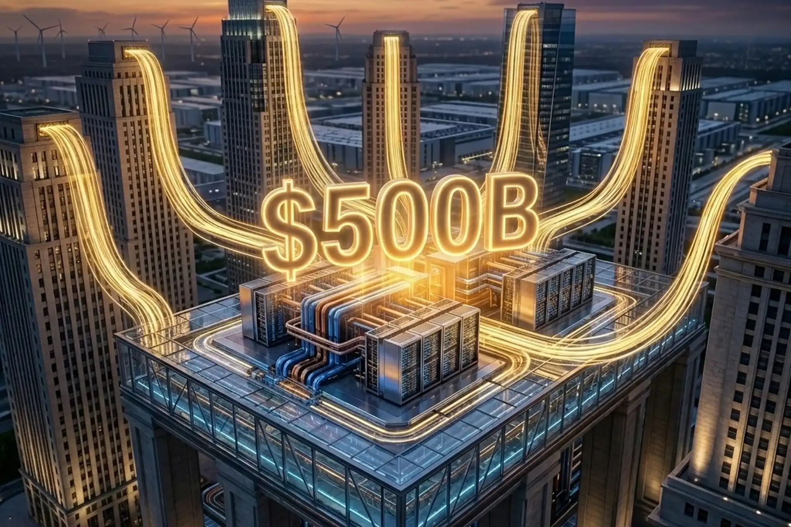

# Head Editor

**id**: 20260811-nvidia-500b-ai-infrastructure-financing-platform
**title**: 輝達攜手華爾街六大巨頭動員5000億美元！算力資產化如何化解AI循環融資危機與資本支出瓶頸
**description**: 輝達與阿波羅、貝萊德、黑石、布魯克菲爾德、高盛及KKR簽署合作備忘錄，建立逾5,000億美元獨立算力融資平台。深入解析此舉如何化解輝達資產負債表承擔客戶借貸的循環融資危機，將GPU轉化為可承銷的基礎設施資產，並評估對微軟、Meta、甲骨文等科技巨頭資本支出與美股相關標的的深遠影響。
**keywords**: 輝達融資平台, NVIDIA 5000億美元, AI算力資產化, 輝達CDS, AI資本支出, Apollo APO, Blackstone BX, KKR, Brookfield BAM, Goldman Sachs GS, 微軟 MSFT, 甲骨文 ORCL, 美股價值投資
**TAGs**: Macro, Stocks, AI, Semiconductor, Tech, Earnings, Investing
**date**: 2026-08-11

---

# Hero Editor

	

		

			<h1>輝達攜手華爾街六大巨頭動員5000億美元！算力資產化如何化解AI循環融資危機與資本支出瓶頸</h1>
			

				<time datetime="2026-08-11">2026-08-11</time>
				<ul class="tags">
					<li class="yolk">Macro</li>
					<li class="yolk">Stocks</li>
					<li class="yolk">AI</li>
					<li class="yolk">Semiconductor</li>
					<li class="yolk">Tech</li>
					<li class="yolk">Earnings</li>
					<li class="yolk">Investing</li>
				</ul>
			

		

	

	

---

# Content Editor

	

		
全球人工智慧基礎設施的擴建正迎來歷史性的轉折點。半導體巨頭輝達（NVIDIA）正式宣布與阿波羅（Apollo Global Management）、貝萊德（BlackRock）、黑石（Blackstone）、布魯克菲爾德（Brookfield Asset Management）、高盛（Goldman Sachs）以及 KKR 等六家管理數兆美元資產的華爾街金融機構簽署合作備忘錄（MOU），共同建立獨立的算力融資平台，目標在未來動員超過 5,000 億美元的第三方資本投入 AI 運算設施。

		
這項合作不僅僅是單純的資金籌集，更是科技產業與金融資本深度融合的里程碑。當市場高度擔憂超大型雲端業者（Hyperscalers）鉅額資本支出難以為繼，甚至對輝達自身的資產負債表風險產生疑慮之際，華爾街頂級私募與信貸機構選擇以金融工程手段介入，宣告將 AI 算力定位為具備穩定現金流回報的獨立可投資資產類別（Investable Asset Class）。

		<ul>
			<li><strong>核心事件</strong>：輝達攜手阿波羅、貝萊德、黑石、布魯克菲爾德、高盛與 KKR 六大資產管理巨頭，建立獨立算力融資平台，預計導入逾 5,000 億美元第三方機構資本，以承銷與支持全球 AI 工廠與資料中心的建置。</li>
			<li><strong>影響範圍</strong>：將算力採購轉化為表外長期融資租賃工具，大幅減輕大型雲端巨頭與 AI 新創的現金流失血壓力，同時消除市場對輝達直接為客戶提供債務擔保的循環融資擔憂。</li>
			<li><strong>關鍵結論</strong>：透過 DSX 標準化設計與 CUDA 軟體生態，GPU 成功具備可承銷資產的流通性與收益性；輝達與另類資產管理公司成為結構性贏家，但若終端 Token 商業化回報落後於高額利息成本，整體信貸體系仍需承受殘值折舊與違約風險。</li>
		</ul>
	

	

		<h2>輝達的資產負債表保衛戰：從循環融資疑慮到 CDS 飆升的警訊</h2>
		
回顧這場重大合作的背後脈絡，市場對 AI 產業資金鏈的緊繃情緒已在 7 月下旬達到高峰。當時市場傳出輝達可能直接參與總規模高達 7,500 億美元的多項融資安排，包含可能為 OpenAI 在俄亥俄州的資料中心提供 2,500 億美元債務擔保，以及協助其融資 3,500 億美元採購輝達晶片。

		
消息傳出後，信用市場迅速拉響警報。根據 ICE Data Services 統計，輝達 5 年期信用違約交換（CDS）在短短數日內由月初的 40 個基點暴漲至 82 個基點，創下該合約活躍交易以來的歷史新高，單日盤中跳升幅度更是空前。輝達股價單日重挫 4.99%，市值蒸發約 2,500 億美元。

		
信用違約交換利差的急遽擴大，反映出固定收益投資人最深層的恐懼：<strong>供應商循環融資（Circular Financing）</strong>。在過去幾季中，輝達透過直接投資 AI 新創或提供租約擔保，協助客戶取得資金採購自家 GPU 晶片。這種模式在產業擴張初期能迅速刺激出貨量，卻模糊了市場真實的終端需求。一旦終端客戶的獲利能力無法支撐龐大硬體成本，原本看似亮眼的晶片銷售訂單，將反噬成為輝達資產負債表上的實質壞帳。

		
國際貨幣基金（IMF）與國際清算銀行（BIS）皆曾提出示警，指出高度集中的供應商融資可能引發系統性連鎖反應。在即將於 8 月底公布第二季財報的關鍵時刻，輝達若繼續仰賴自身資產負債表為產業擴張背書，勢必面臨資本市場的嚴格估值懲罰。因此，引進獨立第三方金融機構接手信用承銷，成為輝達保護自身財務結構的必然選擇。

	

	

		<h2>5000億美元平台運作解析：為何華爾街願意將 GPU 視為基礎設施？</h2>
		
傳統財務觀點向來將半導體晶片視為快速折舊的消耗性電子設備，使用壽命短且二手殘值波動劇烈，極難作為長期信貸的抵押品。華爾街頂級機構之所以願意轉變態度，並將 AI 運算設備視為如同電網、收費公路與商用不動產的基礎設施，關鍵在於輝達執行長黃仁勳提出的核心商業邏輯：「在 AI 時代，算力即營收（In AI, compute is revenue）。」

		
要讓華爾街精算師認可一項資產具備承銷價值，該資產必須滿足三個條件：

		<ul>
			<li><strong>持續且可預測的現金流產出能力</strong>：現代 AI 工廠透過對外出租算力或銷售 Token（代幣運算單元）獲取穩定營收，運算需求已演變為全球企業與主權機構不可或缺的公用事業。</li>
			<li><strong>極高的資產通用性與可替代性（Fungibility）</strong>：輝達的 GPU 搭配其 CUDA 軟體堆疊，具備跨模型、跨任務的高度彈性。如果某一特定客戶違約退租，承銷機構可以迅速將同一批算力資源重新分配給其他企業或雲端運算商，抵押品不會淪為無用的專屬廢鐵。</li>
			<li><strong>軟體迭代延長經濟壽命</strong>：透過 CUDA 與系統層級的持續最佳化，現有硬體的運算效率在服役週期內能持續提升，降低了實體資產過早報廢的風險。</li>
		</ul>
		
此外，輝達在 2026 年台北國際電腦展（GTC Taipei）推出的 <strong>DSX（Design System & eXchange）標準化 AI 工廠架構</strong>，扮演了至關重要的技術催化劑角色。DSX 將資料中心的機櫃配置、散熱冷卻、網路互連與運作軟體進行全面標準化。標準化的實體設施大幅降低了工程評估門檻，使黑石、阿波羅與高盛等機構得以精確計算每座 AI 工廠的建置成本、營運風險與預期內部報酬率（IRR）。

		
貝萊德執行長 Larry Fink 更公開將此一創新比作 1970 年代不動產抵押貸款證券（MBS）的誕生。MBS 在半個世紀前將非流動性的房屋貸款轉化為全球資金追捧的標準化金融商品；如今，算力融資平台則將機房內的 GPU 伺服器轉化為全球固定收益市場可投資的數位基建資產。

	

	

		<h2>科技巨頭的資本支出解方：緩解自由現金流失血的表外架構</h2>
		
推動 5,000 億美元融資平台成立的另一個強大推力，來自超大型科技巨頭日益沉重的財務報表壓力。根據 FactSet 與產業預估，2026 會計年度 Alphabet、亞馬遜（Amazon）、Meta、微軟（Microsoft）與甲骨文（Oracle）五大科技巨頭的合計資本支出將超越 7,000 億美元，年增率突破 80%。

		
如此龐大的硬體支出已對企業的自由現金流（FCF）造成顯著擠壓。近期 Alphabet 在最新季度財報中出現自公開上市（IPO）以來的首次單季自由現金流轉負；甲骨文的信用評等更被標普全球（S&P Global）降至投資級別最低一階的 BBB-，其 5 年期 CDS 攀升至 215 個基點。市場對科技巨頭「不計代價擴建 AI」的容忍度正在迅速收窄。

		<ul>
			<li><strong>微軟（Microsoft，美股代號：MSFT）</strong>：2026 年資本支出維持歷史高檔，雲端業務利潤率受鉅額硬體折舊壓抑。透過融資平台可轉移部分自建機房成本至表外，穩定營運現金流。</li>
			<li><strong>Alphabet（美股代號：GOOGL）</strong>：資本支出年增逾 70%，單季自由現金流轉負使得股東回購動能受限。透過算力租賃能降低重資產持有比例，將資本集中於演算法與 TPU 核心研發。</li>
			<li><strong>Meta Platforms（美股代號：META）</strong>：算力擴建持續加速，自由現金流面臨侵蝕壓力。藉由第三方融資租用算力，有助於保留帳面充沛流動資金。</li>
			<li><strong>甲骨文（Oracle，美股代號：ORCL）</strong>：激進擴建雲端資料中心導致信用評等降至 BBB-，債務擴張面臨利息成本上升問題。平台資金可協助代建機房，終止高成本發債擴產的財務惡性循環。</li>
		</ul>
		
透過獨立算力融資平台，雲端服務商與大型企業可以採取<strong>使用權連結（Usage-linked）的表外融資租賃</strong>架構。企業無須在建廠第一天就將數百億美元的硬體採購列為資本支出並承擔後續數年的龐大折舊費用，而是轉為依據實際算力消耗支付營運費用（OpEx）。這項結構性轉變有效修復了科技巨頭的資產回報率（ROIC）指標，同時讓新創團隊有能力取得最先進的運算資源。

	

	

		<h2>算力金融化浪潮下的贏家與輸家：美股關鍵標的深度解析</h2>
		
當華爾街的資金水龍頭全面對接矽谷的算力工廠，資本市場的利益分配格局正在重組。投資人在評估美股配置時，必須區分哪些企業掌握了不可替代的生態系定價權，哪些企業則面臨邊緣化或信用利差擴大的風險。

		<h3 class="inside my-2">受惠企業</h3>
		
<strong>NVIDIA（美股代號：NVDA）</strong>：輝達是整場金融工程的最大贏家。透過六大機構建立的 5,000 億美元資金池，輝達成功將客戶的採購資金來源外部化，既消除了市場對其自身 CDS 飆升與信用違約擔保的顧慮，又確保了旗下 Blackwell 以及次世代架構晶片的長期出貨動能。輝達持續掌握定價權，同時坐收 CUDA 企業軟體授權的長期經常性收入。

		
<strong>另類資產管理四巨頭（Blackstone BX、Apollo APO、KKR、Brookfield BAM）</strong>：這些頂級私募與基礎設施管理機構掌握了數千億美元的長期養老金、保險與主權資金。算力融資平台為其開闢了高於傳統公用事業回報率、且具備實體資產擔保的優質信貸標的。資產管理機構不僅能藉此迅速擴大資產管理規模（AUM），還能每年穩健收取管理費與超額業績報酬。

		
<strong>Goldman Sachs（美股代號：GS）</strong>：高盛在此架構中扮演算力抵押信貸市場的設計者、結構化承銷商與分銷管道。隨著算力債券化與資產證券化市場的成形，高盛將在投行承銷佣金、二級市場交易做市以及衍生性金融商品設計中獲取可觀的手續費收入。

		
<strong>超大型雲端巨頭（Microsoft MSFT、Meta META、Alphabet GOOGL）</strong>：表外融資管道的暢通，使科技巨頭得以在不損害自由現金流與信評指標的前提下，維持對前沿 AI 模型研發的高強度算力支援，降低了因縮減資本支出而落後技術競賽的風險。

		<h3 class="inside my-2">潛在受害與風險承擔者</h3>
		
<strong>缺乏通用軟體生態系的二線 ASIC 晶片商</strong>：華爾街信貸承銷的核心基礎在於「資產的可替代性與轉售價值」。客製化專用晶片（Custom ASIC）一旦失去特定母公司的訂單，其二手價值幾乎歸零，極難獲得獨立融資平台的低成本信貸支持。這將導致二線晶片商在硬體成本競爭力上進一步落後於輝達生態圈。

		
<strong>高財務槓桿的二線資料中心與主機代管商</strong>：隨著黑石、KKR 與布魯克菲爾德等巨頭直接與輝達合作投資具備 DSX 標準的超大型 AI 工廠，缺乏自有充沛電力供應與一線科技客戶長期綁定合約的二線機房業者，將面臨融資成本居高不下與客戶被巨型平台吸走的雙重擠壓。

	

	

		<h2>尾部風險檢視：Token 變現落差與硬體折舊的雙重考驗</h2>
		
儘管金融工程為 AI 基礎設施提供了充足的資金活水，價值投資人仍須保持清醒，檢視支撐整體信用架構的底層假設是否具備足夠的安全邊際。

		
第一大潛在風險在於<strong>終端 Token 經濟的變現速度落差</strong>。融資平台之所以能承諾投資人穩健回報，前提在於下游企業與消費者願意為 AI 應用支付足夠的訂閱費或使用費。如果企業端在導入 AI 後無法轉化為明確的生產力提升與淨利潤增長，終端算力租賃需求將面臨降溫，最終可能導致部分新創營運商無力支付融資利息，引發局部性信貸違約。

		
第二大風險是<strong>技術跨代升級導致的抵押品加速貶值</strong>。雖然 CUDA 軟體能優化晶片效能，但若輝達未來推出的次世代架構在每瓦算力或每 Token 成本上實現數倍的突破性躍進，現有抵押在信貸基金名下的上一代 GPU 伺服器，其二手市場租金定價將遭受重擊，進而侵蝕資產管理公司的基金淨值。

		
第三大不確定性在於<strong>合約執行進度</strong>。目前各方簽署的僅為合作備忘錄（MOU），具體的法律條款、首批出資承諾與權利義務仍處於最終合約協商階段。投資人需密切追蹤 8 月 26 日輝達財報電話會議中，管理階層對於第三方融資平台落實細節與資產負債表承諾的正式說明。

	

	

		<h2>Takeaways from Mr.Cafe</h2>
		
輝達攜手華爾街六大巨擘建立 5,000 億美元算力融資平台，本質上是一場化解流動性瓶頸與信用風險的經典金融運作。這項策略讓輝達甩開了「循環融資」的信任陰霾，同時讓大型科技巨頭在資本支出見頂的壓力下找到了喘息空間。

		<ul>
			<li><strong>重視現金流品質而非表面營收</strong>：評估科技巨頭時，自由現金流（FCF）與資本支出回報率（ROIC）比營收年增率更能真實反映企業體質。善用表外融資能減輕財務壓力，但終究無法替代實質的終端商業變現能力。</li>
			<li><strong>觀察信用市場作為先行指標</strong>：信用違約交換（CDS）與債券利差往往比股票市場更敏銳地反映企業的基本面風險。當科技股股價處於高檔時，緊盯其信評變化與利差走勢是保護投資本金的關鍵防線。</li>
			<li><strong>聚焦具備深厚護城河的生態系掌控者</strong>：在算力金融化的趨勢下，真正的贏家是掌握標準制定權的硬體軟體整合者（如輝達），以及具備龐大資產承銷與管理能力的另類資產龍頭（如黑石、阿波羅）。在不確定性升高時，唯有具備強大定價權與生態系壁壘的標的，才能提供足夠的安全邊際。</li>
		</ul>
	

