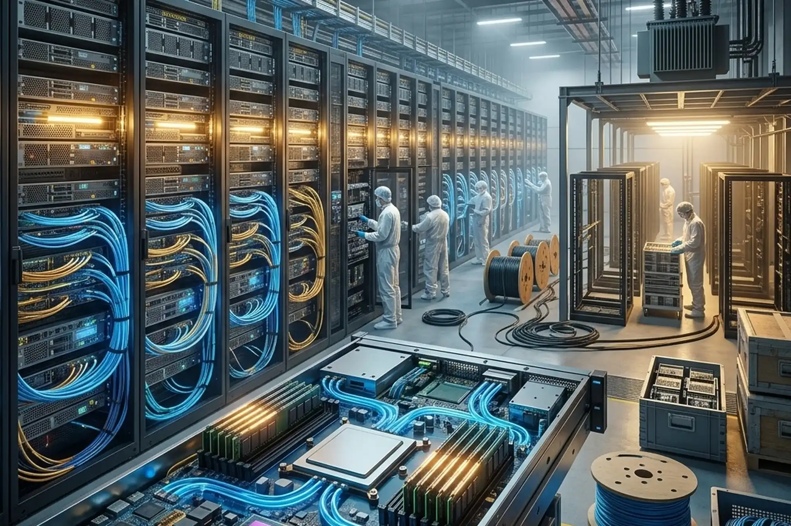

# Head Editor

**id**: 20260810-ai-capex-big-tech-nvidia-analysis
**title**: Big Tech Pouring $1T into AI CapEx Yet NVIDIA Stagnates? The CapEx Shift and New Supply Chain Winners
**description**: Big Tech's 2026 AI capital expenditures are projected to top $720 billion, yet NVIDIA's stock remains rangebound. Discover why hyperscaler spending is pivoting toward memory, networking, and custom ASICs, the cash flow and depreciation headwinds facing hyperscalers, and detailed analysis on Micron (MU), Broadcom (AVGO), NVIDIA (NVDA), Alphabet (GOOGL), Meta (META), and Tesla (TSLA).
**keywords**: AI CapEx, NVIDIA NVDA stock analysis, Alphabet earnings, Magnificent Seven, Micron Technology MU, Cloud hyperscaler CapEx, Goldman Sachs AI report, Morgan Stanley cloud forecast, HBM memory, Custom ASIC chips, Broadcom AVGO, Free cash flow, Margin of Safety
**TAGs**: AI, Semiconductor, Tech, Stocks, Earnings, Investing
**date**: 2026-08-10

---

# Hero Editor

	

		

			<h1>Big Tech Pouring $1T into AI CapEx Yet NVIDIA Stagnates? The CapEx Shift and New Supply Chain Winners</h1>
			

				<time datetime="2026-08-10">2026-08-10</time>
				<ul class="tags">
					<li class="yolk">AI</li>
					<li class="yolk">Semiconductor</li>
					<li class="yolk">Tech</li>
					<li class="yolk">Stocks</li>
					<li class="yolk">Earnings</li>
					<li class="yolk">Investing</li>
				</ul>
			

		

	

	

---

# Content Editor

	

		
Global tech giants recently unveiled their latest quarterly financial reports, reigniting fierce market debate over the escalating artificial intelligence arms race. Alphabet raised its full-year 2026 capital expenditure (CapEx) guidance sharply to between $195 billion and $205 billion, with single-quarter CapEx doubling year-over-year to $44.92 billion. Yet, this blockbuster headline—which intuitively signals surging chip demand—failed to spark a rally in AI computing kingpin NVIDIA (NVDA). Instead, NVIDIA dipped 2.18% intraday, continuing to consolidate around the $200 psychological barrier, while the Magnificent Seven suffered a massive single-day market cap wipeout of $797 billion, marking their steepest selloff since April 2025.

		
This seemingly paradoxical market action signals a profound shift in capital market pricing logic. Capital is not fleeing the AI secular wave; rather, institutional investors are rigorously reassessing profit distribution and return on investment (ROI) across every tier of the AI supply chain.

		<ul>
			<li><strong>Core Event</strong>: Big Tech drastically boosted AI CapEx forecasts, yet capital rotated away from standalone GPUs toward infrastructure bottlenecks. As Alphabet and mega-cap peers reported earnings pointing to combined 2026 hyperscaler CapEx of $725B to $760B, NVIDIA (NVDA) stalled while Micron (MU) and memory supply chains rallied against the broader tech pullback.</li>
			<li><strong>Scope of Impact</strong>: Investment scrutiny shifted toward supply bottlenecks and tangible monetization, causing structural reallocation in hardware procurement. Rapid compute expansion triggered acute shortages in power grids, advanced liquid cooling, high-bandwidth memory (HBM), and optical networking bandwidth, funneling capital into component suppliers with immediate pricing power while depreciation burdens pressured hyperscaler valuations.</li>
			<li><strong>Key Conclusion</strong>: The infrastructure arms race has not peaked; true investment resilience lies in economic moats and pricing power. With global AI CapEx set to cross the $1 trillion annual threshold by 2027, near-term volatility reflects market scrutiny over hyperscaler ROI and tactical de-leveraging. Long-term value investors should focus on structural winners with high earnings visibility and steep switching costs.</li>
		</ul>
	

	

		<h2>Data Speaks: The AI Infrastructure Arms Race Is Accelerating</h2>
		
The recent pullback in mega-cap tech stocks initially stoked fears that AI infrastructure spending had reached a cyclical peak. In reality, the latest financial guidance across hyperscalers demonstrates that global AI infrastructure buildout is showing no signs of slowing down, with aggregate expenditure remaining on an accelerating upward trajectory.

		
The four hyperscalers—Microsoft (MSFT), Alphabet (GOOGL), Amazon (AMZN), and Meta Platforms (META)—are projected to spend between $725 billion and $760 billion in combined CapEx for full-year 2026, representing a massive 77% to 79% surge compared to $413 billion in 2025. Crucially, approximately $432 billion of this budget is allocated for the second half of 2026 alone, proving that deployment momentum in the back half of the year surpasses the first half.

		
Goldman Sachs highlighted in its latest global AI investment report that when factoring in non-cloud U.S. enterprises, private tech firms, and international hardware investments, total global AI-related CapEx will cross $1 trillion in 2026, with U.S. domestic investment contributing $581 billion. Goldman projects that AI CapEx as a share of U.S. GDP will climb from 1.8% in 2026 to 2.8% by 2028. All industry leading indicators tracked by Goldman—including semiconductor equipment imports, PMI figures, and GPU rental pricing—remain at elevated levels, projecting cumulative global AI CapEx of $7.6 trillion between 2026 and 2031.

		
Morgan Stanley's global cloud tracking report reinforces this secular expansion. Analyst Erik Woodring noted that CapEx across the top four hyperscalers is set to expand another 29% in 2027, pushing aggregate market scale to between $1.2 trillion and $1.4 trillion. This confirms that the market is navigating the core of a multi-year hardware investment supercycle, rendering the "peak CapEx" thesis fundamentally invalid against objective data.

		<h3 class="inside my-2">Cash Flow Strains & Depreciation Pressures Behind Robust Revenues</h3>
		
With CapEx expanding at such astronomical scale, why were hyperscalers sold off post-earnings? The key lies in the heavy financial drag that monumental spending places on near-term balance sheets and income statements.

		
Underlying compute demand has undeniably ignited robust cloud revenue growth. In the latest quarter, Google Cloud revenue surged 82% year-over-year; Amazon AWS grew 37%, marking its fastest expansion pace in 18 quarters; and Microsoft Azure maintained rapid growth at 43%. However, explosive top-line revenue expansion could not entirely offset the immediate financial costs of surging CapEx.

		
Alphabet's quarterly CapEx reached $44.92 billion, plunging its single-quarter Free Cash Flow (FCF) into negative territory at -$5.9 billion—the first negative quarterly FCF recorded since Alphabet went public in 2004. While Amazon emphasized that its server investments break even within three years to generate cash, Meta's aggressive capital outlays narrowed net margins.

		
Massive procurements of server clusters and data center physical assets mean tech giants will face steep depreciation expense amortization over coming years. Until software applications (such as enterprise AI copilots and generative SaaS workflows) translate into sizable net income, Wall Street is subjecting hyperscalers to rigorous ROI scrutiny. Evercore ISI senior analyst Mark Mahaney highlighted this psychological pivot: during massive buildout cycles, investors increasingly favor suppliers collecting the checks over the giants footing the bill.

	

	

		<h2>Why Did Massive Capital Inflows Fail to Propel NVIDIA?</h2>
		
As the dominant sovereign of the AI accelerator space, NVIDIA's second-quarter earnings delivered $30.2 billion in revenue (up 122% YoY), with Data Center revenue hitting $26.3 billion (up 154% YoY), gross margin maintaining a stellar 78.4%, operating margin at 61.6%, and quarterly free cash flow reaching $14.9 billion. Despite such immaculate fundamentals, NVIDIA's stock failed to break out alongside hyperscaler CapEx hikes due to structural procurement shifts and institutional hedging.

		<h3 class="inside my-2">Structural Shift: From Pure Compute to Surrounding Bottlenecks</h3>
		
During the initial 2023–2025 buildout phase, hyperscalers raced to secure high-end discrete GPUs (such as H100 and B200), concentrating capital tightly on the leading chip designer. Entering 2026 and 2027, the primary bottleneck in data center deployments has materially shifted.

		
Modern AI superclusters cannot operate merely by plugging GPUs into server chassis. Power grid capacity, advanced liquid-cooling distribution, high-bandwidth memory (HBM), and ultra-high-speed networking interconnects have emerged as the true gating factors for cluster scaling. A substantial portion of Big Tech's incremental billions is now allocated to high-voltage transformers, utility substation upgrades, liquid-cooling manifolds, and high-bandwidth memory purchase orders from Micron (MU) and SK Hynix.

		
When Micron traded up 2.5% pre-market and SK Hynix gained over 5% on earnings day, it reflected institutional capital flowing directly toward the most constrained supply bottlenecks, naturally siphoning away a portion of the buying pressure previously monopolized by pure GPU plays.

		<h3 class="inside my-2">Valuation Baseline & Pre-Earnings Hedging Flows</h3>
		
Beyond physical procurement dynamics, NVIDIA's multi-trillion-dollar market capitalization has fundamentally altered its institutional trading profile. NVIDIA is no longer treated as a high-beta mid-cap semiconductor play, but as a core mega-cap heavyweight alongside Apple and Microsoft.

		
When institutional desks execute profit-taking and systemic de-leveraging across Big Tech, NVIDIA naturally bears part of the portfolio reduction. Furthermore, while NVIDIA's profits continue to double, YoY percentage growth is normalizing against towering historical comparables. Ahead of its late-August earnings release, demand for out-of-the-money put options rose noticeably alongside climbing implied volatility, indicating institutions chose to hedge downside risk with derivatives and lock in multi-year gains, muting near-term upward momentum.

	

	

		<h2>Winners & Vulnerable Plays Across U.S. Equities</h2>
		
As AI CapEx hits new records and procurement broadens across the infrastructure stack, tech enterprises face vastly divergent financial trajectories. Below is an in-depth breakdown of impacted U.S.-listed companies and their stock tickers:

		<h3 class="inside my-2">Beneficiary Companies</h3>
		
<strong>Micron Technology (MU)</strong>: Severe shortages in High Bandwidth Memory (HBM3e) and high-density server DRAM have positioned memory as the single greatest physical bottleneck in AI server assembly. Elon Musk publicly expressed gratitude to Micron during Tesla's earnings call for prioritized memory allocations, underscoring product scarcity. Benefiting from rising average selling prices (ASPs) and multi-year supply lock-ins, Micron's gross margins are in a rapid expansion cycle, granting the firm exceptional pricing power and high earnings visibility.

		
<strong>Broadcom Inc. (AVGO)</strong>: To mitigate long-term dependency on merchant silicon and optimize model-specific compute efficiency, hyperscalers are aggressively accelerating custom ASIC development (such as Google's TPU and Meta's MTIA). Broadcom commands an unrivaled leadership moat in custom AI silicon co-design, high-speed PCIe switches, and Ethernet networking fabrics, directly capturing massive order backlogs from hyperscale cloud operators.

		
<strong>NVIDIA Corporation (NVDA)</strong>: While short-term price action is weighed down by mega-cap rotation and derivative hedging, NVIDIA's Blackwell architecture—offering a 4x leap in training throughput and 30x in inference efficiency—remains sold out for multiple quarters across top cloud providers. Bolstered by over 15 years of CUDA ecosystem lock-in and insurmountable developer inertia, NVIDIA commands exceptionally high customer switching costs, ensuring its long-term profit moat remains virtually unbreachable.

		<h3 class="inside my-2">Companies Facing Margin & Cash Flow Headwinds</h3>
		
<strong>Alphabet Inc. (GOOGL)</strong>: Raising its 2026 CapEx ceiling to $205 billion while swinging quarterly free cash flow to negative $5.9 billion. Although Google Cloud and core search monetization remain rock solid, enormous infrastructure outlays will steadily convert into heavy depreciation expenses over upcoming quarters. If AI revenue acceleration fails to outpace depreciation growth, near-term valuation multiples will face strict market scrutiny.

		
<strong>Meta Platforms, Inc. (META)</strong>: Elevating the lower bound of full-year CapEx to between $130 billion and $145 billion to expand state-of-the-art compute clusters. However, Meta's revenue engine remains overwhelmingly concentrated in digital advertising, where generative AI ad tools are in early monetization stages. Coupled with rising legal and operational overhead, aggressive hardware outlays will compress near-term net profit margins.

		
<strong>Tesla, Inc. (TSLA)</strong>: Aggressively building proprietary gigawatt-scale data centers and procuring tens of thousands of high-end accelerators to train FSD, Robotaxi neural networks, and Optimus humanoid robots. However, core automotive gross margins remain under competitive pressure, while commercialization of autonomous fleets and humanoid robotics will take several years to scale, placing near-term free cash flow under sustained pressure.

	

	

		<h2>Takeaways from Mr.Cafe</h2>
		
This epic AI infrastructure investment supercycle is now confirmed to cross the $1 trillion annual threshold by 2027. Trillion-dollar annual CapEx is rapidly becoming the new baseline—a truly staggering reality.

		
Recent market turbulence does not signal the end of the secular trend; rather, it reflects investors transitioning from early speculative hype into a disciplined evaluation phase centered on supply chain pricing power and return on invested capital.

		
Put simply, the tech sector remains extraordinarily vibrant, but stock picking is no longer the easy game of throwing darts at any AI name like it was two years ago. While share prices may swing, underlying infrastructure supply chains are delivering stellar, record-breaking financial results. This is precisely why investors must return to the foundational principles of value investing.

		
Never let short-term market pullbacks frighten you. Whenever markets reach new heights, every headline is seized upon as a reason to panic and sell off, even when fundamental industry demand has not changed at all. For disciplined value investors, these fear-driven consolidations represent prime opportunities to buy exceptional businesses at a discount!

		<ul>
			<li><strong>Recognize the structural shift in procurement</strong>: AI expansion is no longer confined to a single chipmaker. Power, cooling, high-bandwidth memory, and optical networking bottlenecks are capturing an expanding share of hyperscaler CapEx, bestowing structural suppliers with formidable pricing power.</li>
			<li><strong>Scrutinize free cash flow and depreciation quality</strong>: When evaluating hyperscalers executing monumental CapEx expansions, closely monitor cloud revenue conversion rates and cash flow health to avoid overpaying during the peak of the depreciation cycle.</li>
			<li><strong>Anchor to economic moats and margin of safety</strong>: Sideways trading in leaders like NVIDIA represents normal institutional digestion of high historical bases rather than any erosion of competitive moats. When market noise sparks emotional selloffs, high-moat businesses with predictable earnings visibility offer the ultimate Margin of Safety for long-term compounders.</li>
		</ul>
	

