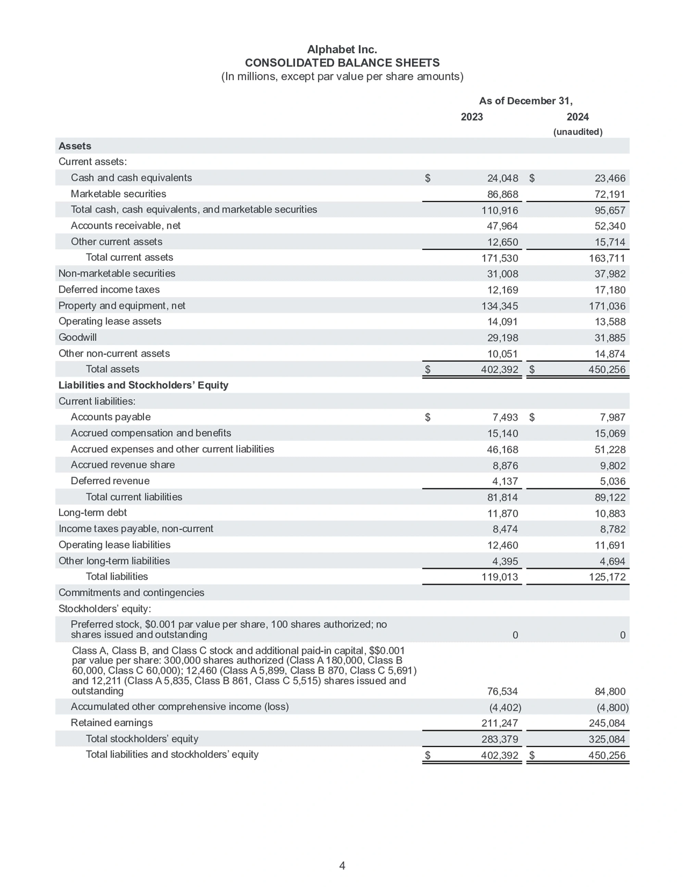
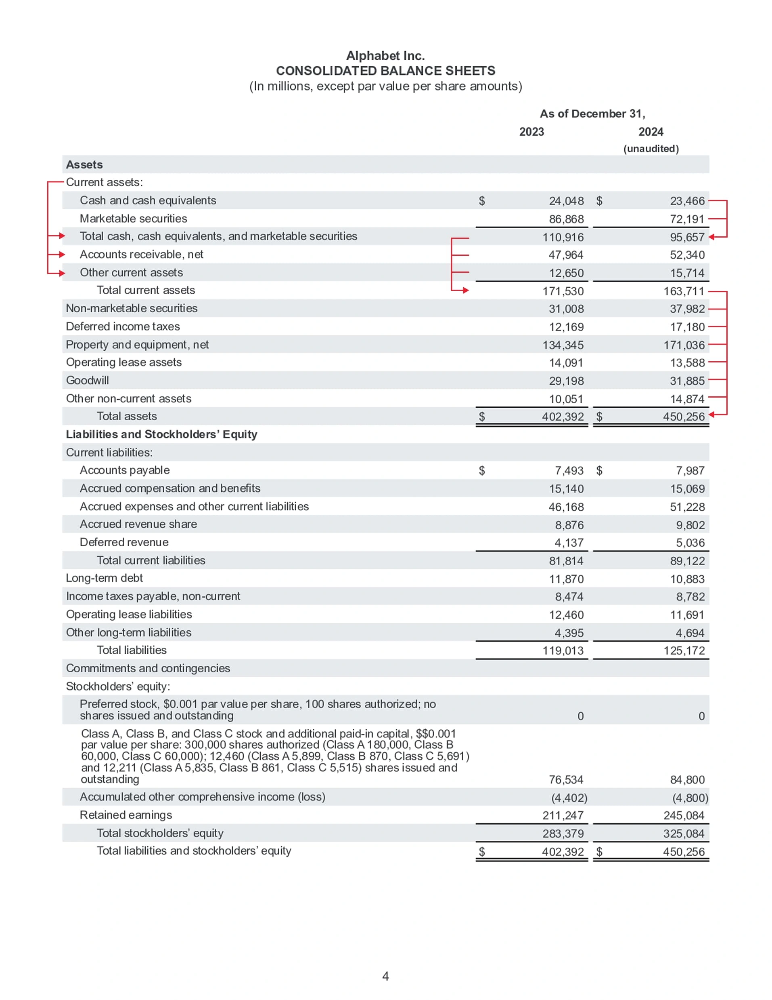
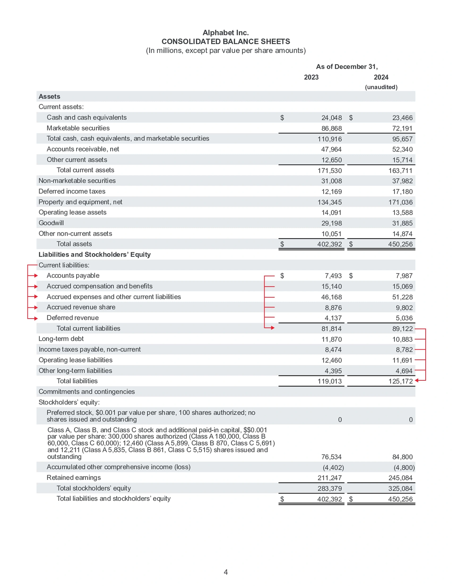
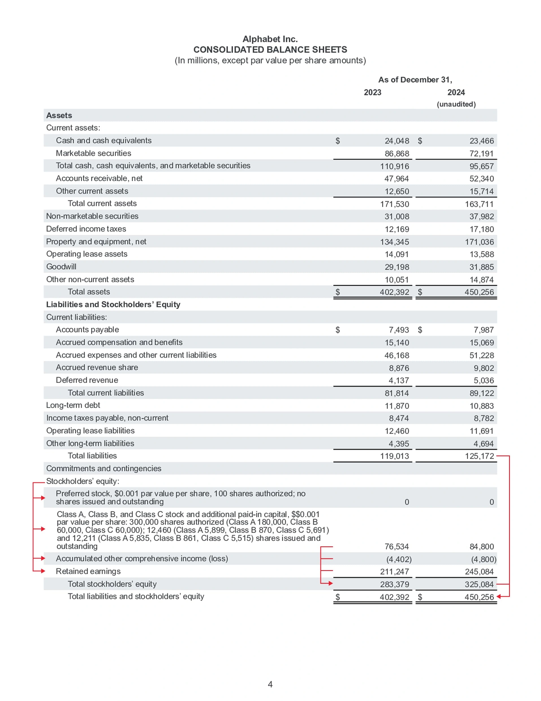

<!-- ----------- Head ----------- -->

**id**: balance-sheet
**title**: The first financial statement you should get to know is the balance sheet | Balance Sheet | ValueCafe
**description**: If you're getting into value investing, the first financial statement you need to wrap your head around is the balance sheet. In this beginner's guide, we'll break down the three main sections: assets, liabilities, and equity, to show you how to analyze a company's financial health and structure. We'll use Alphabet's (Google) financial reports as an example, so you can easily get a handle on how a company manages what it owns and what it owes.
**keywords**: Balance sheet, financial statements, value investing, financial reporting guide, beginner's guide to financial statements, assets, liabilities, equity, how to read a balance sheet, company financial health, financial structure, current assets, retained earnings
**list-summary**: A Must-Read for Value Investors to Analyze Financial Structure and Health
**name**: Balance Sheet

<!-- ----------- Hero ----------- -->

# Balance Sheet

A Must-Read for Value Investors to Analyze Financial Structure and Health

<!-- ----------- Tips ----------- -->

Before we dive in, you might want to take a look at this simplified **Alphabet 2024 Q4 financial statement**. This will at least give you a basic idea of what one looks like. We'll be using this simplified report for our examples later on.

[Alphabet 2024 Q4 financial statement](../images/statements/2024Q4-Alphabet-earnings-release.pdf)

<!-- ----------- Content ----------- -->

Value investing is all about finding assets that are undervalued by the market—ones that have an intrinsic value—and buying them at a reasonable price, rather than just blindly chasing short-term price swings.

This investment philosophy emphasizes holding for the long haul and earning your returns from the company's long-term growth. The absolute essence is this phrase: "Buy at a price below its value." Hold on tight to that, because it's the central idea for everything else you'll learn about value investing.

## What is the Balance Sheet ?

The first financial statement you absolutely need to know is the **Balance Sheet**.

Think of it as a financial snapshot. It's a report that shows a company's financial structure at a specific point in time (like, for example, the third quarter of 2024).

It helps you understand the company's financial health right at that moment. It tells you how much money the company has on its books, how much it owes, and where all its money is being used. It's the foundation for figuring out if the company is a good long-term investment.

Assets = Liabilities + Shareholder Equity

The accounting formula for the balance sheet shows that the "source of assets" comes from either Liabilities or Shareholder Equity. On the report itself, all items are clearly divided into these three categories: **Assets, Liabilities**, and **Shareholder Equity**.

### Assets

The Assets section lists everything the company owns, arranged by liquidity (from most liquid to least). This includes things like **cash**, **accounts receivable**, **inventory**, **real estate**, **property**, **plant**, and **equipment**.

Value investors usually split assets into two groups, "**Current Assets**" and "**Non-Current Assets**," to quickly judge if the company has enough liquidity and if it can continue to operate safely.

1. **Current Assets**: These are assets expected to be converted into cash (or used up) within one year. Think of things like cash, accounts receivable, and inventory. This is the money used to pay employees or keep as an emergency fund, and it directly affects the company's short-term ability to pay its bills.
2. **Non-Current Assets**: These are assets expected to take more than one year to be converted into cash. This includes things like real estate, property, plant, and equipment, and intangible assets. These are typically used for actual business operations, like investment and production. You'll often see them listed on reports as "Fixed Assets" or "Long-Term Assets," and they basically show you what long-term investments the company has made.

### Liabilities

Liabilities? Yes, every company has debt. But honestly, debt isn't as scary as most people think. It's a tool every company uses to operate. Companies use their business performance and reputation to borrow the capital they need. The more clout a company has, the cheaper the loans they can get.

Remember that formula from before? **Assets** = **Liabilities** + **Shareholder Equity**. This just means that one of the ways a company gets its assets is by borrowing (liabilities).

"**Liability**" doesn't necessarily mean the money is due right now. The liabilities section is also arranged by due date, from shortest to longest. It includes things like accounts payable, short-term loans, and long-term debt.

1. **Current Liabilities**: These are debts expected to be paid back within one year, like accounts payable or short-term loans. This directly impacts the company's immediate risk of not being able to pay its bills.
2. **Non-Current Liabilities**: These are debts due more than one year out, like long-term bank loans or bonds. This is money typically used to fund big, long-term investments or major capital spending. You can read this as the company's long-term financing strategy and financial risk.

### Shareholder Equity

Aside from liabilities, everything else falls under Shareholder Equity. You can think of this as the other source of the company's funding. It includes share capital, capital surplus, and retained earnings.

1. **Common Stock**: This is the total par value of all the shares the company issued to raise money. It represents the shareholders' initial investment in the company—its original funding. This number only changes if the company issues more shares or buys them back (with shareholder approval).
2. **Additional Paid-in Capital**: When a company issues stock at a price higher than its par value (the face value), the extra amount is recorded here. Depending on regulations, this money can be used to issue stock dividends, cover losses, or pay cash dividends, giving the company more financial flexibility.
3. **Retained Earnings**: "Earnings" are the profits the company makes. "Retained earnings" are the portion of those profits that aren't paid out to shareholders as dividends. This money is usually reinvested back into the company or used to pay down debt. Retained earnings show the company's profitability and potential for growth, and it's a critical financial base for keeping the business going. (However, too much retained earnings might also suggest the company isn't finding good ways to use its cash.)

## You're Going to Need Financial Ratios

Financial ratios are your tools for quantitative analysis. In practice, when you're reading any financial statement—whether it's the balance sheet, income statement, or cash flow statement—you are absolutely going to need to use financial ratios.

### To Simplify All That Information

The balance sheet lays out all the asset numbers in detail, and investors can find a lot of answers there. But let's be honest, that many numbers can be really tough to read. On top of that, if you have to compare data from multiple time periods at once, it gets even more complicated.

Financial ratios condense those long strings of numbers, helping you get more bang for your buck with less mental effort. For example, say you're worried about a company having too much debt. Trying to parse "Total Debt $4,021,922,291 / Total Assets $6,165,658,176" is a headache. Simplifying it to a "Debt Ratio of 65%" makes it clear at a glance, right?

### To Compare Objectively

When you need to compare multiple companies, it's hard to make an objective call just by looking at the raw numbers. It's like how professional boxers have to be in the same weight class to compete; you have to get the numbers on a level playing field.

For example, if you want to compare which of these two companies has more debt, at first glance it looks like ABC has a ton of debt. But if you look at the ratio, DEF is actually the one with more leverage.

- **Company ABC** = Total Debt $4,021,922,291 / Total Assets $6,165,658,176 = Debt Ratio 65.23%
- **Company DEF** = Total Debt $31,479,254 / Total Assets $37,721,302 = Debt Ratio 83.45%

### To Guide Your Focus

Financial ratios don't just make things more efficient; they also point you toward the information you need to be looking at. For example, take the Quick Ratio: (Current Assets - Inventory) / Current Liabilities.

If it weren't for this formula, a lot of people might not even think to pay special attention to inventory.

## Let's Walk Through a Real Balance Sheet

By law, every company is required to make its financial statements public. You can get all of these reports online—for example, from the most credible source, the [U.S. Securities and Exchange Commission (SEC)](https://www.sec.gov/) website. You can just type in the ticker symbol to find the reports you need, so you can get the financials for any company you want to look up.

Below, we'll use a simplified financial report for Alphabet Inc. to walk you through a balance sheet. Let's go ahead and skip to page 4.

### The Structure of Balance Sheet

You'll see the report has two years on it, 2023 and 2024. This is for comparing this year to last year. Most formats for the "Big Three" financial statements will show this kind of comparison.

The two bold headings, Assets and Liabilities and Stockholders’ Equity, mean the balance sheet is split into two main categories, which reflects that "Assets = Liabilities + Shareholder Equity" logic we talked about earlier.

You'll notice these line items are arranged in three ways: flush-left, indented one level, and indented two levels.

- An item that is **flush-left**: If it's followed by a colon, it means it's a category for multiple sub-items. If it doesn't have a colon, it's a standalone item.
- An item **indented one level** is a sub-item, but it might also be used to show a subtotal for the items listed right above it.
- An item **indented two levels** also has two meanings: first, it could be a total of the sub-items above it, or second, it could be a grand total for a major category.

### The Details of Balance Sheet

Let's start with Assets.

- **Current assets** is the group for the sub-items: "Total cash, cash equivalents, and marketable securities," "Accounts receivable, net," and "Other current assets."
- **Total cash, cash equivalents, and marketable securities** is the total of "Cash and cash equivalents" and "Marketable securities." You'll see a bold underline beneath the numbers, which is used to add up those two rows.
- **Total current assets** is the sum of all the numbers in the "Current assets:" section.
- **Total assets** is the sum of all the numbers in the entire Assets category.

Liabilities work the same way.

- **Current liabilities** is the group for these sub-items: "Accounts payable," "Accrued compensation and benefits," "Accrued expenses and other current liabilities," "Accrued revenue share," and "Deferred revenue."
- **Total current liabilities** is the sum of all the numbers in the "Current liabilities:" section.
- **Total liabilities** is the sum of all the numbers in the entire Liabilities category.

Stockholders’ Equity is, of course, the same deal, so we don't need to go through the details again.

Since Stockholders’ Equity is part of the main "Liabilities and Stockholders’ Equity" category, it isn't put somewhere else—it's just grouped right there with Liabilities.

Finally, Total liabilities and stockholders’ equity is the sum of all the numbers for Liabilities and Stockholders’ Equity. And, as it should, this number will exactly equal the Total assets.

## Terms You'll See on the Balance Sheet

Getting a handle on the different terms on the balance sheet is key to understanding its logic. But you need to know that **not every report will use the exact same terms**.

Different companies might use different names for the same thing, and even the same company might change its terminology after a few years. For example, you might see "Operating lease assets" on one report, while another company calls it "Operating lease right-of-use assets, net."

### Assets

- **Current assets**: Basically, any asset that can be easily turned into cash within a year.
- **Cash and cash equivalents**: This is cash itself or things that are so close to cash they pretty much count as the same thing.
- **Marketable securities**: Securities (like stocks or short-term bonds on the open market) that can be sold and turned into cash very quickly.
- **Accounts receivable, net**: This is money the company is owed for products it has already shipped or services it has already completed. The only thing left is to collect the payment. This money is usually expected to be collected within a year.
- **Other current assets**: Assets that can be turned into cash within a year but don't fit into the other main categories. This could be things like interest, notes, or prepaid insurance.
- **Non-marketable securities**: The opposite of marketable securities. These are investments that are not easy to sell, like stock in a private (unlisted) company.
- **Deferred income taxes**: This is a bit of an accounting trick. By using the differences between accounting rules and tax rules, a company can postpone paying some of its income tax until the future. That tax money it didn't pay out yet can be counted as an asset for now.
- **Property and equipment, net**: Physical, hard-to-sell assets the company bought for long-term use. Think land, vehicles, or machinery.
- **Operating lease assets**: These are assets (like a building or equipment) that the company is leasing out to someone else long-term to collect rent payments.
- **Goodwill**: This is the premium paid when buying a company over its "book value" (its net assets). It’s the extra amount an investor is willing to pay, even if it's more than what the assets are technically worth on paper. Goodwill can come from things like brand value, customer relationships, a strong team, or a good business model.
- **Other non-current assets**: Assets that can't be turned into cash within a year and don't fit into the other categories. This might include security deposits, deferred charges, or asset revaluation gains.

### Liabilities

- **Current liabilities**: These are debts that have to be paid within one year (or one business cycle). This number shows you the company's short-term financial stress.
- **Accounts payable**: This is money the company owes to its suppliers for goods or services it has already received but hasn't paid for yet. (Think of it as the company's "bills-to-pay" pile).
- **Accrued compensation and benefits**: This is money owed to employees for work they've already done—like salaries, bonuses, commissions, retirement contributions, and other benefits—that just hasn't been paid out yet.
- **Accrued expenses and other current liabilities**: This is a catch-all for all sorts of expenses the company has already incurred but hasn't paid the bill for. This includes things like taxes (other than income tax), rent, interest, consulting fees, maintenance, and other short-term debts that don't fit neatly into the other categories.
- **Accrued revenue share**: This is money the company owes to its partners from a revenue-sharing deal. The revenue has been earned, but the company hasn't cut the check to its partners yet.
- **Deferred revenue**: This is a liability that's created when a customer pays the company in advance for a product or service that hasn't been delivered yet. In accounting, you can't count this as "earned" revenue until you've held up your end of the deal. It basically represents an IOU for a future service.
- **Long-term debt**: These are loans or bonds that are due more than one year from now. Think of things like corporate bonds or long-term bank loans.
- **Income taxes payable, non-current**: This is income tax the company owes but doesn't expect to actually pay for at least another year.
- **Operating lease liabilities**: Based on accounting rules, this is the current value of all the future rent payments the company is locked into for its long-term leases (like office buildings or equipment). It represents the long-term obligation the company has for using those assets.
- **Other long-term liabilities**: Any other debt due in more than one year that doesn't fit into the categories above. This could be things like deferred payments or long-term warranty reserves.

### Stockholders’ Equity

- **Preferred stock, $0.001 par value per share, 100 shares authorized; no shares issued and outstanding**: This means the company has permission (is "authorized") to issue up to 100 shares of a special type of preferred stock, which has a face value ("par value") of $0.001 per share. However, as of the date on this report, they haven't actually issued or sold any of it. It's authorized, but not in use.
- **Accumulated other comprehensive income**: This is a line for certain company gains or losses that affect the company's net worth (shareholder equity) but don't show up on the main income statement as part of its "net profit."
- **Retained earnings**: This is the grand total of all the net profits the company has earned since it first started, minus all the dividends it has ever paid out to shareholders. It's the profit the company has "kept" or "retained" to reinvest in itself.

## You Have to Know What You Own

**"Price is what you pay. Value is what you get."**

The balance sheet tells you what a company owns, what it owes, and what the shareholders really have. It's the tool that helps you understand the "value" you're getting.

By analyzing the structure of its assets, liabilities, and shareholder equity, you can get an initial read on a company's financial health. Personally, I like to see companies with **low debt, plenty of cash, and a consistent habit of growing their retained earnings.** That shows they're strong and resilient.

As a value investor, learning to read financial statements is a non-negotiable skill. It's the only way you can actually evaluate a company's intrinsic value. The balance sheet is just one piece of the puzzle. You still need to read the **income statement** to understand its profitability and the **cash flow statement** to see if it's flush with cash.
