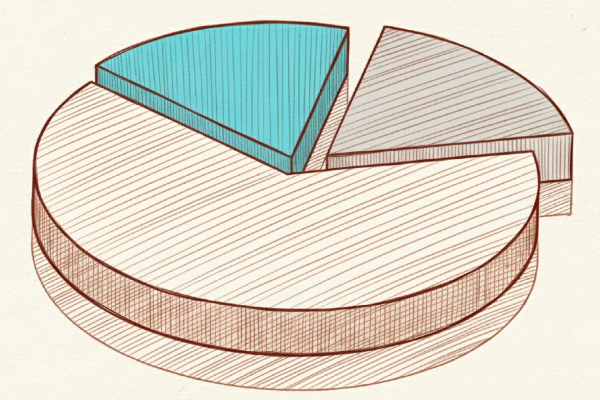

<!-- ----------- Head ----------- -->

**id**: holding-and-review
**title**: The 5th step in value investing is 'Long Term and Reviewing Periodically' | Holding and Review | ValueCafe
**description**: You might have already figured out how to pick great companies, read the three main financial reports, and even calculate intrinsic value. Now, your job is to buy and hold for the long haul while checking in on your stocks regularly. You need to consistently read the company’s latest financial reports to decide whether you should keep holding or if it's time to sell.
**keywords**: Long-term holding, regular check-ups, value investing, portfolio management, when to sell, timing stock sales, fundamentals, investment thesis, investment discipline, regular review, financial statement analysis, investment portfolio.
**list-summary**: If it's still as good as when you first bought it, just keep holding. If it gets better, buy more. But if it gets worse, well, even partners have to split up—it's time to get out.
**name**: Holding and Review

<!-- ----------- Hero ----------- -->

# The 5th step in value investing is 'Long Term and Reviewing Periodically'.

If it's still as good as when you first bought it, just keep holding. If it gets better, buy more. But if it gets worse, well, even partners have to split up—it's time to get out.

<!-- ----------- Content ----------- -->

After you buy a stock, you need to hold on tight, with the same commitment you'd have as a real business partner. But pay attention—things are happening in the world every day, so you have to regularly check in and see if the company's business operations have changed.

If it's still just as good as when you first bought it, keep holding. If it's gotten even better, buy more. But if it's taken a turn for the worse, well, even partners have to split up. It's time to get out.

## The Importance of Regularly Reviewing Your Portfolio

During the long process of holding onto your stocks, all sorts of things are happening in the world every day. Some of those things might actually affect the companies you own.

You have to regularly check if your companies have been impacted by new events and update your understanding of their latest operations. This is the only way you can adjust your strategy in time to react to market changes.

### Checking if the Company's Fundamentals Have Changed

A company's fundamentals are the core factor driving its long-term performance. Regularly checking its financial health, business model, and competitive advantages confirms whether its foundation is still solid. If you notice significant changes in the company's revenue, profits, or other key metrics, you need to re-evaluate its investment value.

### Assessing the Impact of the Market Environment

When the market environment changes—due to economic conditions, policy shifts, industry competition, etc.—you have to assess what kind of future impact this will have on the business's operations.

### Adjusting Your Holdings

When you spot a change, you have to do something about it. If the company is performing better and better, you can consider buying more to increase your position. If you find potential problems, you need to think about cutting back your position or getting out completely.

## What to Do During Your Regular Reviews

As a value investor, there are a few regular checks you should be running while you hold a stock.

### Check Financial Performance vs. Reality

The financial reports and the real-world situation can each tell you different things. You need to review them at least every quarter to keep up with a fast-changing world.

- **Check the financials and performance**: I'd suggest focusing first on revenue, profit margins, and cash flow. Those numbers give you the most direct look at how the business is doing. After that, you can check the other numbers, like debt, inventory, etc.
- **Analyze what's happening in the industry**: Keep an eye on market shifts, new tech, and, of course, the competition.
- **Pay attention to management changes**: A shake-up in the top brass can have a huge impact on the company's strategic direction and its ability to get things done.

### When to Think About Adjusting Your Holdings

In certain situations, you're going to need to consider changing your strategy for a stock.

- **Deteriorating Fundamentals**: If the company's fundamentals keep getting worse—for example, if their year-over-year revenue drops for two straight quarters—you should think about cutting back or getting out to avoid further losses. And pay attention! I said "straight" quarters. If it's just one bad quarter, that doesn't necessarily mean anything. It could just be a temporary headwind. But if it's multiple quarters in a row, it means that headwind is becoming a trend.
- **A Change in the Market Environment**: When the broader market environment goes through a major shift, like an economic recession or a structural change in the industry, it can often create a situation that's tough to reverse.
- **Hitting Your Target**: If a particular investment has already reached the profit goal you set for it, you can consider taking some profits off the table. This lets you lock in your gains and reallocate that money.

## Hold On to Your Reason for Buying

In value investing, buying a stock is like mapping out a long-term strategy. Your "reason for buying" is that strategic guideline. It's not something you change lightly; you have to maintain that consistency.

Hold on tight to your original reason for buying. Every time you go back to review your stocks, you should ask yourself one key question: "**Does this company still fit the reason I bought it in the first place?**"

For example, if your original reason was "rapid growth," then you need to see if it's still growing rapidly. It's this constant process of reflection and review that will protect your portfolio.
