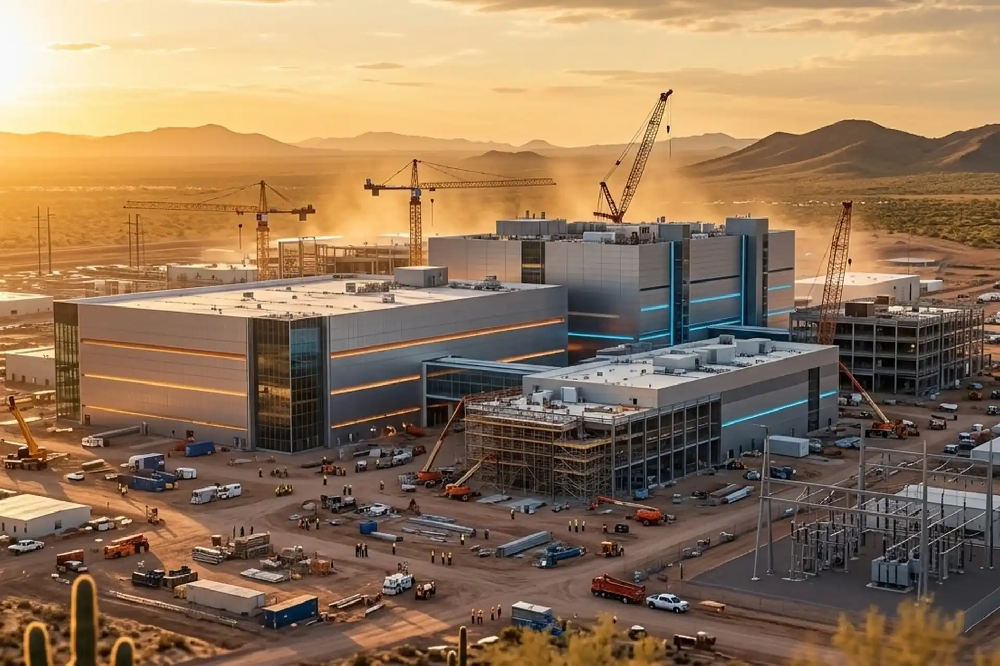

# Head Editor

**id**: 20260722-tsmc-arizona-expansion
**title**: TSMC doubles down with $100B Arizona expansion: Cost structure impact and global semiconductor shakeup
**description**: TSMC announced an extra $100 billion investment in Arizona, pushing its full-year 2026 capex target up to $60–$64 billion. This article takes a deep dive into how high overseas construction costs will temporarily dilute TSMC's gross margins, their equipment buying strategy, and what this means for US chip giants like Nvidia, Apple, and Intel.
**keywords**: TSMC Arizona plant, TSM capex, advanced process nodes, 2nm, advanced packaging, margin dilution, Nvidia supply chain, Intel foundry, semiconductor geopolitics, ValueCafe
**TAGs**: Stocks, Semiconductor, AI, Investing
**date**: 2026-07-22

---

# Hero Editor

	

		

			<h1>TSMC doubles down with $100B Arizona expansion: Cost structure impact and global semiconductor shakeup</h1>
			

				<time datetime="2026-07-22">2026-07-22</time>
				<ul class="tags">
					<li class="yolk">Stocks</li>
					<li class="yolk">Semiconductor</li>
					<li class="yolk">AI</li>
					<li class="yolk">Investing</li>
				</ul>
			

		

	

	

---

# Content Editor

	

		
TSMC (TSM), the world's leading semiconductor foundry, just dropped a bombshell during its latest earnings call. The company is pumping an additional $100 billion into its Arizona operations, raising its total commitment there to a staggering $265 billion. On top of that, it jacked up its 2026 full-year capex target to between $60 billion and $64 billion. This massive expansion highlights the rock-solid, multi-year structural demand for AI while signaling a major geopolitical shakeup across the global chip supply chain.

		<ul>
			<li><strong>Core event</strong>: TSMC announced an extra $100 billion investment in Arizona, bringing total spending to $265 billion. It also bumped its 2026 capex to $60–$64 billion to speed up advanced node and advanced packaging capacity.</li>
			<li><strong>Impact scope</strong>: Building fabs in the US costs 4 to 5 times more than in Taiwan, so expanding overseas will squeeze TSMC's gross margins over the next few quarters. At the same time, localized production gives US chip giants like Nvidia (NVDA) and Apple (AAPL) a much more resilient supply chain while putting serious pressure on foundry rivals like Intel (INTC).</li>
			<li><strong>Key takeaway</strong>: In the short term, TSMC faces a capex surge and heavy depreciation costs, leading firms like GF Securities to downgrade the stock. But long term, TSMC's tech leadership and strong pricing power solidifies its top spot and profit margins in the AI chip market.</li>
		</ul>
	

	

		<h2>Big strategic bets on the AI wave: Acceleration and capex surge</h2>
		
The explosive growth of AI is driving strong multi-year structural demand for global data centers and AI chips. Addressing market concerns over massive capex spending and potential AI bubbles, TSMC Chairman C.C. Wei shared that he spent three to four months personally touching base with key clients, including major cloud service providers, while thoroughly auditing their business performance and financials. Wei confirmed that these customers aren't just loaded with cash, but more importantly, their AI-driven business growth is 100% real. Validating both customer pocket depth and real end-market demand gave TSMC the confidence that ramping up capex and building US fabs is a high-certainty, winning long-term strategy.

		<h3 class="inside">A $265 billion footprint for American manufacturing</h3>
		
In an exclusive interview, TSMC CFO Wendell Huang mentioned that the extra $100 billion investment pushes TSMC's total project pipeline in Arizona to a historic $265 billion, making it one of the largest foreign direct investments in US history. Chairman C.C. Wei added that the extra cash could fund four additional fabs, bringing the total for the Arizona complex to 10 fabs and 2 advanced packaging facilities. Huang emphasized, "We see strong, multi-year structural demand and we don't plan on leaving any food on the table for anyone else." That statement sums up TSMC's aggressive strategy to dominate high-end AI foundry work and keep competitors from grabbing a piece of the pie.

		<h3 class="inside">Doubling down on advanced nodes and packaging</h3>
		
On the production front, Phase 1 of TSMC's Arizona plant has smoothly rolled out its 4nm process, with output set to climb over the coming quarters. To relieve tight capacity, TSMC is fast-tracking the conversion of some 5nm lines to the more advanced 3nm node. Meanwhile, its cutting-edge 2nm tech generated its first revenue in Q2 and is shaping up to be a primary revenue engine for Q3 and beyond. Notably, the additional $100 billion isn't just for front-end wafer fabs; it also covers back-end advanced packaging facilities. As AI chips grow bigger and more complex, advanced packaging has become the bottleneck for compute performance. This two-pronged push gives US customers total peace of mind regarding packaging capacity.

	

	

		<h2>Cost structure impact: High buildout costs and margin dilution</h2>
		
While this massive investment locks in TSMC's tech and market lead, the pricey reality of building fabs overseas puts a real strain on its cost structure and near-term profitability.

		<h3 class="inside">The reality of US fab costs running 4 to 5 times higher</h3>
		
Wendell Huang admitted that building a fab in the US costs four to five times as much as in Taiwan. As various phases in Arizona finish up and hit volume production, heavy depreciation costs will hit the income statement, dragging down TSMC's overall gross margins over the next few quarters. Following the earnings call, GF Securities downgraded TSMC, citing that faster capex spending will cap gross margin expansion for now. Even though TSMC's ADR initially bumped up after stellar quarterly results, it quickly pulled back 7.29% as investors took profits, reflecting Wall Street's short-term anxiety over return on invested capital (ROIC) and depreciation heavy lifting.

		<h3 class="inside">Capex discipline and equipment cost controls</h3>
		
Even with 2026 capex bumped to an eye-popping $60 billion to $64 billion, TSMC is keeping a tight grip on spending discipline. Huang reiterated that due to costs, TSMC isn't jumping to buy ASML's latest High-NA EUV tools right away, which carry a hefty price tag of 350 million euros (around $400 million) per unit. By wringing every last drop of performance out of existing lithography equipment, TSMC's R&D team has kept its tech lead without letting capital intensity spiral out of control. Paired with strong pricing power on advanced nodes, TSMC can pass some of these costs down the line to protect healthy margins and business value.

	

	

		<h2>Geopolitics and the global semiconductor reshuffle</h2>
		
This historic expansion goes far beyond routine corporate growth; it reshapes geopolitical risk and competitive dynamics across the global semiconductor landscape.

		<h3 class="inside">Mitigating Taiwan concentration risk and the role of US-Taiwan trade agreements</h3>
		
Historically, over 90% of the world's most advanced chips were made in Taiwan, exposing US tech giants and the global economy to concentrated risks from regional tension or earthquakes. TSMC's massive Arizona expansion aligns closely with strategic trade negotiations between Washington and Taipei. Establishing an end-to-end advanced supply chain in the US—complete with both front-end manufacturing and back-end packaging—dramatically lowers the tail risk of AI chip supply disruptions, giving the US tech ecosystem a much tougher shield.

		<h3 class="inside">The foundry competitive landscape</h3>
		
With its hundred-billion-dollar war chest and unmatched buildout speed, TSMC is widening its moat in technology and capacity. As Intel Foundry Services (IFS) tries to catch up and Elon Musk pitches ideas like a Terafab, TSMC's localized US capacity meets US tech giants' demands head-on, shutting the door on rivals hoping to capitalize on "Taiwan concentration risk." At the same time, TSMC continues fully compliant operations in China, which accounts for about 8% of its revenue, proving its ability to navigate complex geopolitical rules while keeping business running smoothly.

	

	

		<h2>Risks and opportunities</h2>
		
From a value investing perspective, investors should look past short-term financial noise caused by heavy capex and evaluate how these shifts impact economic moats and risk profiles.

		<h3 class="inside">Winners</h3>
		
Having advanced capacity built on home turf gives US chip designers a safer, much more flexible supply chain.

		<ul>
			<li><strong>Nvidia (NVDA) and Apple (AAPL)</strong>: As TSMC's top clients, Nvidia and Apple benefit directly from local 3nm, 2nm, and advanced packaging capacity in Arizona. This virtually removes geopolitical threats to their key product shipments, cementing their dominant positions in AI data centers and consumer tech.</li>
		</ul>
		<h3 class="inside">Losers and companies under pressure</h3>
		
Competitors and TSMC's own financial metrics will face varying degrees of pressure and market re-evaluations in the near term.

		<ul>
			<li><strong>Intel (INTC)</strong>: Intel Foundry Services (IFS) hoped to win over major chip designers by emphasizing US-based manufacturing. Now that TSMC is building out massive capacity right in Arizona, Intel's chances of stealing high-end foundry orders look much slimmer.</li>
			<li><strong>TSMC (TSM)</strong>: In the short run, TSMC has to absorb margin dilution from high US construction costs, and huge capex takes time to translate into operating cash flow. While downgrades like the one from GF Securities might trigger short-term stock volatility, it's just a temporary bump during a major expansion phase.</li>
		</ul>
	

	

		<h2>Takeaways from Mr.Cafe</h2>
		
TSMC's decision to drop another $100 billion on its Arizona buildout and raise its capex plan shows a grand strategy: accepting short-term margin pressure to secure long-term semiconductor dominance. Even though high US construction costs and heavy depreciation will weigh on gross margin expansion over the next few quarters, TSMC's disciplined equipment spending, cutting-edge 2nm tech, and unmatched pricing power keep key orders from global AI leaders locked down tight. For value investors, short-term stock swings driven by margin worries actually create a great opportunity to look at intrinsic value and safety margins.

	

