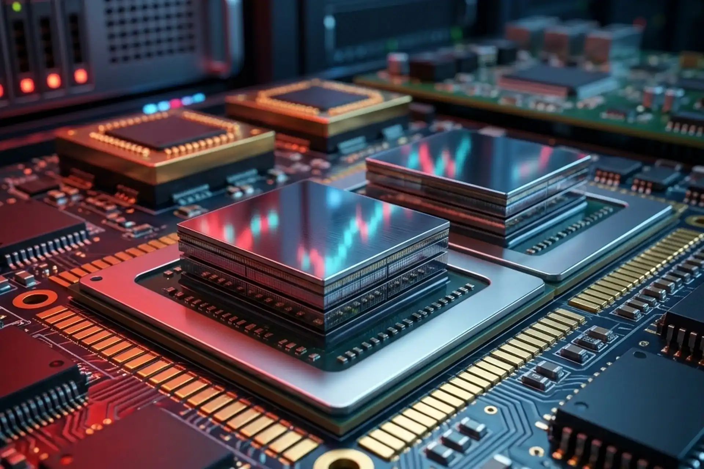

# Head Editor

**id**: 20260801-memory-stocks-selloff-but-supply-crunch
**title**: Terrified by the Memory Stock Selloff? Supply Crunch Will Actually Last Until 2029
**description**: In 2026, South Korea's crackdown on single-stock leveraged ETFs triggered KOSPI circuit breakers and a global memory stock selloff. Discover the real reasons behind crashes in Micron (MU), SK Hynix, and SanDisk (SNDK), how HBM wafer capacity crowding-out creates a persistent supply shortage until 2029 according to Deloitte and Omdia, and key value investing takeaways.
**keywords**: Memory stock selloff, Memory supply crunch 2029, HBM capacity crowding out, Micron MU, SK Hynix, SanDisk SNDK, KOSPI circuit breaker, Leveraged ETF liquidation, Margin of Safety
**TAGs**: Macro, Semiconductor, Stocks, AI, Investing
**date**: 2026-08-01

---

# Hero Editor

	

		

			<h1>Terrified by the Memory Stock Selloff? Supply Crunch Will Actually Last Until 2029</h1>
			

				<time datetime="2026-08-01">2026-08-01</time>
				<ul class="tags">
					<li class="yolk">Macro</li>
					<li class="yolk">Semiconductor</li>
					<li class="yolk">Stocks</li>
					<li class="yolk">AI</li>
					<li class="yolk">Investing</li>
				</ul>
			

		

	

	

---

# Content Editor

	

		
Global semiconductor and memory equities recently suffered a terrifying, sharp selloff. Market leaders such as Micron Technology (MU), SK Hynix, and SanDisk (SNDK) plunged over 30% from their peak valuations in just a few trading sessions, causing widespread anxiety among investors. Many market participants nervously question whether this signals the abrupt end of the artificial intelligence (AI) compute boom and the memory supercycle.

		
We look into the root causes behind this recent selloff wave, analyzing key clues and reports across major media outlets.

		<ul>
			<li><strong>Core Event</strong>: South Korean regulatory tightening on leveraged ETFs combined with fears over Chinese competition triggered a global selloff in memory stocks. The Financial Supervisory Service's (FSS) emergency restrictions forced margin liquidations, causing the KOSPI to plunge nearly 11% and trigger circuit breakers, sending chip stocks into a double-digit tailspin.</li>
			<li><strong>Scope of Impact</strong>: Retail panic spread and short-term capital rotated. Derivatives de-leveraging sparked heavy selling across global semiconductor equities, driving short-term capital into beaten-down software stocks.</li>
			<li><strong>Key Conclusion</strong>: Memory industry fundamentals remain flourishing. The structural stacking architecture of HBM exerts a massive crowding-out effect on wafer capacity, keeping supply tight through 2027 to 2029 as data center and AI server demand remains extraordinarily robust.</li>
		</ul>
	

	

		<h2>South Korean Regulators Pull the Plug: Leveraged Liquidation Triggers Global Semiconductor Cascade</h2>
		
The seemingly sudden crash in global memory stocks originated in Asian financial markets with a sharp regulatory pivot and a cascade of derivative liquidations. As the epicenter of global memory manufacturing, South Korea's stock market accumulated immense leverage risks over the past year, fueled by retail speculation in extreme leveraged products.

		
In mid-July, the Financial Supervisory Service (FSS) and Financial Services Commission (FSC) pivoted decisively to curb speculation, issuing three aggressive measures: an indefinite freeze on new single-stock leveraged ETF and ETN listings, a 3x increase in retail deposit requirements to 30 million KRW in full cash, and a complete shutdown of overseas detour channels. Forced liquidation rapidly spread across the market, causing the KOSPI index to crash 10.84% in a single day and triggering circuit breakers. Core heavyweights SK Hynix and Samsung Electronics plummeted nearly 15% and 14.4% respectively. This regulatory-driven liquidation wave instantly spilled into U.S. markets, dragging down Micron (MU), SanDisk (SNDK), Western Digital (WDC), and Seagate (STX).

	

	

		<h2>Fears of Chinese Competition & AI ROI Anxiety: The Truth Behind Market Panic</h2>
		
Beyond South Korean leveraged ETF liquidations, media overreaction and short-term capital rotation amplified market panic. Investors facing market turbulence often get distracted by headlines, mistaking short-term psychological shocks for fundamental reversals.

		
ChangXin Memory Technologies' (CXMT) IPO alongside reports of Chinese domestic DUV lithography equipment development sparked market anxiety over commodity DRAM expansion and price wars. However, market research shows that while CXMT is growing in commodity DRAM, it remains years behind South Korean and U.S. leaders in high-bandwidth memory (HBM). Meanwhile, Wall Street anxiety over AI capital expenditure (Capex) return on investment (ROI) prompted short-term capital to rotate out of high-valuation chip stocks into cheaper software names like Salesforce, Adobe, and Microsoft. These sentiment-driven capital flows masked the underlying reality of persistent supply tightness.

	

	

		<h2>HBM's Structural Magic: Why Wafer Capacity Is Severely Crowded Out</h2>
		
Understanding the real strength of memory fundamentals requires analyzing the structural crowding-out effect of High-Bandwidth Memory (HBM) on global wafer capacity. This technology innovation has fundamentally altered the industry's supply-demand equation.

		
HBM is not a conventional memory chip; it vertically stacks 12 to 16 DRAM dies connected via thousands of Through-Silicon Vias (TSVs) and a logic base die. This complex architecture consumes wafer capacity in two ways: first, incorporating TSVs expands die area by 20% to 35% per layer; second, multi-die stacking suffers from a multiplicative yield penalty, causing 12-layer yields to decline exponentially. According to market research, while HBM will represent only 6% to 13% of total memory bit shipments by 2027–2030, it will consume 18% to 30% of total wafer capacity. This massive capacity consumption directly starves standard DRAM (such as DDR5) and enterprise SSD production. Deloitte and Omdia reports explicitly project that this supply tightness, driven by AI data center demand and HBM crowding-out, will persist through 2027 to 2029.

	

	

		<h2>Decoding U.S. Memory & Storage Stocks in the Storm</h2>
		
During panic selloffs, markets frequently dump all sector equities indiscriminately. However, differences in product mix, contract structures, and balance sheet strength determine individual corporate resilience. Investors must identify which companies possess genuine earnings moats.

		<h3 class="inside">Beneficiaries & Defensive Plays</h3>
		
In an environment of tight capacity and high order visibility, industry leaders with comprehensive product portfolios and long-term cloud contracts demonstrate superior defensive strength.

		
<strong>Micron Technology (MU)</strong>: As one of the few global vendors offering advanced DRAM, NAND, and HBM3e/HBM4, Micron reported Q3 revenue skyrocketing over fourfold YoY, with management guiding Q4 gross margins near 86%. Following the stock pull-back, its forward P/E dropped to around 6x, providing a strong Margin of Safety to capture long-term AI data center expansion.

		
<strong>Seagate Technology (STX)</strong>: As a leader in high-capacity cloud hard drives, Seagate recently delivered record free cash flow and gross margins exceeding 52%. Crucially, management confirmed in April that its data center drive capacity is fully committed through late 2027. Combined with steady dividend payouts, Seagate offers excellent volatility resistance.

		<h3 class="inside">Vulnerable & Higher-Risk Names</h3>
		
Conversely, companies with single-product concentration, heavy spot price dependence, or high non-operating investment gains face greater operational and valuation risks.

		
<strong>Sandisk (SNDK)</strong>: With pure-play exposure to NAND flash, SanDisk's earnings depend heavily on volatile spot prices influenced by consumer electronics demand and mature capacity. When sentiment sours, earnings estimates face steep down revisions, leading to heightened stock volatility.

		
<strong>Western Digital (WDC)</strong>: While benefiting from cloud storage demand, a significant portion of Western Digital's recent net income stems from non-operating paper gains on its retained SanDisk stake. Trading at a higher valuation multiple than direct peers, it faces greater valuation correction pressure during market de-leveraging.

	

	

		<h2>Takeaways from Mr.Cafe</h2>
		
The memory industry remains fundamentally cyclical, meaning even during an AI-driven supercycle, stocks cannot sustain endless valuation multiples. Markets naturally swing between extreme optimism and panic.

		
Faced with this memory stock selloff, investors should not chase surging prices blindly, losing their Margin of Safety. Equally, during regulatory liquidations, there is no need to panic sell. With HBM capacity crowding-out keeping supply tight through 2029, memory fundamentals remain flourishing. Value investing centers on evaluating intrinsic value and free cash flow generation. By picking resilient companies at a reasonable price with a solid Margin of Safety, investors can navigate market volatility with confidence and achieve long-term capital growth.

	

